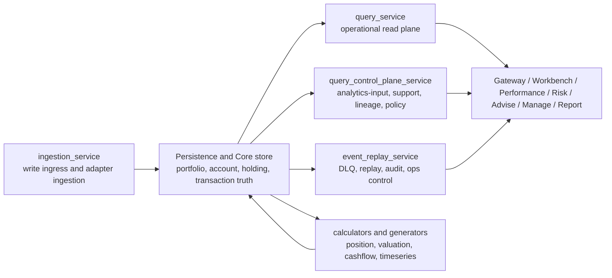

# lotus-core

Authoritative portfolio, booking, account, holding, and transaction platform for the Lotus
ecosystem.

Service profile: `domain-service`; primary runtime: Python FastAPI services plus governed workers
and operators.

Repository-local engineering context:
[REPOSITORY-ENGINEERING-CONTEXT.md](REPOSITORY-ENGINEERING-CONTEXT.md)

Primary target architecture:
[docs/architecture/lotus-core-target-architecture.md](docs/architecture/lotus-core-target-architecture.md)

Contract-family inventory:
[docs/architecture/RFC-0082-contract-family-inventory.md](docs/architecture/RFC-0082-contract-family-inventory.md)

Architecture index:
[docs/architecture/README.md](docs/architecture/README.md)

## Purpose And Scope

`lotus-core` is the system of record for foundational portfolio-management and transaction data in
Lotus.

It owns:

- portfolio, account, holding, mandate, and transaction domain data
- write-ingress and persistence of source data
- position, valuation, cashflow, and time-series foundations
- operational read-plane contracts
- governed analytics-input, snapshot/simulation, support, lineage, and policy contracts

It does not own:

- downstream performance analytics conclusions
- downstream risk analytics conclusions
- product-facing review narratives or report composition
- advisory recommendation logic
- the cross-cutting ecosystem platform layer

## Ownership And Boundaries

`lotus-core` is a domain-authoritative backend, not a product surface and not a cross-cutting
platform repository.

Boundary rules that matter:

1. foundational portfolio and transaction truth stays here
2. downstream analytics conclusions stay in their authoritative services
3. downstream-facing APIs must remain classified under RFC-0082 contract families
4. shared infrastructure ownership now belongs in `lotus-platform`, while `lotus-core` may still
   provide app-local isolated runtime support

## Ecosystem Role

Primary downstream consumers:

- `lotus-gateway` and `lotus-workbench` for governed read publication and front-office surfaces
- `lotus-performance` and `lotus-risk` for source-owned performance and risk calculations
- `lotus-advise`, `lotus-manage`, and `lotus-report` for advisory, mandate, and reporting workflows
- platform validators that certify source-data contracts, trust telemetry, and operating posture

Primary upstream dependencies:

- app-local PostgreSQL/Kafka infrastructure for isolated development
- shared platform contracts and validators from `lotus-platform`
- external market, reference, treasury, and OMS evidence only through bounded, fail-closed source
  product contracts

## Data Mesh Posture

`lotus-core` is the source authority for Core-owned source-data products. Product declarations,
source-security profiles, route-family metadata, trust-telemetry coverage, and methodology docs
are implementation truth only when repo-native validation proves them.

Important boundary: active declarations, CI-backed implementation, live validator proof, trust
telemetry coverage, and platform mesh certification are separate statuses. Do not document a
product as mesh certified unless current generated platform certification artifacts prove that
exact state.

## Current Operational Posture

`lotus-core` is an implementation-backed domain service with a heavy validation contract. It is not
a marketing surface, and this README does not claim bank-buyable readiness by itself.

Current repo truth:

1. RFC-0082 governs downstream-facing contract-family ownership.
2. RFC-0083 governs the system-of-record target architecture and hardening program.
3. `query_service` is the operational read plane.
4. `query_control_plane_service` is the governed plane for analytics-input, snapshot/simulation,
   support, lineage, policy, source-data product, and capability contracts.
5. App-local Docker Compose remains available for isolated backend development; shared platform
   runtime and ingress ownership belongs in `lotus-platform`.
6. `make lotus-core-validate` writes machine-readable app-level evidence under
   `output/lotus-core-validation/` and is blocking in the PR Merge Gate. The workflow checks out
   `lotus-platform` validation contracts so repo-native domain-product validation has its required
   platform vocabulary and validator.
7. `make docs-evidence-pack` writes a documentation release evidence manifest under
   `output/documentation-evidence/`, covering README/wiki link validation, API vocabulary artifact
   generation, critical-path coverage contract validation, RFC ledger checks,
   supported-feature truth, and runbook validation.
   Supported-feature publication is backed by
   `contracts/supported-features/lotus-core-supported-features.v1.json` and
   `make supported-features-guard`.
8. Dependency hygiene now uses current stable compatible pins with no vulnerability ignores; see
   [CR-1123](docs/architecture/CR-1123-STABLE-COMPATIBLE-DEPENDENCY-REFRESH.md).
9. Production-like deployments default to the governed service-local enterprise security profile:
   write authorization, read authorization, read auditing, capability-rule enforcement, and
   runtime configuration enforcement are on unless explicitly overridden through
   `LOTUS_CORE_PRODUCTION_SECURITY_PROFILE=false`. This does not replace gateway/platform ingress
   and IAM proof.
10. Service images carry OCI provenance labels and matching runtime environment metadata for Git
    commit SHA, Git branch, build timestamp, repo URL, image version, and CI run ID. The resolved
    image digest is captured after push in the release manifest and is supplied to deployment
    runtime metadata because a build-time self-digest label would change the image digest. API-facing
    and worker health web apps expose the same release metadata and OCI label map at
    `GET /version`; `/health/live` and `/health/ready` also include a bounded `runtime` block with
    service name, app version, environment, runtime profile, started-at, uptime, and build
    metadata for incident triage. Local builds use `LOTUS_IMAGE_DIGEST=unknown` unless the
    build/release lane or deploy manifest supplies a resolved digest.
11. Immutable image publication is CI-only through `.github/workflows/image-release.yml`: images
    are tagged with the full Git SHA, pushed to GHCR, scanned, signed, emitted with BuildKit SBOM
    and provenance attestations, exported with CycloneDX SBOM artifacts, and recorded in per-image
    release manifests that use digest references for Kubernetes deployment and same-image promotion
    evidence across `dev`, `uat`, and `prod`.

For a business-friendly feature map, use [wiki/Supported-Features.md](wiki/Supported-Features.md).
For detailed source-data products and boundary caveats, use
[wiki/Mesh-Data-Products.md](wiki/Mesh-Data-Products.md) and the methodology docs under
[docs/methodologies/source-data-products/](docs/methodologies/source-data-products).

## Reader Paths

- Business, sales, and demo readers:
  [Supported Features](wiki/Supported-Features.md), [Overview](wiki/Overview.md), and
  [Integrations](wiki/Integrations.md)
- Operators and support teams:
  [Operations Runbook](wiki/Operations-Runbook.md), [Support and Lineage](wiki/Support-and-Lineage.md),
  and [Troubleshooting](wiki/Troubleshooting.md)
- Engineers:
  [Getting Started](wiki/Getting-Started.md), [Development Workflow](wiki/Development-Workflow.md),
  [Validation and CI](wiki/Validation-and-CI.md), and
  [Current-State Architecture Map](docs/architecture/current-state-architecture-map.md)
- API and contract reviewers:
  [API Surface](wiki/API-Surface.md), [RFC Index](wiki/RFC-Index.md), and
  [RFC-0082 Contract Family Inventory](docs/architecture/RFC-0082-contract-family-inventory.md)

## Architecture At A Glance



Primary runtime surfaces:

- `query_service`
  operational read plane
- `query_control_plane_service`
  analytics-input, snapshot/simulation, support, lineage, policy, and export contracts
- `ingestion_service`
  write ingress and adapter ingestion contracts
- `event_replay_service`
  replay, ingestion-health, DLQ, and operations control-plane contracts
- `financial_reconciliation_service`
  reconciliation and control execution contracts
- calculators and generators
  position, valuation, cashflow, and time-series materialization

Primary architecture references:

- [RFC-0082 Contract Family Inventory](docs/architecture/RFC-0082-contract-family-inventory.md)
- [RFC-0083 Target-State Gap Analysis](docs/architecture/RFC-0083-target-state-gap-analysis.md)
- [Query Service And Control Plane Boundary](docs/architecture/QUERY-SERVICE-AND-CONTROL-PLANE-BOUNDARY.md)
- [Microservice Boundaries and Trigger Matrix](docs/architecture/microservice-boundaries-and-trigger-matrix.md)

## Repository Layout

| Path | Responsibility |
| --- | --- |
| `src/services/query_service/` | Operational read-plane API for portfolio, position, transaction, cash, market, and reporting reads. |
| `src/services/query_control_plane_service/` | Control-plane and downstream analytics-input, snapshot, simulation, support, lineage, policy, and export contracts. |
| `src/services/ingestion_service/` | Source-data and adapter write ingress. |
| `src/services/event_replay_service/` | Ingestion operations, DLQ, replay, audit, and remediation control plane. Keep routers thin; put command/query orchestration in `app/application/` and composition providers in `app/dependencies.py`. |
| `src/services/persistence_service/` | Persistence orchestration. |
| `src/services/calculators/` | Core financial calculators. |
| `src/services/timeseries_generator_service/` | Position and portfolio time-series generation. |
| `src/libs/portfolio-common/` | Shared domain and contract-support libraries. |
| `contracts/` | Domain-data product, trust telemetry, and other machine-readable contracts. |
| `scripts/` | Gates, guards, manifests, smoke tools, proof generators, and operational scripts. |
| `docs/` | Detailed architecture, standards, features, operations, methodology, and RFC material. |
| `wiki/` | Canonical authored source for GitHub wiki publication. |

## Quick Start

Install dependencies:

```bash
make install
```

Fast local feature-lane parity:

```bash
make ci-local
```

App-local isolated stack:

```bash
docker compose up -d
python -m tools.kafka_setup
python -m alembic upgrade head
```

Important runtime note:

- use `lotus-core` app-local compose for isolated backend development
- use `lotus-platform/platform-stack` for shared infrastructure support
- use `lotus-workbench` canonical runtime when the task is really front-office populated product
  proof

## Common Commands

- `make install`
  install development dependencies
- `make ci-local`
  feature-lane parity
- `make ci`
  PR merge gate parity
- `make ci-main`
  main releasability parity
- `make test`
  targeted unit gate
- `make test-unit-db`
  database-backed unit gate
- `make test-integration-lite`
  integration-lite suite
- `make test-e2e-smoke`
  E2E smoke
- `make test-docker-smoke`
  deterministic Docker endpoint smoke
- `make route-contract-family-guard`
  RFC-0082 route-family enforcement
- `make source-data-product-contract-guard`
  source-data product contract enforcement
- `make endpoint-consolidation-watchlist-guard`
  RFC-0083 endpoint consolidation watchlist enforcement
- `make analytics-input-consumer-contract-guard`
  downstream analytics-input consumer enforcement
- `make event-runtime-contract-guard`
  eventing and supportability contract enforcement
- `make rfc0083-closure-guard`
  RFC-0083 closure ledger enforcement
- `make rfc-status-ledger-guard`
  full RFC status ledger coverage across core RFCs, transaction specs, architecture RFC material,
  and operations RFC playbooks
- `make front-door-sync-guard`
  README/wiki/sidebar/documentation front-door synchronization and PR documentation decision check
- `make critical-path-coverage-guard`
  critical-path coverage contract and changed-code coverage reporting guard
- `make api-route-catalog-guard`
  generated API route catalog drift check across OpenAPI and route-family governance
- `make image-provenance-guard`
  OCI label, CI build-arg, CI-only image release, release-manifest, digest-deploy,
  no-build-secret, and `/version` metadata enforcement
- `make architecture-docs-catalog-guard`
  architecture documentation catalog, current-state/review/historical classification, and
  uncataloged architecture document enforcement
- `make clean`
  remove governed local caches, build byproducts, coverage files, and generated `output/`
  evidence artifacts through the reviewed cleanup script

## Validation And CI Lanes

`lotus-core` uses:

1. `Remote Feature Lane`
2. `Pull Request Merge Gate`
3. `Main Releasability Gate`

Important lane mapping:

- `make ci-local`
  fast local feature-lane parity
- `make ci`
  PR merge gate parity
- `make ci-main`
  main releasability parity

Coverage posture:

- `make coverage-gate` still enforces the combined branch-aware 98% aggregate threshold.
- It now also writes `output/coverage/coverage.json` and
  `output/coverage/critical-path-coverage-report.json`, separating aggregate coverage,
  measured changed-code coverage, and measured critical-path coverage for transaction lifecycle,
  calculations, position/cash state, corporate actions, auth/audit/security, ingestion/replay/
  outbox, repository/database hot paths, and API/error-mapping paths.
- `docs/standards/critical-path-coverage.v1.json` is the governed contract for critical-path
  module groups, minimum measured coverage expectations, test-family expectations, and exception
  policy.

Because this repo has a heavy validation contract, targeted local proof plus GitHub-backed heavy
execution is often the right workflow.

The approval-grade institutional completion and sign-off lane is available through scheduled or
manual main releasability runs and the `test-institutional-release-gates` make target. Routine
`main` push runs intentionally skip that 100k-transaction lane while retaining the faster release
gates as blocking health checks.

## Contract Notes

Important current core truths:

1. `query_service` is the operational read plane
2. `query_control_plane_service` owns analytics-input, snapshot/simulation, support, lineage,
   integration policy, capability, and export contracts
3. `lotus-core` owns canonical source data and analytics inputs, not downstream performance or risk
   conclusions
4. route-family, temporal-vocabulary, source-data-product, security, and event-runtime governance
   are all active and enforced by repo-native guards
5. app-local runtime support is still valid here, but cross-cutting platform ownership lives in
   `lotus-platform`
6. production-like environments use the shared production security profile for service-local
   enterprise auth/audit defaults; local/dev/test environments remain opt-in

Copy-paste route examples and family groupings live in [wiki/API-Surface.md](wiki/API-Surface.md).

## Documentation Map

Start here:

- architecture index:
  [docs/architecture/README.md](docs/architecture/README.md)
- wiki home:
  [wiki/Home.md](wiki/Home.md)

Architecture and contract truth:

- target architecture:
  [docs/architecture/lotus-core-target-architecture.md](docs/architecture/lotus-core-target-architecture.md)
- contract-family inventory:
  [docs/architecture/RFC-0082-contract-family-inventory.md](docs/architecture/RFC-0082-contract-family-inventory.md)
- RFC-0083 target-state gap analysis:
  [docs/architecture/RFC-0083-target-state-gap-analysis.md](docs/architecture/RFC-0083-target-state-gap-analysis.md)
- query/control-plane boundary:
  [docs/architecture/QUERY-SERVICE-AND-CONTROL-PLANE-BOUNDARY.md](docs/architecture/QUERY-SERVICE-AND-CONTROL-PLANE-BOUNDARY.md)
- route-family registry:
  [docs/standards/route-contract-family-registry.json](docs/standards/route-contract-family-registry.json)
- generated API route catalog:
  [docs/standards/api-route-catalog.v1.json](docs/standards/api-route-catalog.v1.json)
- front-door synchronization contract:
  [docs/standards/front-door-sync.v1.json](docs/standards/front-door-sync.v1.json)
- endpoint consolidation watchlist:
  [docs/standards/endpoint-consolidation-watchlist.json](docs/standards/endpoint-consolidation-watchlist.json)
- temporal vocabulary:
  [docs/standards/temporal-vocabulary.md](docs/standards/temporal-vocabulary.md)

Operator and onboarding wiki:

- API surface and route-family examples:
  [wiki/API-Surface.md](wiki/API-Surface.md)
- query control plane:
  [wiki/Query-Control-Plane.md](wiki/Query-Control-Plane.md)
- support and lineage:
  [wiki/Support-and-Lineage.md](wiki/Support-and-Lineage.md)
- operations runbook:
  [wiki/Operations-Runbook.md](wiki/Operations-Runbook.md)
- validation and CI:
  [wiki/Validation-and-CI.md](wiki/Validation-and-CI.md)
- getting started:
  [wiki/Getting-Started.md](wiki/Getting-Started.md)

Service and subsystem pages:

- data models:
  [wiki/Data-Models.md](wiki/Data-Models.md)
- event replay:
  [wiki/Event-Replay-Service.md](wiki/Event-Replay-Service.md)
- financial reconciliation:
  [wiki/Financial-Reconciliation.md](wiki/Financial-Reconciliation.md)
- timeseries and aggregation:
  [wiki/Timeseries-and-Aggregation.md](wiki/Timeseries-and-Aggregation.md)
- database migrations:
  [wiki/Database-Migrations.md](wiki/Database-Migrations.md)
- testing guide:
  [wiki/Testing-Guide.md](wiki/Testing-Guide.md)

## Wiki Source

Repository-authored wiki pages live under [wiki/](wiki). If the GitHub wiki is published later,
keep `wiki/` as the canonical source and treat any separate `*.wiki.git` clone as publication
plumbing only.
