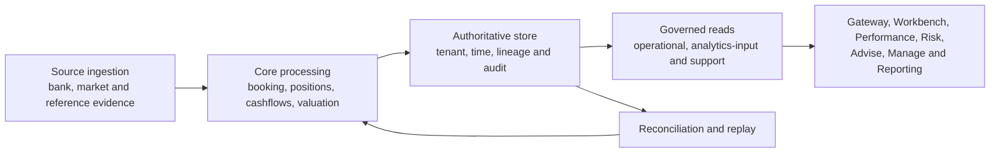

# lotus-core

The portfolio and transaction foundation for Lotus.

`lotus-core` is the authoritative system of record for portfolio and account records, transaction
processing, positions, valuations, cashflows, and historical data used by downstream Lotus
applications. It preserves financial and temporal truth so every published value can be traced to
its source evidence, replayed deterministically, and defended operationally.

Core supplies governed facts. Performance conclusions belong to `lotus-performance`, risk
conclusions to `lotus-risk`, advisory decisions to `lotus-advise`, mandate workflow to
`lotus-manage`, and client-facing publication to Gateway, Workbench, Report, Render, and Archive.
Consumers should use Core contracts rather than re-derive source truth.

## Capabilities

| Capability | Financial outcome |
| --- | --- |
| Portfolio and account records | Maintains tenant-owned portfolios, accounts, holdings, mandates, instruments, and source lineage. |
| Transaction processing | Books supported transaction and corporate-action lifecycles with idempotent, auditable cost, cashflow, and position effects. |
| Positions and cash | Reconstructs dated quantity and cash state from authoritative events without silently substituting missing evidence. |
| Valuation | Produces valuation evidence against explicit as-of dates, prices, FX rates, quantity epochs, and reconciliation state. |
| Cashflows and history | Serves governed transaction windows, cashflows, valuations, and time-series foundations for downstream analytics. |
| Reconciliation and recovery | Detects inconsistent source or derived state, fences stale work, and supports controlled replay, reprocessing, and recovery. |
| Governed reads | Exposes operational reads plus analytics-input, lineage, policy, support, snapshot, and simulation contracts. |

The supported feature catalogue is maintained in
[Supported Features](wiki/Supported-Features.md). Exact route ownership and schemas are available
through the [API Surface](wiki/API-Surface.md),
[API route catalogue](docs/standards/api-route-catalog.v1.json), and
[route-family registry](docs/standards/route-contract-family-registry.json).

## Availability

The repository implements and tests the capabilities declared in its supported-feature and route
contracts. Production certification is separate: deployment identity, external market/reference
feeds, treasury or OMS integration, IAM, operational evidence, and downstream journeys must be
proven in their owning environments. Where authoritative evidence is absent or inconsistent, Core
is designed to report an explicit unavailable or blocked state rather than a plausible value.

## Quick Start

Prerequisites:

- Python 3.12 for the host-side development and validation gates;
- GNU Make;
- Docker with Compose for the isolated PostgreSQL and Kafka-backed runtime.

From the repository root on Linux or macOS, create the isolated environment before installing:

```bash
python3.12 -m venv .venv
source .venv/bin/activate
python --version
make install
cp .env.example .env
docker compose up -d --build
docker compose ps --all
curl --fail http://localhost:8201/health/ready
```

Expected result: Python reports `3.12.x`; Kafka topic provisioning and the migration runner exit
successfully; the query-service readiness request returns HTTP `200`. Windows commands, the full
readiness set, and clean-checkout proof are in [Getting Started](wiki/Getting-Started.md).
`.env.example` is local-only; do not reuse its plaintext or development settings in a promoted
environment.

For the integrated, populated front-office journey, use the
[Workbench canonical local runtime](https://github.com/sgajbi/lotus-workbench/blob/main/docs/operations/canonical-front-office-local-runtime.md).

## How Core Fits


```mermaid
flowchart LR
    Sources["Source ingestion<br/>bank, market and reference evidence"] --> Processing["Core processing<br/>booking, positions, cashflows, valuation"]
    Processing --> Store["Authoritative store<br/>tenant, time, lineage and audit"]
    Store --> Reads["Governed reads<br/>operational, analytics-input and support"]
    Reads --> Consumers["Gateway, Workbench, Performance, Risk,<br/>Advise, Manage and Reporting"]
    Store --> Recovery["Reconciliation and replay"]
    Recovery --> Processing
```

The runtime is split by ownership boundary rather than by presentation surface:

- `ingestion_service` admits source-owned writes and ingestion jobs;
- `portfolio_transaction_processing_service` applies atomic cost, cashflow, position, and
  transaction-readiness effects;
- valuation and derived-state services schedule and materialize dated financial state;
- `financial_reconciliation_service` owns reconciliation evidence and lifecycle controls;
- `query_service` is the operational read plane;
- `query_control_plane_service` owns governed analytics-input, lineage, policy, snapshot,
  simulation, export, and support contracts;
- `event_replay_service` owns replay, DLQ, ingestion-health, and remediation operations.

See the [architecture index](docs/architecture/README.md),
[current-state architecture map](docs/architecture/current-state-architecture-map.md), and
[repository engineering context](REPOSITORY-ENGINEERING-CONTEXT.md) for detailed boundaries.

## Financial Trust Model

Core changes are expected to preserve these invariants:

1. financial amounts and quantities use exact, governed numeric semantics;
2. trade, settlement, booking, effective, observation, valuation, correction, and ingestion time
   are not interchangeable;
3. tenant ownership is source-validated and durable across ingress, persistence, events, jobs,
   replay, and reads;
4. idempotency and fencing prevent duplicate or stale work from becoming authoritative;
5. every derived value retains source, price, FX, policy/version, epoch, and correlation lineage
   required to explain it;
6. reconciliation and readiness fail closed when required evidence is missing, stale, mismatched,
   or unresolved;
7. replay and recovery reproduce the same authoritative outcome or surface a controlled failure.

Detailed temporal, transaction, source-product, security, and methodology contracts are indexed in
[docs](docs/README.md) and the [RFC index](wiki/RFC-Index.md).

## Security And Operations

Production-like profiles enforce authenticated tenant and capability boundaries plus durable audit
delivery before protected work. A missing or invalid authority, audit-store failure, incompatible
source state, or unavailable dependency must not widen access or fabricate a result.

Start with:

- [Operations Runbook](wiki/Operations-Runbook.md)
- [Security and Governance](wiki/Security-and-Governance.md)
- [Support and Lineage](wiki/Support-and-Lineage.md)
- [Troubleshooting](wiki/Troubleshooting.md)

## Development And Validation

Use repository-native targets so local and CI evidence share the same entrypoints:

```bash
make ci-local        # fast feature-lane parity
make ci              # pull-request merge-gate parity
make ci-main         # main releasability parity
make front-door-sync-guard
make quality-wiki-docs-gate
```

The full command catalogue, coverage mechanics, database/runtime gates, release procedure, and
image provenance live in the [development workflow](wiki/Development-Workflow.md),
[Validation and CI](wiki/Validation-and-CI.md), and
[operations runbook](docs/operations/runbook.md).

## Navigate

| Reader or task | Authoritative starting point |
| --- | --- |
| Product and business capability | [Supported Features](wiki/Supported-Features.md) and [Overview](wiki/Overview.md) |
| API integration | [API Surface](wiki/API-Surface.md) and [Integrations](wiki/Integrations.md) |
| Architecture and ownership | [Architecture index](docs/architecture/README.md) and [repository context](REPOSITORY-ENGINEERING-CONTEXT.md) |
| Operations and recovery | [Operations Runbook](wiki/Operations-Runbook.md) and [Troubleshooting](wiki/Troubleshooting.md) |
| Validation and contribution | [Validation and CI](wiki/Validation-and-CI.md) and [Development Workflow](wiki/Development-Workflow.md) |
| Current implementation status | [Supported Features](wiki/Supported-Features.md) and [RFC Index](wiki/RFC-Index.md) |

Repo-local `wiki/` is the authored source for the
[published GitHub wiki](https://github.com/sgajbi/lotus-core/wiki). The separate wiki repository is
publication transport only.
