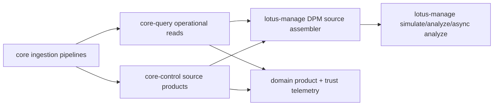

# RFC 087 - DPM Source Data Products for lotus-manage Stateful Execution

| Field | Value |
| --- | --- |
| Status | Draft |
| Created | 2026-05-02 |
| Last Updated | 2026-05-02 |
| Owners | lotus-core engineering; lotus-manage engineering |
| Depends On | RFC 035; RFC 036; RFC 058; RFC 067; RFC 082; RFC 083; RFC 085; RFC 086; platform RFC-0082; platform RFC-0083; platform RFC-0084; platform RFC-0087; platform RFC-0091 |
| Related Standards | `docs/architecture/RFC-0082-contract-family-inventory.md`; `docs/architecture/RFC-0083-source-data-product-catalog.md`; `docs/architecture/RFC-0083-security-tenancy-lifecycle-target-model.md`; `docs/architecture/RFC-0083-market-reference-data-target-model.md`; `docs/standards/route-contract-family-registry.json` |
| Scope | Cross-repo architecture and lotus-core implementation program |

## Executive Summary

`lotus-manage` RFC-0036 needs governed `lotus-core` source data for stateful discretionary
portfolio-management execution. The correct target architecture is not a single
`/dpm-execution-context` endpoint in `lotus-core`.

`lotus-core` must expose smaller, governed source-data products that `lotus-manage` can compose in
the same style used by `lotus-advise`: query-plane operational reads for canonical portfolio state,
control-plane integration products for governed source products, and explicit supportability
evidence for completeness and degraded posture.

This RFC defines the core enhancements required to unblock gold-standard `lotus-manage` stateful
execution without creating a monolithic context endpoint or moving DPM execution ownership into
`lotus-core`.

## Decision

`lotus-core` will not provide a single all-in-one DPM context endpoint.

Instead, `lotus-core` will:

1. certify the existing source-data products that already support stateful DPM input assembly,
2. add focused source-data products for DPM-specific gaps,
3. enhance ingestion so those products can be loaded, replayed, reconciled, and evidenced,
4. expose downstream APIs with source-data product metadata, OpenAPI quality, capability rules,
   access policy, observability, and trust telemetry aligned to Lotus mesh standards,
5. leave `lotus-manage` as the DPM execution and workflow owner.

`lotus-manage` will compose these products into its own `DpmCoreSourceContext` and execute simulate,
analyze, and async analyze locally.

## Non-Goals

This RFC does not:

1. add `POST /integration/portfolios/{portfolio_id}/dpm-execution-context`,
2. move DPM optimization, workflow gates, action-register logic, or run supportability into
   `lotus-core`,
3. make `lotus-core` responsible for discretionary rebalance recommendations,
4. introduce Gateway or Workbench integration work,
5. widen advisory proposal scope inside `lotus-manage`,
6. weaken the RFC-0082 query-service versus query-control-plane boundary.

## Current Evidence

### Existing deployed core routes

`core-control.dev.lotus` currently exposes these relevant control-plane routes:

1. `POST /integration/portfolios/{portfolio_id}/core-snapshot`,
2. `POST /integration/portfolios/{portfolio_id}/benchmark-assignment`,
3. `POST /integration/portfolios/{portfolio_id}/analytics/reference`,
4. `POST /integration/portfolios/{portfolio_id}/analytics/portfolio-timeseries`,
5. `POST /integration/portfolios/{portfolio_id}/analytics/position-timeseries`,
6. `POST /integration/instruments/enrichment-bulk`,
7. `POST /integration/reference/classification-taxonomy`,
8. `POST /integration/benchmarks/{benchmark_id}/coverage`,
9. `POST /integration/reference/risk-free-series/coverage`,
10. `GET /support/portfolios/{portfolio_id}/readiness`,
11. `GET /lineage/portfolios/{portfolio_id}/keys`.

`core-query.dev.lotus` currently exposes these relevant query-plane routes:

1. `GET /portfolios/{portfolio_id}`,
2. `GET /portfolios/{portfolio_id}/positions`,
3. `GET /portfolios/{portfolio_id}/cash-balances`,
4. `GET /portfolios/{portfolio_id}/cash-accounts`,
5. `GET /portfolios/{portfolio_id}/transactions`,
6. `GET /portfolios/{portfolio_id}/positions/{security_id}/lots`,
7. `GET /prices/`,
8. `GET /fx-rates/`,
9. `GET /instruments/`,
10. `GET /lookups/instruments`.

### Existing source-data products

The current RFC-0083 source-data product catalog already provides useful DPM ingredients:

| Need | Existing product | Route | Current assessment |
| --- | --- | --- | --- |
| Portfolio state | `PortfolioStateSnapshot:v1` | `/integration/portfolios/{portfolio_id}/core-snapshot` | Use as the governed preferred state source where its sections are sufficient. |
| Holdings and cash | `HoldingsAsOf:v1` | `/portfolios/{portfolio_id}/positions`, `/cash-balances` | Use for operational state and gap filling. |
| Transaction/tax evidence | `TransactionLedgerWindow:v1` plus lot drill-down | `/transactions`, `/positions/{security_id}/lots` | Partial. Per-security tax-lot access is too chatty for production DPM. |
| Instrument enrichment | `InstrumentReferenceBundle:v1` | `/integration/instruments/enrichment-bulk`, `/classification-taxonomy` | Useful, but lacks DPM eligibility, restriction, and settlement profile semantics. |
| Market data | Operational `GET /prices/`, `GET /fx-rates/` | query plane | Usable, but not a governed bulk target-universe market-data product. |
| Readiness/evidence | `DataQualityCoverageReport`, `IngestionEvidenceBundle`, readiness routes | control plane | Useful, but not DPM-specific completeness across model, shelf, tax lots, prices, and FX. |

### Existing pattern in lotus-advise

`lotus-advise` resolves stateful context by composing multiple `lotus-core` routes:

1. query-plane portfolio, positions, cash, prices, FX, and instruments,
2. control-plane enrichment and classification taxonomy,
3. a separate control-plane execution endpoint for advisory simulation execution.

`lotus-manage` should follow the same source-composition pattern, except DPM execution remains in
`lotus-manage`.

## Target Architecture

### Core upstream sourcing responsibilities

`lotus-core` remains the canonical source-data product producer. It may receive data from multiple
upstream enterprise systems, but downstream services should see governed Lotus products rather than
raw upstream shapes.

| Source domain | Typical upstream owner | Core responsibility | DPM relevance |
| --- | --- | --- | --- |
| Portfolio, account, positions, and cash | portfolio book of record, custody, accounting platform | Ingest, validate, reconcile, materialize, and expose portfolio state, cash, and holdings. | Required for stateful DPM starting state and cash constraints. |
| Transactions, lots, and cost basis | order/accounting platform, tax-lot engine, custody tax lot feed where applicable | Maintain transaction ledger and position lot state with lineage, restatement, and reconciliation evidence. | Required for tax-aware sells, realized-gain constraints, and audit-grade disposal evidence. |
| Model portfolios and targets | investment office model portfolio system | Ingest effective-dated model definitions, versions, approvals, target weights, bands, and source evidence. | Required for target allocation, drift, and rebalance computation. |
| Mandate, client, and policy binding | mandate administration, CRM/client master, investment policy engine | Ingest effective-dated portfolio-to-mandate/model/policy relationships and authority status. | Required to prove discretionary authority, policy pack selection, and jurisdiction/booking constraints. |
| Product shelf, restrictions, and settlement profile | product master, compliance restriction service, settlement calendar/master data | Ingest or materialize effective eligibility, restriction reason codes, buy/sell flags, settlement days, and calendars. | Required to prevent ineligible buys, explain exclusions, and model settlement-aware execution. |
| Instrument reference and taxonomy | security master, taxonomy/master data platform | Continue publishing enrichment and classification products, adding only DPM-specific fields where they belong to instrument eligibility. | Required for asset-class controls, issuer concentration, liquidity checks, and reporting labels. |
| Prices and FX | market-data vendor, pricing service, internal valuation service | Ingest and expose bounded bulk coverage products with freshness and missing-data diagnostics. | Required for target-universe valuation, drift, cash conversion, and supportability. |

Core must not source discretionary recommendations, rebalance actions, workflow approval decisions,
or proposal status. Those remain `lotus-manage` domain responsibilities.

### Logical flow

### Source composition in lotus-manage

`lotus-manage` should compose these source families:

1. portfolio state:
   - primary: `PortfolioStateSnapshot:v1`,
   - fallback/augmentation: `HoldingsAsOf:v1`.
2. model target:
   - new `DpmModelPortfolioTarget:v1`.
3. mandate and model binding:
   - new `DiscretionaryMandateBinding:v1`.
4. instrument eligibility, restriction, and settlement profile:
   - enhanced `InstrumentReferenceBundle:v1` or new `InstrumentEligibilityProfile:v1`.
5. market data for held and target instruments:
   - new `MarketDataCoverageWindow:v1` or enhanced bulk price/FX integration product.
6. tax lots:
   - new `PortfolioTaxLotWindow:v1`.
7. supportability and lineage:
   - existing readiness/lineage routes plus new DPM coverage fields.

### Target `lotus-manage` source call plan

The intended stateful `lotus-manage` integration should be bounded and parallelizable:

1. call `PortfolioStateSnapshot:v1` for portfolio state, holdings, and cash,
2. call `DiscretionaryMandateBinding:v1` to resolve model, policy, jurisdiction, and authority,
3. call `DpmModelPortfolioTarget:v1` using the resolved model and mandate context,
4. call `InstrumentEligibilityProfile:v1` once for the union of held and target instruments,
5. call `MarketDataCoverageWindow:v1` for required prices and FX,
6. call `PortfolioTaxLotWindow:v1` only when tax-aware mode is requested or required by mandate,
7. call readiness/lineage support routes for operator evidence and degraded-state explanation.

`lotus-manage` should not loop over every position for tax lots, prices, FX, enrichment, or
eligibility in production paths once these source products are available.

## Product Gap Matrix

| DPM data requirement | Current core support | Gap | Target product/API |
| --- | --- | --- | --- |
| Portfolio id, base currency, status | `GET /portfolios/{portfolio_id}` and `core-snapshot` | Sufficient for first integration; ensure metadata fields are complete | No new endpoint required |
| Holdings and cash as of date | `core-snapshot`, `positions`, `cash-balances` | Sufficient for first integration; ensure lineage and data-quality are consumed | No new endpoint required |
| Model portfolio targets | No governed model-target product found | Blocking gap | Add `DpmModelPortfolioTarget:v1` |
| Mandate-to-model binding | Portfolio DTO has mandate-like fields; benchmark assignment has `policy_pack_id`; no governed DPM mandate binding | Blocking gap | Add `DiscretionaryMandateBinding:v1` |
| Policy-pack selector | Some policy ids exist in benchmark assignment/reference records | No DPM policy selector source product | Add to `DiscretionaryMandateBinding:v1` |
| Product shelf status | Instrument enrichment has issuer/liquidity fields; advisory simulation models contain shelf semantics but not source-data product | Blocking gap for DPM buy/sell eligibility | Add `InstrumentEligibilityProfile:v1` |
| Restriction reason codes | Not exposed as governed source data | Blocking gap for audit-grade exclusions | Add to `InstrumentEligibilityProfile:v1` |
| Settlement days/profile | Transaction/cash-account settlement fields exist; instrument-level settlement profile is not exposed | Blocking gap for settlement-aware DPM | Add to `InstrumentEligibilityProfile:v1` or `SettlementProfile:v1` if it grows beyond instrument scope |
| Held instrument prices | `GET /prices/` per security | Usable but chatty; no DPM coverage summary | Enhance with bulk market-data product |
| Target instrument prices | `GET /prices/` per security | Usable but chatty; must cover instruments not currently held | Enhance with bulk market-data product |
| FX for portfolio/cash/target currencies | `GET /fx-rates/` per pair | Usable but chatty; no coverage summary | Enhance with bulk FX coverage product |
| Tax lots | `GET /positions/{security_id}/lots` per security | Too chatty; lacks portfolio-window support | Add `PortfolioTaxLotWindow:v1` |
| Completeness/readiness | `GET /support/portfolios/{portfolio_id}/readiness` | Strong general readiness, not DPM-specific | Enhance readiness with DPM source family coverage |
| Source lineage | `lineage` and product metadata | Needs DPM source family lineage grouping | Enhance product metadata/trust telemetry |

## New And Enhanced Core Products

### 1. `DpmModelPortfolioTarget:v1`

Purpose:

Publish effective model-portfolio target weights for a given model, mandate, tenant, booking
center, and as-of date.

Proposed API:

`POST /integration/model-portfolios/{model_portfolio_id}/targets`

Request fields:

1. `as_of_date`,
2. `tenant_id`,
3. `booking_center_code`,
4. `mandate_id`,
5. optional `portfolio_id`,
6. optional `include_inactive_targets=false`.

Response fields:

1. source-data product envelope fields,
2. `model_portfolio_id`,
3. `model_portfolio_version`,
4. `as_of_date`,
5. `base_currency`,
6. `targets[]` with `instrument_id`, `target_weight`, optional `min_weight`, `max_weight`,
   `target_role`, and `rebalance_band`,
7. `policy_context` with source policy and approval status,
8. `supportability` with `state`, `reason`, `freshness_bucket`, and missing data families.

Required ingestion:

1. `POST /ingest/model-portfolios`,
2. `POST /ingest/model-portfolio-targets`.

Storage requirements:

1. model master table,
2. target version/effective-date table,
3. source-system, source-record-id, source-batch, restatement, approval, and evidence timestamps.

### 2. `DiscretionaryMandateBinding:v1`

Purpose:

Publish the effective DPM binding from portfolio/mandate to model, policy pack, jurisdiction,
booking center, and rebalance constraints.

Proposed API:

`POST /integration/portfolios/{portfolio_id}/mandate-binding`

Request fields:

1. `as_of_date`,
2. `tenant_id`,
3. optional `mandate_id`,
4. optional `booking_center_code`,
5. optional `include_policy_pack=true`.

Response fields:

1. source-data product envelope fields,
2. `portfolio_id`,
3. `mandate_id`,
4. `mandate_type`,
5. `discretionary_authority_status`,
6. `booking_center_code`,
7. `jurisdiction_code`,
8. `model_portfolio_id`,
9. `policy_pack_id`,
10. `risk_profile`,
11. `investment_horizon`,
12. `leverage_allowed`,
13. `tax_awareness_allowed`,
14. `settlement_awareness_required`,
15. `rebalance_frequency`,
16. `rebalance_bands`,
17. `source_lineage`.

Required ingestion:

1. enhance `POST /ingest/portfolios` where existing fields are enough,
2. add `POST /ingest/mandate-bindings` for effective-dated mandate/model/policy relationships.

Storage requirements:

1. effective-dated mandate binding table,
2. policy selector metadata,
3. source lineage and restatement fields.

### 3. `InstrumentEligibilityProfile:v1`

Purpose:

Publish DPM-safe instrument shelf, eligibility, restriction, settlement, and liquidity metadata for
held and target instruments.

Proposed API:

`POST /integration/instruments/eligibility-bulk`

Request fields:

1. `as_of_date`,
2. `tenant_id`,
3. `booking_center_code`,
4. optional `mandate_id`,
5. optional `policy_pack_id`,
6. `instrument_ids[]`.

Response fields:

1. source-data product envelope fields,
2. `records[]` preserving request order,
3. `instrument_id`,
4. `eligibility_status` with values such as `APPROVED`, `RESTRICTED`, `SELL_ONLY`, `BANNED`,
   `SUSPENDED`, `UNKNOWN`,
5. `restriction_reason_codes[]`,
6. `eligible_for_buy`,
7. `eligible_for_sell`,
8. `asset_class`,
9. `product_type`,
10. `issuer_id`,
11. `ultimate_parent_issuer_id`,
12. `liquidity_tier`,
13. `settlement_days`,
14. `settlement_calendar_id`,
15. `source_lineage`,
16. per-record `supportability`.

Required ingestion:

1. enhance `POST /ingest/instruments` only for stable master fields,
2. add `POST /ingest/instrument-eligibility` for policy/mandate/effective-dated eligibility,
3. add or enhance `POST /ingest/reference/classification-taxonomy` only for taxonomy labels, not
   DPM eligibility status.

Storage requirements:

1. effective-dated instrument eligibility table,
2. restriction reason code table or JSON field with governed vocabulary,
3. settlement profile fields,
4. source lineage and evidence timestamps.

### 4. `PortfolioTaxLotWindow:v1`

Purpose:

Publish tax-lot and cost-basis state for all or selected securities in a portfolio over an as-of
scope without requiring one request per security.

Proposed API:

`POST /integration/portfolios/{portfolio_id}/tax-lots`

Request fields:

1. `as_of_date`,
2. optional `security_ids[]`,
3. optional `lot_status_filter`,
4. optional `include_closed_lots=false`,
5. `page_size`,
6. `cursor`.

Response fields:

1. source-data product envelope fields,
2. `portfolio_id`,
3. `as_of_date`,
4. `lots[]`,
5. `security_id`,
6. `lot_id`,
7. `open_quantity`,
8. `acquisition_date`,
9. `cost_basis_base`,
10. `cost_basis_local`,
11. `local_currency`,
12. `tax_lot_status`,
13. `source_transaction_id`,
14. `source_lineage`,
15. paging fields.

Required ingestion:

No new ingestion path is required for first implementation if the existing BUY/cost-basis pipeline
is authoritative. If external tax-lot feeds become source of record, add
`POST /ingest/tax-lots` as a later slice with reconciliation controls.

Storage requirements:

Use existing `position_lot_state` as the initial authority, adding only fields that are proven
missing for DPM tax-aware allocation.

### 5. `MarketDataCoverageWindow:v1`

Purpose:

Publish prices and FX for a caller-provided universe with explicit completeness diagnostics. This
product prevents `lotus-manage` from issuing N price and M FX calls and independently inferring
source coverage.

Proposed APIs:

1. `POST /integration/market-data/prices-bulk`,
2. `POST /integration/market-data/fx-bulk`,
3. optional combined coverage route
   `POST /integration/market-data/coverage`.

Request fields:

1. `as_of_date`,
2. `instrument_ids[]` for prices,
3. `currency_pairs[]` for FX,
4. `valuation_currency`,
5. `freshness_policy`,
6. paging fields when needed.

Response fields:

1. source-data product envelope fields,
2. price records with `instrument_id`, `price_date`, `price`, `currency`, `quality_status`,
3. FX records with `from_currency`, `to_currency`, `rate_date`, `rate`, `quote_convention`,
   `quality_status`,
4. `coverage` with expected count, observed count, missing instruments, missing currency pairs,
   stale rows, and freshness bucket,
5. source lineage and supportability.

Required ingestion:

Existing `POST /ingest/market-prices` and `POST /ingest/fx-rates` are sufficient for first
implementation. They may need stricter source-batch and evidence propagation into response metadata.

## Product Catalog Updates

Add these products to `portfolio_common.source_data_products.SOURCE_DATA_PRODUCT_CATALOG` and
`contracts/domain-data-products/lotus-core-products.v1.json`:

1. `DpmModelPortfolioTarget:v1`,
2. `DiscretionaryMandateBinding:v1`,
3. `InstrumentEligibilityProfile:v1`,
4. `PortfolioTaxLotWindow:v1`,
5. `MarketDataCoverageWindow:v1`.

Each product must define:

1. owner `lotus-core`,
2. consumers including `lotus-manage` and any already known downstream consumers,
3. serving plane,
4. route family,
5. paging/export posture,
6. required metadata fields,
7. source-data security profile,
8. trust telemetry requirements.

## Route Family Classification

| Route | Family | Serving plane | Reason |
| --- | --- | --- | --- |
| `/integration/model-portfolios/{model_portfolio_id}/targets` | Analytics Input | `query_control_plane_service` | Deterministic downstream target input, not an operational portfolio read. |
| `/integration/portfolios/{portfolio_id}/mandate-binding` | Analytics Input | `query_control_plane_service` | DPM policy/source selector required by downstream execution input assembly. |
| `/integration/instruments/eligibility-bulk` | Analytics Input | `query_control_plane_service` | Governed source input for DPM eligibility and downstream analytics/suitability. |
| `/integration/portfolios/{portfolio_id}/tax-lots` | Analytics Input | `query_control_plane_service` | Productized bulk tax-lot window for DPM source assembly with paging and supportability; existing per-security lot reads remain operational reads. |
| `/integration/market-data/prices-bulk` | Analytics Input | `query_control_plane_service` | Bulk market-data window with coverage diagnostics. |
| `/integration/market-data/fx-bulk` | Analytics Input | `query_control_plane_service` | Bulk FX window with coverage diagnostics. |
| `/integration/market-data/coverage` | Control-Plane And Policy | `query_control_plane_service` | Coverage/readiness evidence. |

Final implementation must update `docs/standards/route-contract-family-registry.json` and pass
`make route-contract-family-guard`.

## Data Mesh Requirements

Every new product must meet the current Lotus mesh baseline:

1. repo-native producer declaration in `contracts/domain-data-products/lotus-core-products.v1.json`,
2. platform vocabulary alignment for product names, identifiers, and trust metadata,
3. `x-lotus-source-data-product` OpenAPI metadata,
4. `x-lotus-source-data-security` OpenAPI metadata,
5. runtime DTO envelope fields:
   - `product_name`,
   - `product_version`,
   - `tenant_id`,
   - `generated_at`,
   - `as_of_date`,
   - `restatement_version`,
   - `reconciliation_status`,
   - `data_quality_status`,
   - `latest_evidence_timestamp`,
   - `source_batch_fingerprint`,
   - `snapshot_id`,
   - `policy_version`,
   - `correlation_id`.
6. trust telemetry fixture under `contracts/trust-telemetry/`,
7. runtime collection path or explicit static-fixture fallback with no overclaiming,
8. validation through:
   - `make source-data-product-contract-guard`,
   - `make domain-product-validate`,
   - trust telemetry tests,
   - OpenAPI/vocabulary gates.

## Observability, Logging, And Supportability

Each new or enhanced endpoint must provide:

1. structured logs with `correlation_id`, `trace_id`, product name, route family, and bounded
   outcome labels,
2. no portfolio id, security id, transaction id, request body, response body, or client-sensitive
   identifiers as Prometheus labels,
3. bounded counters for request outcome, data-quality status, and supportability state,
4. histograms for endpoint latency where existing platform patterns support them,
5. supportability objects with `state`, `reason`, `freshness_bucket`, and missing source families,
6. readiness diagnostics for DPM source families through either:
   - enhanced `/support/portfolios/{portfolio_id}/readiness`, or
   - a focused `/support/portfolios/{portfolio_id}/dpm-readiness` route if the generic readiness
     contract becomes too broad.

## Security And Access Requirements

Each product must:

1. be tenant scoped,
2. carry entitlement/capability rules derived from source-data product catalog metadata,
3. honor existing enterprise readiness middleware,
4. require policy headers where configured,
5. emit audit events according to the product access class,
6. classify sensitivity and retention posture in the source-data security profile,
7. avoid leaking restriction rationale or mandate metadata beyond entitled consumers.

## API Documentation Requirements

Swagger/OpenAPI for every route must include:

1. clear `What`, `How`, and `When` operation descriptions,
2. explicit `When not to use` guidance where there is a risk of wrong-layer consumption,
3. examples for every request and success response,
4. JSON examples for every error response,
5. descriptions, types, and examples for every attribute,
6. route grouping aligned with RFC-0082 families,
7. source-data product and security OpenAPI extensions,
8. pagination and ordering semantics where applicable,
9. supportability and data-quality behavior.

## Performance And Latency Requirements

This RFC exists partly to prevent high-latency fan-out from `lotus-manage`.

Targets:

1. `lotus-manage` should be able to assemble one DPM stateful context with bounded parallel calls,
   not per-position/per-currency serial loops.
2. Bulk endpoints must preserve deterministic ordering and page safely.
3. Tax-lot, price, and FX retrieval must have request-size limits and clear paging/export posture.
4. Query plans for effective-dated model, mandate, eligibility, and market data must be covered by
   repository or integration tests where practical.
5. Load and latency gates must include at least one canonical `PB_SG_GLOBAL_BAL_001` stateful DPM
   source assembly proof once implementation reaches live runtime.

## Delivery Slices

### Slice 0 - Current inventory and RFC rebaseline

1. Confirm existing core routes and current OpenAPI metadata.
2. Confirm `lotus-advise` source-composition pattern.
3. Rebaseline `lotus-manage` RFC-0036 so it no longer expects a single DPM context route.
4. Close or update any issue that requests a monolithic `dpm-execution-context` route.

Exit evidence:

1. this RFC merged,
2. `lotus-manage` RFC-0036 updated to reference the composed-source model,
3. no active docs claim that `lotus-core` should expose one all-in-one DPM context endpoint.

### Slice 1 - Product catalog and route-family scaffolding

1. Add planned products to `source_data_products.py`.
2. Add source-data security profiles.
3. Add route-family registry entries in planned or implemented state according to local guard
   conventions.
4. Add repo-native producer declarations and trust telemetry placeholders.
5. Add tests that prevent product-name, route-family, and metadata drift.

Exit evidence:

1. source-data product guard passes,
2. route-family guard passes,
3. domain-product validation passes when platform sibling checkout is available.

### Slice 2 - Model portfolio target product

1. Add model portfolio and target ingestion DTOs/routes.
2. Add persistence tables and migrations.
3. Add effective-dated resolver service.
4. Add `POST /integration/model-portfolios/{model_portfolio_id}/targets`.
5. Add OpenAPI, tests, source-data metadata, telemetry, and live proof.

Exit evidence:

1. API returns deterministic target weights for canonical data,
2. missing/stale model data returns source-safe errors and supportability,
3. `lotus-manage` can consume the product in a mocked integration test.

### Slice 3 - Discretionary mandate binding product

1. Add or enhance portfolio/mandate ingestion for DPM binding fields.
2. Add effective-dated mandate binding persistence.
3. Add `POST /integration/portfolios/{portfolio_id}/mandate-binding`.
4. Include policy pack selector, model binding, authority status, tax and settlement flags, and
   source lineage.

Exit evidence:

1. canonical portfolio resolves mandate, model, and policy selectors,
2. unauthorized or inactive mandate status is source-safe and test-covered,
3. `lotus-manage` does not infer mandate truth locally.

### Slice 4 - Instrument eligibility and settlement profile product

1. Add eligibility/restriction ingestion.
2. Add effective-dated eligibility storage.
3. Add `POST /integration/instruments/eligibility-bulk`.
4. Preserve request order and explicit unknown records.
5. Include settlement days/calendar, restriction reason codes, and supportability.

Exit evidence:

1. held and target instruments return deterministic eligibility,
2. missing eligibility produces bounded supportability instead of local fallback truth,
3. DPM shelf construction can be proven without advisory-era assumptions.

### Slice 5 - Bulk tax-lot product

1. Add `POST /integration/portfolios/{portfolio_id}/tax-lots`.
2. Source from existing cost-basis/lot state initially.
3. Add paging, filtering, source lineage, and data-quality status.
4. Assess whether external tax-lot ingestion is needed; implement only if source-of-record
   requirements demand it.

Exit evidence:

1. tax-aware DPM can resolve all portfolio lots without per-security fan-out,
2. page boundaries are deterministic,
3. empty/incomplete lots are visible through supportability.

### Slice 6 - Bulk market-data and FX coverage products

1. Add bulk prices and FX integration products or extend existing integration/reference routes
   under a governed market-data product family.
2. Add coverage diagnostics for held and target universe instruments.
3. Preserve source evidence timestamps, observed dates, freshness buckets, and missing families.

Exit evidence:

1. DPM target universe prices and FX can be sourced with bounded calls,
2. missing target price/FX cases are deterministic and supportability-visible,
3. query performance and paging behavior are tested.

### Slice 7 - DPM source readiness and supportability

1. Enhance portfolio readiness with DPM source-family coverage or add a focused DPM readiness
   route.
2. Include model, mandate, eligibility, tax-lot, price, FX, and lineage completeness.
3. Add bounded metrics and no-sensitive-label tests.

Exit evidence:

1. operators can explain why stateful DPM is ready, partial, stale, or blocked,
2. metrics and logs meet platform observability constraints,
3. no sensitive identifiers leak into metric labels.

### Slice 8 - End-to-end manage source-assembly proof

1. Add a live canonical proof using `PB_SG_GLOBAL_BAL_001`.
2. Validate core APIs directly.
3. Validate `lotus-manage` source assembly against core products.
4. Keep execution inside `lotus-manage`.
5. Capture JSON and human-readable evidence.

Exit evidence:

1. `lotus-manage` stateful simulate, analyze, and async analyze can be enabled in a controlled
   environment,
2. source lineage ties every DPM source family to core product ids and evidence,
3. local and remote CI gates are green,
4. RFC-0036 can resume final gold-standard implementation.

### Slice 9 - Final certification and closure

1. Full endpoint certification for every new core product.
2. API vocabulary and OpenAPI quality pass.
3. Mesh, trust telemetry, source-data security, and route-family guards pass.
4. Update `REPOSITORY-ENGINEERING-CONTEXT.md`, README/wiki source, and platform context if durable
   source-data product guidance changes.
5. Publish wiki after merge.
6. Update `lotus-manage` RFC-0036 and supported-features evidence.

Exit evidence:

1. core PR Merge Gate and relevant main-releasability gates are green,
2. downstream `lotus-manage` proof is linked,
3. no docs or APIs claim unsupported products,
4. branch hygiene is complete.

## Risks And Mitigations

| Risk | Mitigation |
| --- | --- |
| Recreating a monolithic context endpoint through a different name | Keep each product independently useful, governed, and cataloged; `lotus-manage` owns assembly. |
| Wrong serving plane | Use RFC-0082 family classification before adding each route. |
| High latency from too many calls | Add bulk target-universe products for tax lots, prices, FX, and eligibility. |
| Local DPM fallback becomes hidden source truth | Require source-lineage and supportability fields; missing source data blocks or degrades explicitly. |
| Mesh documentation drifts from implementation | Add catalog, contract, OpenAPI, trust telemetry, and wiki checks in each slice. |
| Mandate/restriction data leaks beyond entitlement | Apply source-data security profiles and capability rules before runtime enablement. |
| New ingestion is under-modeled | Use source batch, idempotency, reconciliation, and evidence patterns from RFC-0083. |

## Validation Plan

Each implementation slice must include:

1. unit tests for DTO validation and resolver edge cases,
2. repository/service tests for query shape and effective dating,
3. route tests for success, missing data, invalid request, paging, and unauthorized/degraded cases,
4. OpenAPI tests for summaries, descriptions, examples, error examples, and extensions,
5. source-data product guard tests,
6. route-family registry guard tests,
7. trust telemetry tests,
8. no-sensitive-metrics tests,
9. focused live proof when the slice changes deployed source-data behavior.

Final validation must include:

1. `make ci-local`,
2. relevant `make ci` or GitHub PR Merge Gate,
3. `make source-data-product-contract-guard`,
4. `make domain-product-validate`,
5. `make route-contract-family-guard`,
6. OpenAPI/vocabulary gates,
7. live core-control and core-query API proof,
8. downstream `lotus-manage` stateful source assembly proof.

## Acceptance Criteria

This RFC is complete only when:

1. `lotus-core` exposes all missing DPM source products as governed, documented, tested APIs,
2. all products are present in the source-data product catalog and domain-product declarations,
3. ingestion and persistence paths exist for every source-owned data point,
4. supportability and trust telemetry can explain completeness for each DPM source family,
5. `lotus-manage` no longer depends on a monolithic source route,
6. `lotus-manage` proves stateful simulate/analyze/async analyze using composed core products,
7. all relevant CI, mesh, OpenAPI, route-family, and security gates are green,
8. wiki/source docs describe implementation-backed current state without aspirational claims.

## No-Wiki-Change Decision For This Draft

This draft RFC changes planned implementation direction but does not change current deployed
`lotus-core` behavior. Repo-local wiki source should be updated in the implementation slices when
the API surface or current supported products actually change.
