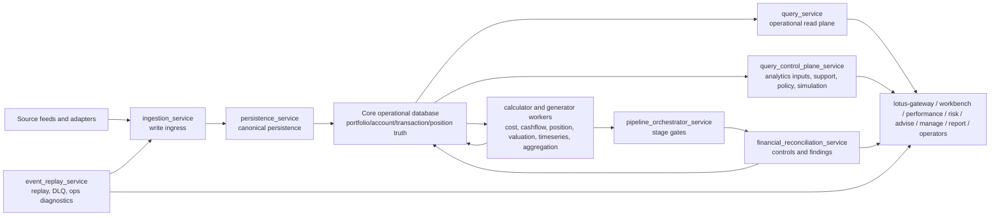
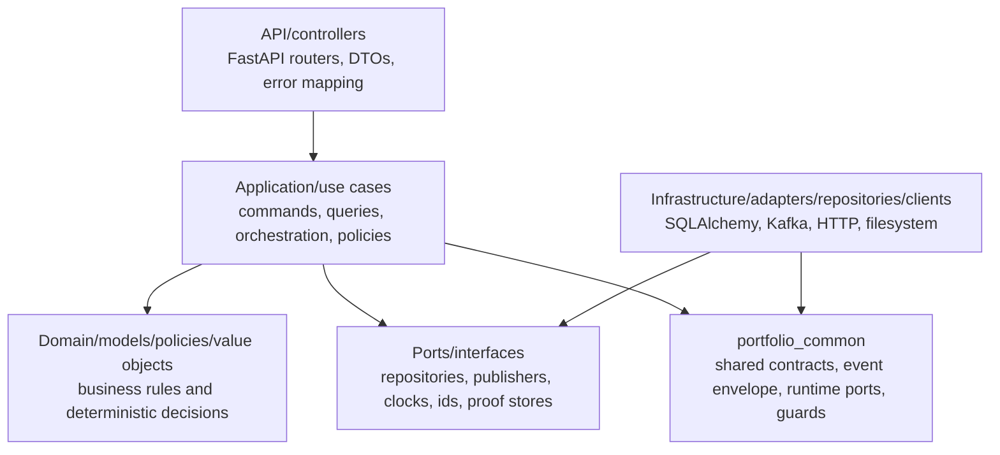
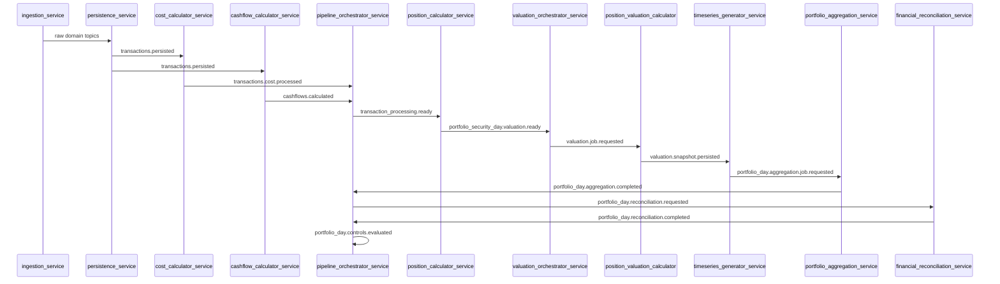

# Lotus Core Current-State Architecture Map

Last updated: 2026-07-05

Issue: https://github.com/sgajbi/lotus-core/issues/616

Guard: `make architecture-docs-catalog-guard`

## Purpose

This is the current-state map for where code and ownership belong in `lotus-core`. Use it before
adding a route, service module, repository, event, source-data product, support API, or runtime
boundary.

This page is intentionally current-state. Target-state and deep migration plans remain in the
linked RFC and CR records.

## Freshness Rule

Major route, module, deployable, database-ownership, event-flow, or downstream-consumer moves must
update this map in the same slice. The architecture catalog guard checks that this page:

1. is an explicit current-state catalog entry,
2. names every deployable service in
   `docs/architecture/runtime-boundary-decision-catalog.json`,
3. includes the service paths from that catalog,
4. preserves bounded-context, event/outbox flow, database ownership, dependency direction,
   downstream consumers, and prohibited responsibilities anchors.

## Current Shape

## Dependency Direction

Rules:

1. API DTOs, FastAPI objects, persistence models, and downstream response models do not belong in
   domain or application logic.
2. Domain policies do not import routers, middleware, SQLAlchemy sessions, Kafka producers, or HTTP
   clients.
3. Infrastructure adapts ports; application code depends on ports and typed records, not concrete
   sessions or transport clients.
4. New runtime boundaries require `docs/standards/runtime-boundary-decision-standard.md` evidence
   before deployable expansion.

## Bounded Contexts

| Bounded context | Current owner | Primary truth | Must not own |
| --- | --- | --- | --- |
| portfolio/account | `query_service`, `persistence_service`, shared database models | Portfolio master, account, cash-account, holding read truth | Downstream suitability, advisory recommendations, relationship-householding outside source facts |
| transaction booking | `ingestion_service`, `persistence_service`, calculator workers | Canonical transaction ingress, persisted transactions, transaction lifecycle signals | External OMS acknowledgement or order execution workflows |
| positions | `position_calculator_service`, `query_service` | Position state, position history, daily snapshots | Performance attribution, risk decomposition, client-facing recommendation logic |
| valuation | `valuation_orchestrator_service`, `position_valuation_calculator` | Valuation jobs, valuation snapshot mutation, valuation readiness | Market-data vendor ownership or performance methodology |
| cashflow | `cashflow_calculator_service`, `query_service` | Cashflow classification, cashflow projection, rule-backed cashflow evidence | Liquidity advice, financial-planning recommendation, treasury instruction |
| cost | `cost_calculator_service`, `query_service` | Cost basis, lot state, accrued-offset evidence, transaction cost state | Tax advice or external cost-estimate methodology |
| source-data products | `query_control_plane_service`, `query_service`, `portfolio_common.source_data_products` | RFC-0083 product identity, supportability, freshness, lineage, consumer map | Downstream analytics conclusions or duplicated data-mesh certification claims |
| ingestion/replay | `ingestion_service`, `event_replay_service` | Write ingress, ingestion jobs, replay audit, consumer DLQ evidence | Generic downstream read models or hidden mutation paths |
| reconciliation | `financial_reconciliation_service`, `pipeline_orchestrator_service` | Control runs, findings, control-stage status, publishability evidence | Calculator mutation or downstream report composition |
| operations/supportability | `query_control_plane_service`, `event_replay_service`, shared health/observability modules | Health, readiness, support overview, lineage, replay diagnostics, runbooks | Business workflow shortcuts that bypass domain services |
| security/audit | shared enterprise readiness modules plus service-local wrappers | Enterprise auth/audit posture, capability rules, source-data security metadata | Platform ingress/IAM claims without `lotus-platform` proof |
| platform runtime support | `lotus-platform` for shared runtime; `lotus-core` for app-local compose and service image metadata | App-local stack, CI evidence, image provenance, service health metadata | Shared ingress, platform-wide infrastructure ownership, cross-repo orchestration truth |

## Deployable Ownership Map

| Deployable | Service path | Owned modules and state | Prohibited responsibilities |
| --- | --- | --- | --- |
| `ingestion_service` | `src/services/ingestion_service` | Write-ingress routers, upload/component boundaries, ingestion job lifecycle, idempotency, source publication | Operational reads, analytics input products, replay execution, calculator mutation |
| `event_replay_service` | `src/services/event_replay_service` | Replay/remediation commands, ingestion operations queries, consumer DLQ replay, replay audit, ops control | Source write ingestion, generic query read plane, calculator writes |
| `financial_reconciliation_service` | `src/services/financial_reconciliation_service` | Reconciliation run orchestration, finding policy, control execution APIs, finding persistence | Calculator mutation, portfolio/position source ownership, report composition |
| `persistence_service` | `src/services/persistence_service` | Raw domain event decoding, canonical persistence writes, idempotency, completion publication | API read shaping, analytics inputs, downstream contract composition |
| `cost_calculator_service` | `src/services/calculators/cost_calculator_service` | Cost basis, lot state, accrued offsets, transaction cost processing and replay | Tax advice, cashflow rule ownership, position valuation |
| `cashflow_calculator_service` | `src/services/calculators/cashflow_calculator_service` | Cashflow classification, rule lookup, cashflow persistence, DLQ-aware consumer handling | Portfolio liquidity advice, cost basis, valuation job dispatch |
| `position_calculator_service` | `src/services/calculators/position_calculator` | Position reducer, position history, daily position snapshots, reprocessing requests | Valuation compute, performance attribution, source ingestion |
| `valuation_orchestrator_service` | `src/services/valuation_orchestrator_service` | Valuation job scheduling, reprocessing state, dispatch readiness | Valuation compute mutation, read-plane response shaping |
| `position_valuation_calculator` | `src/services/calculators/position_valuation_calculator` | Valuation job consumption, valuation snapshot mutation, active valuation handoff | Job scheduling ownership, benchmark/performance calculations |
| `timeseries_generator_service` | `src/services/timeseries_generator_service` | Position-timeseries generation, aggregation job staging | Portfolio aggregation policy, operational API responses |
| `portfolio_aggregation_service` | `src/services/portfolio_aggregation_service` | Portfolio-timeseries aggregation, aggregation jobs, completion publication | Position valuation, report composition, downstream performance analytics |
| `pipeline_orchestrator_service` | `src/services/pipeline_orchestrator_service` | Stage-gate orchestration, readiness events, control-stage status, quiescence | Business calculations, source write ingestion, direct API serving |
| `query_service` | `src/services/query_service` | Operational read APIs, source-data response builders, repository-output typed records, OpenAPI read metadata | Mutating workflows, analytics methodology, control-plane policy ownership |
| `query_control_plane_service` | `src/services/query_control_plane_service` | Analytics input contracts, support/lineage, policy/capabilities, simulation, export lifecycle | Basic operational read sprawl, write ingestion, calculator mutation |

The deployable list is governed by `docs/architecture/runtime-boundary-decision-catalog.json` and
`docs/architecture/microservice-boundaries-and-trigger-matrix.md`.

## Database Ownership

| Data family | Owning runtime or boundary | Read surfaces | Notes |
| --- | --- | --- | --- |
| portfolio/account/instrument/reference master | `persistence_service` and source-ingestion paths | `query_service`, `query_control_plane_service` | Core source truth. Downstream services consume contracts, not private tables. |
| transaction ledger and business dates | `persistence_service` | `query_service`, analytics-input products | Transaction date vocabulary follows RFC-0083 temporal semantics. |
| ingestion jobs, failures, replay audit, consumer DLQ | `ingestion_service`, `event_replay_service` | `event_replay_service`, support APIs | Operator evidence, not public business data. |
| cost and lot state | `cost_calculator_service` | `query_service`, source-data products where declared | Calculator-owned mutation with query-service read publication. |
| cashflows and cashflow rules | `cashflow_calculator_service` | `query_service` | Do not use for financial-planning advice. |
| position history and snapshots | `position_calculator_service`, `position_valuation_calculator` | `query_service`, analytics inputs | Position mutation and valuation mutation stay separate. |
| valuation jobs and reprocessing state | `valuation_orchestrator_service` | support APIs, worker consumers | Job orchestration state, not business output. |
| position timeseries and portfolio timeseries | `timeseries_generator_service`, `portfolio_aggregation_service` | `query_service`, analytics inputs | Published with source-data product metadata where supported. |
| reconciliation runs/findings and control stages | `financial_reconciliation_service`, `pipeline_orchestrator_service` | support and reconciliation APIs | Controls decide supportability/publishability posture. |
| outbox events and processed events | shared infrastructure boundary | dispatcher and consumers | All mutating event publication uses outbox/idempotency contracts. |

## Event/Outbox Flow

Event and outbox governance is defined by
`RFC-0083-eventing-supportability-target-model.md`, `scripts/event_runtime_contract_guard.py`,
`portfolio_common.event_supportability`, `portfolio_common.outbox_repository`, and
`portfolio_common.outbox_dispatcher`.

## Downstream Consumers

| Consumer | Allowed relationship to `lotus-core` | Must not infer |
| --- | --- | --- |
| `lotus-gateway` / Workbench | Operational reads, snapshots, simulation state, support posture, and product-surface routing through governed contracts | Raw core access as permission to compute performance/risk or bypass owning services |
| `lotus-performance` | Analytics input products, benchmark/reference inputs, source-data quality and lineage | Performance methodology ownership inside `lotus-core` |
| `lotus-risk` | Analytics input products and governed market/reference inputs | Risk calculations, active-risk narrative, or issuer-risk ownership inside `lotus-core` |
| `lotus-advise` | Simulation state and core execution projection contracts | Advisory recommendation or suitability ownership inside `lotus-core` |
| `lotus-manage` | Core state, source-data products, DPM source facts, and simulation/snapshot inputs | Mandate workflow ownership or execution decisioning inside `lotus-core` |
| `lotus-report` | Operational reporting reads and source facts | Report composition, narrative, publication certification, or client-document rendering |
| Operators and QA | Control-plane, policy, replay, support, lineage, reconciliation, runbooks | Business workflow shortcuts that mutate state outside owned services |

Downstream-facing route-family truth lives in `RFC-0082-contract-family-inventory.md`,
`docs/standards/route-contract-family-registry.json`, `wiki/API-Surface.md`, and
`docs/standards/verified-api-examples.v1.json`.

## Cross-References By Section

| Section | Primary references |
| --- | --- |
| bounded contexts and deployables | `lotus-core-target-architecture.md`, `microservice-boundaries-and-trigger-matrix.md`, `runtime-boundary-decision-catalog.json` |
| API catalog and route ownership | `RFC-0082-contract-family-inventory.md`, `docs/standards/route-contract-family-registry.json`, `wiki/API-Surface.md` |
| source-data products | `RFC-0083-source-data-product-catalog.md`, `docs/supported-features.md`, `wiki/Mesh-Data-Products.md` |
| event/outbox flow | `RFC-0083-eventing-supportability-target-model.md`, `scripts/event_runtime_contract_guard.py`, `docs/operations-runbook.md` |
| mapping and anti-corruption | `mapping-anti-corruption-boundary.md`, `CR-1330-API-MAPPER-PATTERN.md`, `CR-1333-MAPPING-ANTI-CORRUPTION-CONTRACT.md` |
| runtime providers and ports | `runtime-provider-port-policy.md`, `application-port-capability-catalog.md`, `CR-1331-RUNTIME-PROVIDER-PORTS.md` |
| supportability and incidents | `docs/operations-runbook.md`, `docs/operations/Incident-Playbooks.md`, `wiki/Operations-Runbook.md` |
| review evidence | `CODEBASE-REVIEW-LEDGER.md`, `CODEBASE-REVIEW-PLAYBOOK.md`, `CR-*` records |

## Change Checklist

When a slice changes ownership, route family, module boundaries, database writes, events, or
downstream consumers:

1. update this map,
2. update `architecture-documentation-catalog.v1.json` if document truth changed,
3. update `runtime-boundary-decision-catalog.json` if deployable service paths changed,
4. update `RFC-0082-contract-family-inventory.md` and
   `docs/standards/route-contract-family-registry.json` for route-family changes,
5. update `RFC-0083-source-data-product-catalog.md` and source-data product guards for product
   ownership changes,
6. update `RFC-0083-eventing-supportability-target-model.md` and event runtime guards for event or
   outbox changes,
7. run `make architecture-docs-catalog-guard` and the focused guard for the changed contract.
