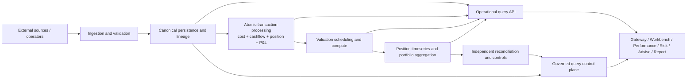

# Lotus Core End-State Runtime Vision

Status: Governed target hypothesis; runtime decisions remain evidence-gated
Date: 2026-07-15
Issue: #468

## Purpose

Define one coherent end-state map for `lotus-core`: capability ownership, likely deployable count,
data flow, internal layering, and the evidence required before runtime consolidation. This document
does not approve a merge solely because two capabilities form a serial pipeline.

## Runtime Count

The current governed post-pipeline-retirement topology contains 11 deployables. The target
hypothesis is 9 deployables, or 10 when valuation scheduler/compute isolation remains justified.

| End-state deployable | Capability and owned state | Boundary posture |
| --- | --- | --- |
| `ingestion_service` | HTTP/file intake, validation, idempotent submissions, source lineage, raw-event outbox | Keep separate from canonical mutation while untrusted-input isolation remains valuable. |
| `persistence_service` | Canonical portfolio, transaction, instrument, price, FX, and calendar persistence | Keep; canonical write authority. |
| `portfolio_transaction_processing_service` | Atomic cost, cashflow, position, corporate actions, transfers, income classification, P&L, replay | Approved consolidation; separate in-process domain modules and one financial unit of work. |
| `valuation_service` | Valuation scheduling, backdated/market-triggered revaluation, compute, snapshot publication | Target candidate combining orchestrator and worker; retain two deployables if saturation or availability evidence requires isolation. |
| `portfolio_derived_state_service` | Position timeseries, portfolio aggregation, backfill, aggregation queue, completion publication | Target candidate combining generator and aggregation as separate modules. |
| `financial_reconciliation_service` | Independent controls, findings, rerunnable tie-outs, publishability decision | Keep as an independent financial-control boundary. |
| `query_service` | High-throughput canonical operational reads | Keep separate from operator/simulation/export workloads. |
| `query_control_plane_service` | Source products, simulations, lineage, support, exports, capabilities | Keep separate for security, workload, and operator-contract isolation. |
| `event_replay_service` | Privileged replay, DLQ remediation, diagnostics, audit, controlled recovery | Keep as a privileged operational boundary. |

The former `pipeline_orchestrator_service` is retired. Transaction readiness belongs to transaction
processing, aggregation stages reconciliation requests, and financial reconciliation owns control
evidence and controls publication. The shared control table remains temporarily because transaction
readiness and QCP support reads still use it; table redesign is not a prerequisite for runtime
retirement and requires a separately reversible migration decision.

## End-State Flow



Every transition uses a versioned API or outbox event with deterministic identity, epoch/as-of
semantics, source lineage, freshness, idempotency, replay behavior, and bounded observability.

## Internal Layering

Every deployable follows the same dependency direction:

```text
API / Kafka consumer / scheduler
    -> request or event mapper
    -> application command / use case
    -> domain models, policies, and value objects
    -> ports
    -> infrastructure adapters
    -> PostgreSQL / Kafka / cache / external source
```

Domain/application code does not import FastAPI, SQLAlchemy sessions or models, Kafka clients, or
downstream DTOs. Shared libraries contain only stable multi-consumer domain records, ports, and
infrastructure primitives with explicit consumers; service-owned workflows and repositories stay
with their service.

## Runtime Decisions

| Candidate | Target hypothesis | Required proof |
| --- | --- | --- |
| cost + cashflow + position | One transaction deployable | Complete target source ownership, downstream compatibility retirement, deployed load/recovery, release provenance, and canonical QA. |
| valuation orchestrator + valuation worker | One valuation deployable | Scheduler availability under compute saturation, independent scaling comparison, backfill load, failure recovery, rollback, and SLO evidence. |
| timeseries generator + portfolio aggregation | One derived-state deployable | Bounded fan-in/backfill, ordering, queue recovery, load, failure isolation, table ownership, and rollback evidence. |
| pipeline orchestrator | Retired | Transition ownership is reassigned, the runtime/image/consumer surface is removed, and a regression guard prevents restoration. Compatibility events and the shared support table remain until separate consumer/retention proof permits removal. |
| ingestion + persistence | Keep separate | Merge only if security isolation, replay, source-validation scaling, and canonical-write protection no longer justify separation. |
| query + query control plane | Keep separate | Merge only if authorization, operator, simulation, export, and latency workloads have equivalent policy/SLO needs. |

## Completion Conditions

The target count becomes approved only after each candidate has a recorded keep/merge/retire
decision, before/after topology, consumer and table inventory, load/backfill profile, failure-mode
analysis, security/SLO assessment, migration/rollback plan, CI/release proof, and canonical platform
QA. Folder movement or shared database access is not runtime-boundary evidence.
