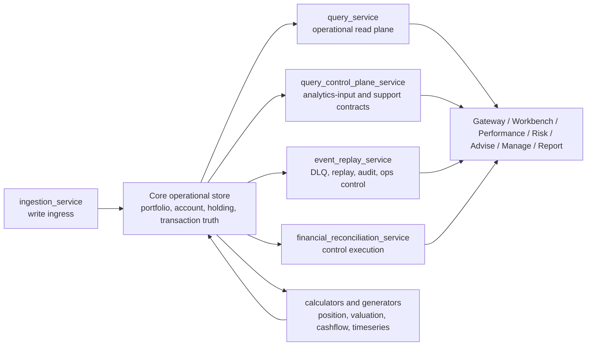

# Architecture

`lotus-core` is a domain-authoritative backend. Its design goal is clear internal ownership first:
API routes bind HTTP, application services orchestrate use cases, domain and shared libraries hold
business rules, infrastructure modules adapt persistence and external systems, and repo-native
guards enforce the boundaries.

## System Shape

## Main Runtime Areas

### `query_service`

Operational read-plane API for canonical portfolio, position, transaction, market, lookup, and
reporting-oriented reads.

### `query_control_plane_service`

Governed downstream contract plane for:

- analytics inputs
- benchmark and reference inputs
- snapshots and simulations
- support and lineage
- integration policy and capabilities
- export lifecycle and supportability surfaces

### `ingestion_service`

Write-ingress and adapter upload contracts for source data.

### `event_replay_service`

Replay, ingestion-health, DLQ, and operations control-plane contracts.

Current structure:

| Layer | Responsibility |
| --- | --- |
| `app/routers/` | HTTP binding, FastAPI dependencies, DTO construction, and error mapping only. |
| `app/application/` | Replay commands, query services, retry payload policies, audit/state orchestration, and command errors. |
| `app/dependencies.py` | Runtime composition for command/query services and replay payload dispatchers. |

Do not put replay payload construction, deterministic fingerprinting, consumer-DLQ candidate
selection, audit persistence, retry/bookkeeping state transitions, or query envelope totals in the
router.

### `financial_reconciliation_service`

Control execution and reconciliation run contracts.

### calculators and generators

- position calculator
- valuation calculator
- cashflow calculator
- timeseries generator

## Architecture references

- [Architecture Index](../docs/architecture/README.md)
- [Target Architecture](../docs/architecture/lotus-core-target-architecture.md)
- [Microservice Boundaries and Trigger Matrix](../docs/architecture/microservice-boundaries-and-trigger-matrix.md)
- [RFC-0082 Contract Family Inventory](../docs/architecture/RFC-0082-contract-family-inventory.md)
- [Query Service And Control Plane Boundary](../docs/architecture/QUERY-SERVICE-AND-CONTROL-PLANE-BOUNDARY.md)
- [RFC-0083 Target-State Gap Analysis](../docs/architecture/RFC-0083-target-state-gap-analysis.md)
- [System Data Flow](System-Data-Flow)
- [Outbox Events](Outbox-Events)

## Ownership rule

If a proposed change blurs foundational source-data ownership with downstream analytics ownership,
the change belongs in architecture review before implementation.

If a proposed change adds route-local database sessions, repository construction, external clients,
file access, or business workflow logic, it must either move behind a service/use-case boundary or
be registered as explicit transitional debt in the API-router boundary exception registry.

If a proposed change adds or expands a deployable service, worker, scheduler, or runtime boundary,
first prove the in-process package/use-case/port/adapter boundary is insufficient and record the
runtime-boundary decision evidence. Important modules default to `no split yet` until scale,
deployment cadence, operations ownership, persistence ownership, failure isolation, security, or
SLO evidence changes that decision.
