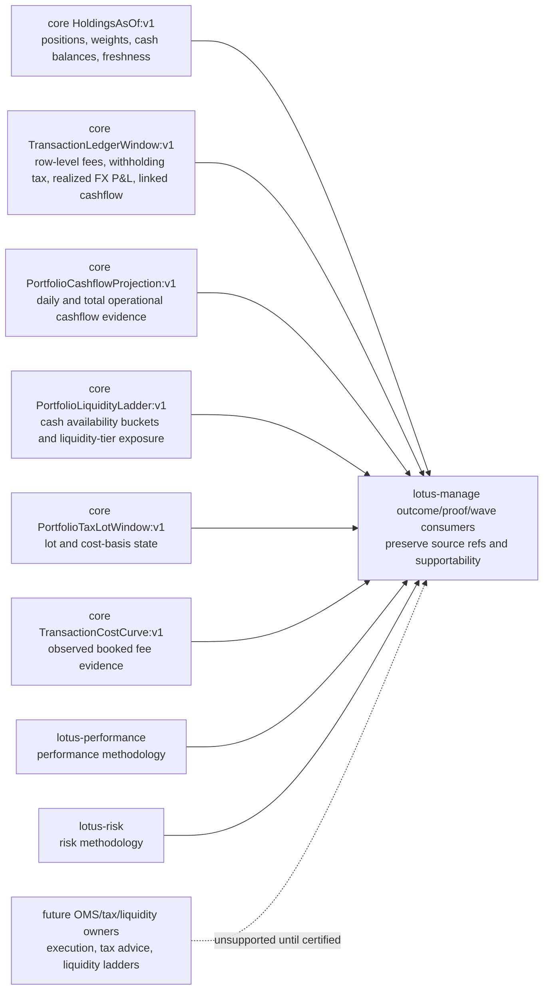
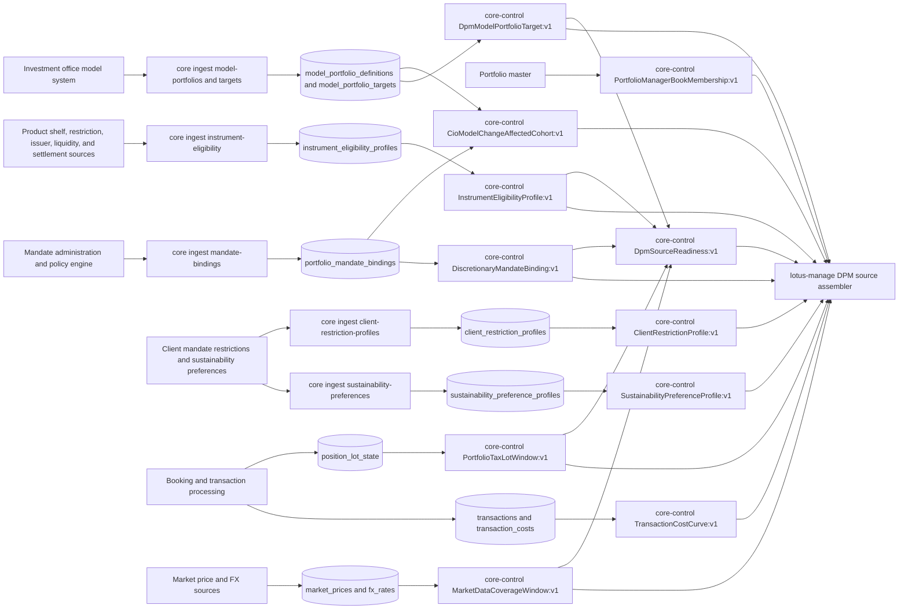
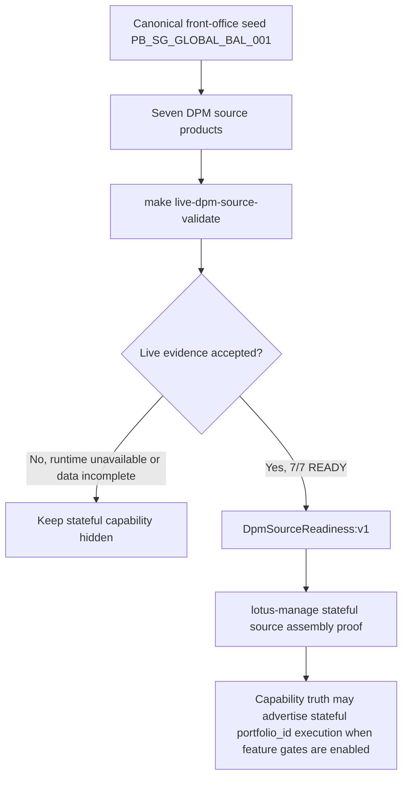

# Mesh Data Products

## Mesh role

`lotus-core` is a maturity-wave producer in the Lotus enterprise data mesh.

## Governed product

- Product ID: `lotus-core:PortfolioStateSnapshot:v1`
- Product role: authoritative portfolio state snapshot for downstream performance, risk, advisory, reporting, management, gateway, and Workbench discovery flows
- Source declaration: `contracts/domain-data-products/`
- Trust telemetry: `contracts/trust-telemetry/`

## Active DPM Source Products

RFC-087 Slices 4 through 9 and the RFC41-WTBD-001/RFC41-WTBD-002 source-owner foundations promote the first DPM
source products for `lotus-manage` discretionary mandate portfolio management.

These products support discretionary mandate portfolio management rather than advisor proposal
generation. In business terms, `lotus-core` supplies the governed facts that a portfolio manager
needs before `lotus-manage` can calculate a rebalance: the approved model, the mandate authority,
the investable/restricted universe, tax lots, observed transaction-cost evidence, market prices,
FX coverage, client restriction profiles, sustainability preferences, an operator-grade
source-family readiness decision, first-wave PM-book membership from portfolio master data, and
CIO model-change affected-mandate discovery from approved model and mandate-binding data.
`lotus-manage` remains the execution and decisioning application; `lotus-core` remains the
source-data authority.

| Product | Route | Purpose | Current proof |
| --- | --- | --- | --- |
| `DpmModelPortfolioTarget:v1` | `/integration/model-portfolios/{model_portfolio_id}/targets` | Approved effective-dated model portfolio target weights, min/max bands, lineage, and supportability for stateful DPM source assembly. | Implemented, CI-backed, and live-proven on 2026-05-02; canonical proof returned READY with nine targets totaling `1.0000000000`. |
| `DiscretionaryMandateBinding:v1` | `/integration/portfolios/{portfolio_id}/mandate-binding` | Effective-dated portfolio mandate, objective, model, policy, authority, jurisdiction, booking center, tax-awareness, settlement-awareness, review cadence, review dates, and rebalance constraints. | Implemented, CI-backed, and live-proven on 2026-05-02; RFC38-WTBD-005 enriched the canonical source contract with mandate objective and review-cycle fields on 2026-05-10, with missing fields degrading supportability instead of being locally defaulted. |
| `InstrumentEligibilityProfile:v1` | `/integration/instruments/eligibility-bulk` | Bulk product-shelf, restriction, liquidity, issuer, and settlement eligibility for held and target instruments. | Implemented, CI-backed, and live-proven on 2026-05-02; canonical proof returned READY eligibility, including the expected restricted private-credit buy block. |
| `PortfolioTaxLotWindow:v1` | `/integration/portfolios/{portfolio_id}/tax-lots` | Portfolio-window tax lots and cost-basis state for tax-aware DPM sell decisions without production per-security fan-out. | Implemented, CI-backed, and live-proven on 2026-05-02; canonical proof returned READY portfolio tax-lot coverage for the managed mandate portfolio. |
| `TransactionCostCurve:v1` | `/integration/portfolios/{portfolio_id}/transaction-cost-curve` | Source-owned observed booked transaction-fee evidence grouped by security, transaction type, and currency so proof packs can distinguish source-backed costs from local estimates. This is not a predictive market-impact quote. | Implemented and locally proven for RFC40-WTBD-007 source ownership. Downstream `lotus-manage` consumption remains the next WTBD slice before client-facing proof packs may advertise source-backed transaction-cost curves. |
| `MarketDataCoverageWindow:v1` | `/integration/market-data/coverage` | Held and target universe price and FX coverage diagnostics for valuation, drift, cash conversion, and rebalance sizing. The implementation-backed methodology is documented in `docs/methodologies/source-data-products/market-data-coverage-window.md`. | Implemented, CI-backed, and live-proven on 2026-05-02; canonical proof returned READY market-data and FX coverage for the held and target universe. The product supports readiness diagnostics only and does not claim valuation methodology, FX attribution, liquidity ladders, market impact, best execution, venue routing, or OMS acknowledgement. |
| `DpmSourceReadiness:v1` | `/integration/portfolios/{portfolio_id}/dpm-source-readiness` | Operator-grade readiness summary for mandate, model target, eligibility, tax-lot, and market-data source families before stateful DPM promotion. The implementation-backed methodology is documented in `docs/methodologies/source-data-products/dpm-source-readiness.md`. | Implemented, CI-backed, and live-proven on 2026-05-02; canonical proof returned READY across all five source families. The product supports fail-closed workflow gating and operator routing only; it does not claim mandate approval, suitability, valuation, FX attribution, liquidity ladders, execution quality, best execution, venue routing, or OMS acknowledgement. |
| `PortfolioManagerBookMembership:v1` | `/integration/portfolio-manager-books/{portfolio_manager_id}/memberships` | Source-owned PM-book membership resolved from core portfolio master `advisor_id`, as-of lifecycle, active status, booking center, and portfolio type filters. | Implemented and locally proven for RFC41-WTBD-001 source ownership. It deliberately does not claim a full relationship-householding hierarchy or entitlement model. |
| `CioModelChangeAffectedCohort:v1` | `/integration/model-portfolios/{model_portfolio_id}/affected-mandates` | Source-owned CIO model-change affected-mandate cohort resolved from the approved model definition and effective active discretionary mandate bindings, with deterministic event identity, snapshot identity, supportability, and lineage. | Implemented and locally proven for RFC41-WTBD-002 source ownership. It deliberately does not claim tactical house-view, risk-event, campaign, or OMS execution authority. |
| `ClientRestrictionProfile:v1` | `/integration/portfolios/{portfolio_id}/client-restriction-profile` | Effective-dated client and mandate restriction profile for DPM buy/sell controls, including scoped instrument, asset-class, issuer, and country restrictions with lineage and supportability. | Implemented and locally proven for RFC40-WTBD-008 source ownership. Canonical seed coverage includes private-credit and sanctioned-market buy restrictions. Downstream `lotus-manage` consumption remains the next WTBD slice before client-facing proof packs may advertise source-backed restriction enforcement. |
| `SustainabilityPreferenceProfile:v1` | `/integration/portfolios/{portfolio_id}/sustainability-preference-profile` | Effective-dated sustainability preference profile for mandate-aware portfolio construction, including allocation bounds, exclusions, positive tilts, framework, source, and lineage. | Implemented and locally proven for RFC40-WTBD-008 source ownership. Canonical seed coverage includes a minimum sustainable allocation, thermal-coal exclusion, and low-carbon-transition positive tilt. Downstream `lotus-manage` consumption remains the next WTBD slice before client-facing proof packs may advertise source-backed sustainability preference enforcement. |
| `PortfolioCashflowProjection:v1` | `/portfolios/{portfolio_id}/cashflow-projection` | Core-derived daily cashflow projection for operational cash-movement evidence. It exposes daily booked cashflow, projected settlement cashflow, net cashflow, cumulative cashflow, booked/projected/net totals, source-data product identity, portfolio base currency, runtime metadata, data-quality posture, latest evidence timestamp, and deterministic projection fingerprint for downstream outcome and liquidity consumers. | Implemented and locally proven in RFC-0042 WTBD-006 source-owner hardening; live front-office proof remains part of the consuming manage slice. |
| `PortfolioLiquidityLadder:v1` | `/portfolios/{portfolio_id}/liquidity-ladder` | Source-owned cash-availability ladder evidence. It exposes opening source cash, deterministic T0/T+1/T+2-to-T+7/T+8-to-T+30/T+31-to-horizon cash buckets, booked and projected settlement cashflow contributions, cumulative cash availability, maximum cash shortfall, non-cash exposure by instrument liquidity tier, runtime metadata, data-quality posture, evidence timestamp, and deterministic source fingerprint. | Implemented and locally proven in RFC-0042 WTBD-006 source-owner hardening. It is evidence for monitoring, reporting, DPM supportability, and client explanation; it is not an advice recommendation, income plan, funding recommendation, OMS execution forecast, tax methodology, best-execution assessment, or market-impact model. |

## Realized Outcome Evidence Boundaries

Outcome review, proof-pack, and wave surfaces are bank-buyable only when they preserve the
difference between source-owned evidence and downstream interpretation. `lotus-core` currently owns
recorded portfolio, transaction, tax-lot, observed-fee, and operational cashflow facts. It does not
own risk methodology, performance returns, client tax advice, liquidity planning, execution routing,
or OMS acknowledgement methodology.

| Audience | What this means |
| --- | --- |
| Business users | Core supplies recorded facts such as holdings, cash totals, transaction fees, withholding tax, realized FX P&L, linked cashflow rows, tax lots, observed fee evidence, and operational cashflow projections. Decisioning products can explain those facts but must not silently invent a broader methodology. |
| Developers and architects | Use `HoldingsAsOf:v1`, `MarketDataCoverageWindow:v1`, `TransactionLedgerWindow:v1`, `PortfolioTaxLotWindow:v1`, `TransactionCostCurve:v1`, `PortfolioCashflowProjection:v1`, and `PortfolioLiquidityLadder:v1` as explicit source products. Preserve the source measure, source unit, selected field, supportability state, lineage/source ref, evidence timestamp, and product identity in downstream contracts. |
| Operations | Investigate stale, partial, or missing evidence at the owning source product before treating a manage/risk/performance surface as wrong. If a source product is unavailable or outside scope, downstream products should degrade rather than recalculate locally. |
| Sales and client demos | Position the platform as source-governed: recorded ledger and portfolio facts are traceable to core, analytics are owned by their specialist services, and unsupported execution/tax/liquidity claims remain visibly outside the supported boundary. |

`TransactionLedgerWindow:v1` is the governed source for explicit transaction-row measures such as
trade fees, transaction-cost records, withholding tax, other deductions, net interest, realized
capital/FX/total P&L fields, linked cashflow records, and FX/event linkage identifiers. It is not an
execution-quality, tax-advice, liquidity-planning, cash-movement aggregation, FX-attribution, or
transaction-cost methodology product.

`HoldingsAsOf:v1` is the governed source for position rows, position weights, current-epoch
supportability, held-since dates, cash-account balances, portfolio/base currency, optional cash
reporting-currency restatement, and holdings evidence timestamps. It is not a performance-return,
risk-exposure, liquidity-ladder, income-need, tax-advice, execution-quality, or OMS acknowledgement
product.

Its current implementation-backed methodology is conservative: the product resolves booked and
projected-inclusive holdings modes, reconciles snapshot-backed positions to latest current-epoch
history quantity, supplements missing snapshot securities from position history, preserves valuation
continuity for supplement rows, checks non-cash market-price freshness against the response as-of
date, classifies unknown, partial, stale, and complete posture, and builds cash balances from cash
snapshot rows plus cash-account master data without deriving downstream liquidity, risk,
performance, tax, or execution conclusions.

`MarketDataCoverageWindow:v1` is the governed source for DPM market-price and FX coverage
diagnostics over an explicit held and target universe. It resolves latest market prices and FX
rates on or before the requested as-of date, preserves per-instrument and per-pair status, reports
missing and stale observations, and classifies batch readiness as ready, degraded, or incomplete.
It is not a valuation engine, FX attribution method, liquidity ladder, cash forecast,
market-impact model, execution-quality assessment, best-execution certification, venue-routing
model, or OMS acknowledgement.

`DpmSourceReadiness:v1` composes mandate binding, model targets, instrument eligibility, portfolio
tax lots, and market-data coverage into one fail-closed readiness envelope. `UNAVAILABLE` source
families outrank `INCOMPLETE`, `INCOMPLETE` outranks `DEGRADED`, and only five ready families
produce `DPM_SOURCE_READINESS_READY`. This lets operations and downstream DPM services route source
blockers without reconstructing mandate, eligibility, tax, market-data, valuation, suitability,
liquidity, execution, or OMS truth.

`TransactionLedgerWindow:v1` current implementation-backed methodology is deterministic: the
product filters booked transaction rows by portfolio, optional instrument/security, transaction
type, FX/event linkage, date window, and effective as-of date; preserves joined row-level
transaction-cost and cashflow evidence; optionally populates reporting-currency fields from latest
available FX rates, including explicit row-level realized FX P&L local evidence; and classifies
empty, complete, and paged windows without deriving tax advice, FX attribution, cash-movement
aggregation, transaction-cost curves, execution quality, or OMS acknowledgement.

`PortfolioCashflowProjection:v1` is the governed source for daily booked cashflow, projected
settlement cashflow, net cashflow points, cumulative cashflow over the returned window,
booked/projected/net totals, portfolio currency, include-projected posture, evidence timestamp, and
deterministic source fingerprint. It is not a client income plan, liquidity ladder, funding
recommendation, market-impact estimate, or OMS execution forecast.

Its current implementation-backed methodology is deterministic: booked mode uses latest
portfolio-flow cashflow rows through `as_of_date`; projected mode extends the returned date window
and adds only settlement-dated future external `DEPOSIT` and `WITHDRAWAL` movements that were booked
before the projection start date. Same-day booked and projected movements are additive but remain
separately visible through component fields, empty days carry forward the prior cumulative value, and
all monetary fields remain in the portfolio base currency.

`PortfolioLiquidityLadder:v1` is the governed source for cash-availability ladder evidence. It
starts from source cash balances, overlays booked and optional projected settlement-dated external
cashflows, groups the result into deterministic liquidity buckets, reports cumulative cash
availability and maximum shortfall, and groups non-cash holdings by source-owned instrument
liquidity tier. It is intentionally evidence-only: downstream consumers may use the facts for
monitoring, reporting, DPM supportability, and client explanation, but must not present it as an
advice recommendation, client income plan, funding recommendation, OMS execution forecast,
best-execution assessment, tax methodology, or market-impact model.

`PortfolioTaxLotWindow:v1` is the governed source for effective-dated lot and cost-basis state from
`position_lot_state`, including open/original quantity, acquisition date, base and local cost basis,
local currency when source transaction currency is available, source transaction id, calculation
policy id/version, and supportability. It is not jurisdiction-specific tax advice, realized-tax
optimization, wash-sale treatment, client-tax approval, or tax-reporting certification.

`TransactionCostCurve:v1` is the governed source for observed booked transaction-fee evidence
grouped by security, transaction type, and fee currency. Its implementation-backed methodology uses
explicit `transaction_costs` rows when present, falls back to `trade_fee` only when explicit cost
rows are absent, filters unusable zero-fee or zero-notional observations, and computes total cost,
total absolute notional, notional-weighted average cost bps, min cost bps, and max cost bps for each
group. It is not an execution-quality, market-impact, venue-routing, best-execution, OMS
acknowledgement, or minimum-cost execution methodology.

## Audience Guide

| Audience | How to use this page |
| --- | --- |
| Business and product | Use the active product table to explain what governed data supports discretionary mandate portfolio management and why stateful execution is not promoted until every source family is ready. |
| Sales and client demos | Use the diagram to describe how the platform separates source-data authority from rebalance decisioning. Core source products and direct manage integration are live-certified; external channel publication remains controlled by `lotus-manage` feature gates. |
| Operations | Use the proof posture and operating rule sections to understand whether an incident is a source-data availability issue, a stale/missing-data issue, or a management execution issue. |
| Developers and architects | Use the route and product names as the integration contract. New DPM needs should extend the product-specific catalog rather than creating a monolithic execution-context endpoint. |

## Proof Posture

Current implementation proof is local, CI-backed, and live-proven on the canonical core/manage
proof path.

| Proof area | Current state |
| --- | --- |
| Source-product implementation | Implemented for model targets, mandate binding, instrument eligibility, portfolio tax lots, observed transaction-cost curves, market-data/FX coverage, client restriction profiles, sustainability preferences, DPM source-family readiness, first-wave PM-book membership, and first-wave CIO model-change affected-cohort discovery. |
| Local validation | Source-data product guard, domain-product validation, focused validator tests, OpenAPI contract tests, and product-specific service/router tests exist. |
| Reusable live validation | `make live-dpm-source-validate` runs `scripts/validate_live_dpm_source_products.py` against `core-control.dev.lotus`. |
| Latest live attempt | Passed: `make live-dpm-source-validate` returned 7/7 probes with READY source-family evidence on 2026-05-02. |
| Stateful `lotus-manage` promotion | Service-level proof passed: `make live-api-validate-core` in `lotus-manage` returned 11/11 probes with stateful core sourcing available. Runtime publication remains controlled by explicit feature gates. |

## Future DPM Source Products

All first-wave RFC-087 DPM source-product declarations are now active. RFC41-WTBD-001 adds
PM-book membership, RFC41-WTBD-002 adds CIO model-change affected-mandate discovery,
RFC40-WTBD-007 adds observed transaction-cost curve source ownership, and RFC40-WTBD-008 adds
client restriction and sustainability preference source ownership without moving rebalance
decisioning, suitability adjudication, or execution pricing into core. New proposed products
should be added only through a follow-up RFC or explicit RFC extension with implementation
evidence.

There are currently no remaining planned DPM source products in the in-code planned catalog.

## Platform relationship

`lotus-platform` aggregates the repo-native declaration, validates trust telemetry, applies mesh SLO/access/evidence policies, and includes this product in generated catalog, dependency graph, live certification, maturity matrix, evidence packs, and RFC-0092 operating reports.

## Operating rule

Do not duplicate product authority in gateway, Workbench, or platform. Changes to portfolio-state product identity, lifecycle, telemetry, or evidence must start in `lotus-core` and then pass platform mesh certification.

For RFC-087 specifically, do not add a single "DPM execution context" endpoint to core. Core should
continue to expose governed source products with clear ownership and supportability. Composition
belongs in `lotus-manage`, and downstream routing belongs in Gateway after the manage contract is
certified.
