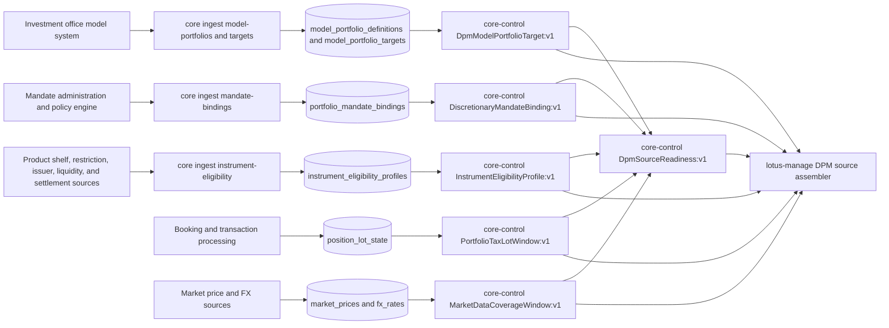
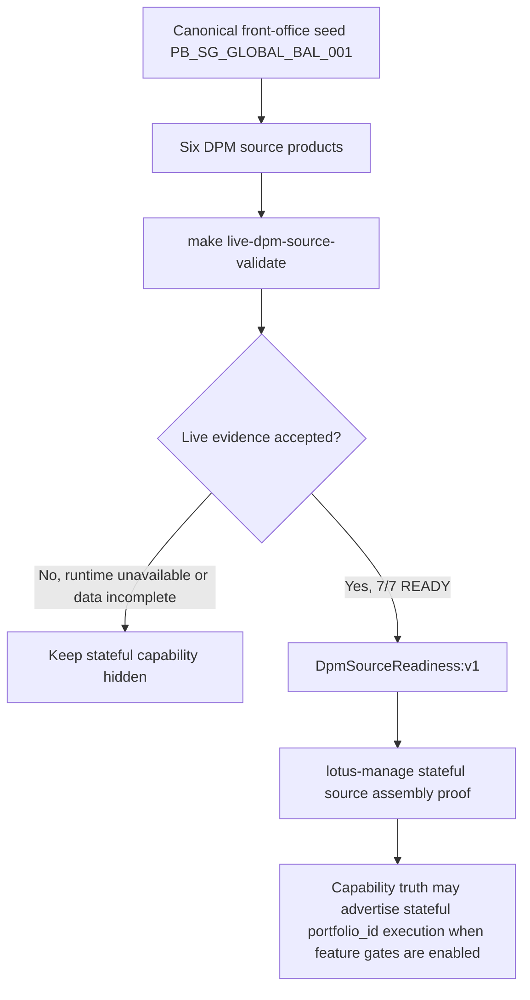

# Mesh Data Products

## Mesh role

`lotus-core` is a maturity-wave producer in the Lotus enterprise data mesh.

## Governed product

- Product ID: `lotus-core:PortfolioStateSnapshot:v1`
- Product role: authoritative portfolio state snapshot for downstream performance, risk, advisory, reporting, management, gateway, and Workbench discovery flows
- Source declaration: `contracts/domain-data-products/`
- Trust telemetry: `contracts/trust-telemetry/`

## Active DPM Source Products

RFC-087 Slices 4 through 9 promote the first DPM source products for `lotus-manage` discretionary
mandate portfolio management.

These products support discretionary mandate portfolio management rather than advisor proposal
generation. In business terms, `lotus-core` supplies the governed facts that a portfolio manager
needs before `lotus-manage` can calculate a rebalance: the approved model, the mandate authority,
the investable/restricted universe, tax lots, market prices, FX coverage, and an operator-grade
source-family readiness decision. `lotus-manage` remains the execution and decisioning application;
`lotus-core` remains the source-data authority.

| Product | Route | Purpose | Current proof |
| --- | --- | --- | --- |
| `DpmModelPortfolioTarget:v1` | `/integration/model-portfolios/{model_portfolio_id}/targets` | Approved effective-dated model portfolio target weights, min/max bands, lineage, and supportability for stateful DPM source assembly. | Implemented, CI-backed, and live-proven on 2026-05-02; canonical proof returned READY with nine targets totaling `1.0000000000`. |
| `DiscretionaryMandateBinding:v1` | `/integration/portfolios/{portfolio_id}/mandate-binding` | Effective-dated portfolio mandate, model, policy, authority, jurisdiction, booking center, tax-awareness, settlement-awareness, and rebalance constraints. | Implemented, CI-backed, and live-proven on 2026-05-02; canonical proof returned the discretionary mandate binding to `MODEL_PB_SG_GLOBAL_BAL_DPM`. |
| `InstrumentEligibilityProfile:v1` | `/integration/instruments/eligibility-bulk` | Bulk product-shelf, restriction, liquidity, issuer, and settlement eligibility for held and target instruments. | Implemented, CI-backed, and live-proven on 2026-05-02; canonical proof returned READY eligibility, including the expected restricted private-credit buy block. |
| `PortfolioTaxLotWindow:v1` | `/integration/portfolios/{portfolio_id}/tax-lots` | Portfolio-window tax lots and cost-basis state for tax-aware DPM sell decisions without production per-security fan-out. | Implemented, CI-backed, and live-proven on 2026-05-02; canonical proof returned READY portfolio tax-lot coverage for the managed mandate portfolio. |
| `MarketDataCoverageWindow:v1` | `/integration/market-data/coverage` | Held and target universe price and FX coverage diagnostics for valuation, drift, cash conversion, and rebalance sizing. | Implemented, CI-backed, and live-proven on 2026-05-02; canonical proof returned READY market-data and FX coverage for the held and target universe. |
| `DpmSourceReadiness:v1` | `/integration/portfolios/{portfolio_id}/dpm-source-readiness` | Operator-grade readiness summary for mandate, model target, eligibility, tax-lot, and market-data source families before stateful DPM promotion. | Implemented, CI-backed, and live-proven on 2026-05-02; canonical proof returned READY across all five source families. |
| `PortfolioCashflowProjection:v1` | `/portfolios/{portfolio_id}/cashflow-projection` | Core-derived daily net cashflow projection for operational liquidity planning. It exposes source-data product identity, runtime metadata, data-quality posture, latest evidence timestamp, and deterministic projection fingerprint for downstream outcome and liquidity consumers. | Implemented and locally proven in RFC-0042 WTBD-006 source-owner hardening; live front-office proof remains part of the consuming manage slice. |

## Audience Guide

| Audience | How to use this page |
| --- | --- |
| Business and product | Use the active product table to explain what governed data supports discretionary mandate portfolio management and why stateful execution is not promoted until every source family is ready. |
| Sales and client demos | Use the diagram to describe how the platform separates source-data authority from rebalance decisioning. Core source products and direct manage integration are live-certified; external channel publication remains controlled by `lotus-manage` feature gates. |
| Operations | Use the proof posture and operating rule sections to understand whether an incident is a source-data availability issue, a stale/missing-data issue, or a management execution issue. |
| Developers and architects | Use the route and product names as the integration contract. New DPM needs should extend the product-specific catalog rather than creating a monolithic execution-context endpoint. |

## Proof Posture

Current implementation proof is local, CI-backed, and live-proven on the canonical core/manage
proof path.

| Proof area | Current state |
| --- | --- |
| Source-product implementation | Implemented for model targets, mandate binding, instrument eligibility, portfolio tax lots, market-data/FX coverage, and DPM source-family readiness. |
| Local validation | Source-data product guard, domain-product validation, focused validator tests, OpenAPI contract tests, and product-specific service/router tests exist. |
| Reusable live validation | `make live-dpm-source-validate` runs `scripts/validate_live_dpm_source_products.py` against `core-control.dev.lotus`. |
| Latest live attempt | Passed: `make live-dpm-source-validate` returned 7/7 probes with READY source-family evidence on 2026-05-02. |
| Stateful `lotus-manage` promotion | Service-level proof passed: `make live-api-validate-core` in `lotus-manage` returned 11/11 probes with stateful core sourcing available. Runtime publication remains controlled by explicit feature gates. |

## Future DPM Source Products

All first-wave RFC-087 DPM source-product declarations are now active. New proposed products should
be added only through a follow-up RFC or explicit RFC-087 extension with implementation evidence.

There are currently no remaining planned DPM source products in the in-code planned catalog.

## Platform relationship

`lotus-platform` aggregates the repo-native declaration, validates trust telemetry, applies mesh SLO/access/evidence policies, and includes this product in generated catalog, dependency graph, live certification, maturity matrix, evidence packs, and RFC-0092 operating reports.

## Operating rule

Do not duplicate product authority in gateway, Workbench, or platform. Changes to portfolio-state product identity, lifecycle, telemetry, or evidence must start in `lotus-core` and then pass platform mesh certification.

For RFC-087 specifically, do not add a single "DPM execution context" endpoint to core. Core should
continue to expose governed source products with clear ownership and supportability. Composition
belongs in `lotus-manage`, and downstream routing belongs in Gateway after the manage contract is
certified.
