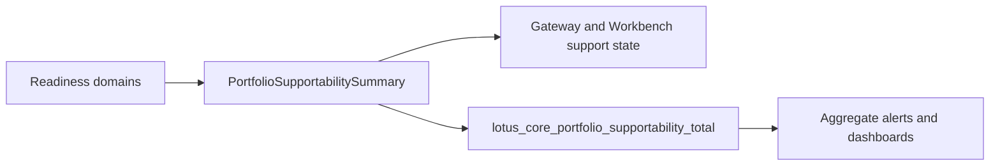

# Operations Runbook

## Main operational surfaces

- app-local compose runtime
- migration-runner and kafka-topic-creator startup prerequisites
- replay and ingestion-health contracts
- support and lineage APIs
- reconciliation runs
- demo data pack loading

Executable incident playbooks are maintained in
`contracts/operations/incident-playbooks.v1.json`, summarized in
[Incident Playbooks](../docs/operations/Incident-Playbooks.md), and validated by
`make incident-playbook-guard`.

Guarded incident IDs: `ingestion-stuck-failed`, `dlq-growth`, `replay-failure`, `outbox-backlog`,
`valuation-aggregation-lag`, `stale-source-data`, `reconciliation-failure`, `readiness-failure`,
`database-connectivity`, `kafka-connectivity`, and `security-audit-denial-spikes`.

## Useful commands

```bash
docker compose up -d
docker compose logs --tail=200 demo_data_loader
docker compose logs --tail=200 migration-runner
docker compose logs --tail=200 kafka-topic-creator
make test-docker-smoke
```

## Preferred diagnostics

Use APIs before going directly to the database where possible:

- support overview:
  `GET /support/portfolios/{portfolio_id}/overview`
- readiness:
  `GET /support/portfolios/{portfolio_id}/readiness?as_of_date=YYYY-MM-DD`
- lineage routes:
  `GET /lineage/portfolios/{portfolio_id}/keys`
- replay evidence:
  `GET /support/portfolios/{portfolio_id}/reprocessing-keys`
  `GET /support/portfolios/{portfolio_id}/reprocessing-jobs`
- reconciliation run inspection:
  `GET /support/portfolios/{portfolio_id}/reconciliation-runs`
- institutional load progress:
  `GET /support/load-runs/{run_id}?business_date=YYYY-MM-DD`

For event-publication drift, inspect outbox backlog and dispatcher health before assuming downstream
consumer faults.

## Preferred diagnostic sequence

When a portfolio or load scenario looks wrong, check in this order:

1. support overview or load-run progress for the first truthful status
2. readiness when the question is front-office or workflow gating rather than operator backlog
3. replay, valuation, aggregation, and reconciliation listings when support evidence shows lag or
   blocking controls
4. lineage routes when the problem is narrowed to a portfolio-security key
5. database facts only when rollout mismatch, migration doubt, or API/schema drift makes the API
   evidence insufficient

## Portfolio Readiness Observability

`GET /support/portfolios/{portfolio_id}/readiness` is the source-owned supportability surface for
front-office portfolio readiness. The response `supportability` object publishes:

- `feature_key`: `core.observability.portfolio_supportability`
- `state`: `ready`, `degraded`, or `empty`
- `reason`: a bounded `portfolio_supportability_*` reason
- `freshness_bucket`: `current`, `stale`, or `unknown`
- `metric_labels`: `state`, `reason`, and `freshness_bucket`

The matching Prometheus counter is `lotus_core_portfolio_supportability_total`. Do not add
portfolio, account, client, transaction, security, trace, correlation, request-body, or
response-body fields to metric labels. Use readiness payload fields for drill-through, and use
metrics only for aggregate supportability posture.



## Canonical front-office reseed

Routine canonical front-office reseeding is scoped to `PB_SG_GLOBAL_BAL_001`. The seed tool may
clear known volatile replay fences for canonical seed topics when local Kafka offsets have been
reset or reused, but it must not perform broad `processed_events` deletion. If broader local
runtime state is polluted, reset the Docker-backed core runtime before reseeding.

The app-local `demo_data_loader` demo pack is diagnostic/sample-data tooling and must not be part
of canonical private-banking proof. Governed Workbench and platform QA startup set
`DEMO_DATA_PACK_ENABLED=false`; canonical `PB_SG_GLOBAL_BAL_001` data must come from
`tools/front_office_portfolio_seed.py`.

The canonical seed includes planned withdrawal evidence for both the fixed contract as-of window
and the current Workbench forward-liquidity horizon. After reseeding, `PortfolioCashflowProjection`
should show at least one non-zero point for the canonical window and one non-zero current-horizon
planned settlement point.

Projected settlements in the canonical seed must land on business days and must be covered by the
required FX pairs through the latest projected settlement date. Benchmark and FX reference coverage
extends through at least 45 calendar days after the canonical as-of date, and through any later
projected settlement date, so current-date Gateway and Workbench probes do not degrade on missing
reference series. The current raw `market_prices` and `fx_rates` contracts are point-in-time
series; when those contracts move to effective-date ranges, open-ended terminal price/rate validity
should use `3999-12-31` explicitly.

## Startup checks

When app-local runtime is unhealthy, check this order:

1. `docker compose ps`
2. `migration-runner` completed successfully
3. `kafka-topic-creator` completed successfully
4. service health routes are responding
5. demo data loader completed if the scenario expects seeded data

Runtime-facing API services and worker health web apps expose `/health/live`, `/health/ready`, and
`/metrics`. They also expose `GET /version`, which returns the image provenance values embedded
during build or deployment: Git commit SHA, Git branch, build timestamp, repo URL, image version,
image digest resolved after push, CI pipeline/run ID, and the corresponding OCI label/release
metadata map. Local builds report `image_digest: "unknown"` unless the build/release lane or deploy
manifest supplies `LOTUS_IMAGE_DIGEST`. The final registry digest is release/deployment metadata;
it cannot be truthfully baked as a self-digest label during the same image build because changing
that label changes the digest.

`/health/live` and `/health/ready` include a bounded `runtime` block with service name, app
version, environment, runtime profile, router started-at time, uptime seconds, and the same shared
build metadata payload. Missing build metadata is explicit as `unknown` in local development and
does not fail probes.

Health responses include `X-Correlation-ID`, `X-Request-Id`, `X-Trace-Id`, and
`traceparent` headers so incident triage can tie probe behavior to request logs and route-template
HTTP metrics. Valid incoming W3C `traceparent` headers are preserved. Requests with only
`X-Trace-Id`, or no trace headers, receive a W3C-shaped `traceparent` with a fresh non-zero span id.
This is propagation context for Lotus diagnostics; it is not a standalone claim that OpenTelemetry
export or an APM collector is configured.

Readiness dependency checks emit bounded Prometheus telemetry:

- `health_dependency_check_total{service,dependency,status}`
- `health_dependency_check_duration_seconds{service,dependency}`
- `health_readiness_state{service,state}`

Use these for dependency flapping and latency trends. Keep portfolio, security, request,
correlation, trace, and raw exception details in logs or support APIs, not metric labels.

Metric vocabulary is guarded by `make metric-vocabulary-guard`. HTTP request metrics use
`endpoint_template` for route templates; raw `path`, portfolio/account/client/security IDs,
request/correlation/trace IDs, payload fields, stack traces, and raw exception text are forbidden
Prometheus labels. Service-local metrics must either move to `portfolio_common.monitoring` or be
registered with an owner in `SERVICE_LOCAL_METRIC_OWNERS`.

Image provenance is guarded by `make image-provenance-guard`. It checks service Dockerfile OCI
labels, CI prebuild build args, CI-only image publication, full Git SHA image tags, release digest
manifests, SBOM artifact/provenance/signing/scan workflow controls, digest-based Kubernetes image
references, same-image promotion evidence across `dev`, `uat`, and `prod`, no secret-like build
ARG/ENV additions, and the shared `/version` route.

HTTP security-control coverage is guarded by `make security-control-coverage-guard`. Production-like
profiles must set non-wildcard `LOTUS_HTTP_TRUSTED_HOSTS`; local/dev/test profiles default to `*`
for app-local compatibility. Browser CORS remains deny-by-default unless
`LOTUS_HTTP_CORS_ALLOW_ORIGINS` is configured.

Kafka consumers inheriting `BaseConsumer` emit:

- `kafka_consumer_events_total{service,topic,group_id,outcome,reason}`
- `kafka_consumer_processing_duration_seconds{service,topic,group_id}`

Use these for worker fleet dashboards and incident triage across processing attempts, successes,
retryable failures, terminal failures, DLQ outcomes, commit failures, poll errors, critical loop
exits, and shutdown failures. Keep message keys, offsets, payload fields, raw exception text,
portfolio/security IDs, request/correlation IDs, and trace IDs out of metric labels.

Operational logs in guarded health, Kafka, outbox, ingestion, query, replay, and scheduler paths
use constant messages with `event_name`, `operation`, `status`, and `reason_code` structured
fields. Use `portfolio_common.logging_utils.operation_log_extra(...)` or
`log_operation_event(...)` for new operational logs in these paths. Do not embed portfolio,
account, client, security, request, correlation, or trace identifiers in free-text log messages; use
support APIs, audit records, DLQ evidence, or bounded structured fields for drill-through.

Run the guard with:

```bash
make structured-log-guard
```

It is also part of `make lint`.

## Database-first diagnostics

Prefer API diagnostics first, but go to the database when:

- service rollout has not caught up with support telemetry changes
- migration state is in doubt
- you need durable truth for queue or materialization state
- you need exact run-scoped facts after a branch-only telemetry change has not yet reached the
  running stack

For schema state:

```bash
python -m alembic current
```

## Operational boundary

Treat these as `lotus-core` issues:

- ingestion, persistence, replay, and DLQ behavior
- position, valuation, and timeseries materialization
- support, lineage, and reconciliation evidence
- app-local schema or topic bring-up

Treat these as `lotus-platform` issues:

- shared ingress
- cross-repo environment wiring
- platform-owned runtime automation
- ecosystem-level validation governance

## Important rule

When shared infrastructure ownership is the issue, move to `lotus-platform`. When the issue is core
domain truth, replay, persistence, or supportability behavior, stay in `lotus-core`.

## Related references

- [Support and Lineage](Support-and-Lineage)
- [Query Control Plane](Query-Control-Plane)
- [Architecture Index](../docs/architecture/README.md)
