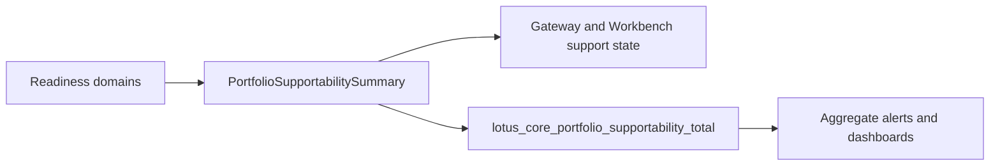

# Operations Runbook

## Main operational surfaces

- app-local compose runtime
- migration-runner and kafka-topic-creator startup prerequisites
- replay and ingestion-health contracts
- support and lineage APIs
- reconciliation runs
- demo data pack loading

## Useful commands

```bash
docker compose up -d
docker compose logs --tail=200 demo_data_loader
docker compose logs --tail=200 migration-runner
docker compose logs --tail=200 kafka-topic-creator
make test-docker-smoke
```

## Preferred diagnostics

Use APIs before going directly to the database where possible:

- support overview:
  `GET /support/portfolios/{portfolio_id}/overview`
- readiness:
  `GET /support/portfolios/{portfolio_id}/readiness?as_of_date=YYYY-MM-DD`
- lineage routes:
  `GET /lineage/portfolios/{portfolio_id}/keys`
- replay evidence:
  `GET /support/portfolios/{portfolio_id}/reprocessing-keys`
  `GET /support/portfolios/{portfolio_id}/reprocessing-jobs`
- reconciliation run inspection:
  `GET /support/portfolios/{portfolio_id}/reconciliation-runs`
- institutional load progress:
  `GET /support/load-runs/{run_id}?business_date=YYYY-MM-DD`

For event-publication drift, inspect outbox backlog and dispatcher health before assuming downstream
consumer faults.

## Preferred diagnostic sequence

When a portfolio or load scenario looks wrong, check in this order:

1. support overview or load-run progress for the first truthful status
2. readiness when the question is front-office or workflow gating rather than operator backlog
3. replay, valuation, aggregation, and reconciliation listings when support evidence shows lag or
   blocking controls
4. lineage routes when the problem is narrowed to a portfolio-security key
5. database facts only when rollout mismatch, migration doubt, or API/schema drift makes the API
   evidence insufficient

## Portfolio Readiness Observability

`GET /support/portfolios/{portfolio_id}/readiness` is the source-owned supportability surface for
front-office portfolio readiness. The response `supportability` object publishes:

- `feature_key`: `core.observability.portfolio_supportability`
- `state`: `ready`, `degraded`, or `empty`
- `reason`: a bounded `portfolio_supportability_*` reason
- `freshness_bucket`: `current`, `stale`, or `unknown`
- `metric_labels`: `state`, `reason`, and `freshness_bucket`

The matching Prometheus counter is `lotus_core_portfolio_supportability_total`. Do not add
portfolio, account, client, transaction, security, trace, correlation, request-body, or
response-body fields to metric labels. Use readiness payload fields for drill-through, and use
metrics only for aggregate supportability posture.



## Canonical front-office reseed

Routine canonical front-office reseeding is scoped to `PB_SG_GLOBAL_BAL_001`. The seed tool may
clear known volatile replay fences for canonical seed topics when local Kafka offsets have been
reset or reused, but it must not perform broad `processed_events` deletion. If broader local
runtime state is polluted, reset the Docker-backed core runtime before reseeding.

## Startup checks

When app-local runtime is unhealthy, check this order:

1. `docker compose ps`
2. `migration-runner` completed successfully
3. `kafka-topic-creator` completed successfully
4. service health routes are responding
5. demo data loader completed if the scenario expects seeded data

## Database-first diagnostics

Prefer API diagnostics first, but go to the database when:

- service rollout has not caught up with support telemetry changes
- migration state is in doubt
- you need durable truth for queue or materialization state
- you need exact run-scoped facts after a branch-only telemetry change has not yet reached the
  running stack

For schema state:

```bash
python -m alembic current
```

## Operational boundary

Treat these as `lotus-core` issues:

- ingestion, persistence, replay, and DLQ behavior
- position, valuation, and timeseries materialization
- support, lineage, and reconciliation evidence
- app-local schema or topic bring-up

Treat these as `lotus-platform` issues:

- shared ingress
- cross-repo environment wiring
- platform-owned runtime automation
- ecosystem-level validation governance

## Important rule

When shared infrastructure ownership is the issue, move to `lotus-platform`. When the issue is core
domain truth, replay, persistence, or supportability behavior, stay in `lotus-core`.

## Related references

- [Support and Lineage](Support-and-Lineage)
- [Query Control Plane](Query-Control-Plane)
- [Architecture Index](../docs/architecture/README.md)
