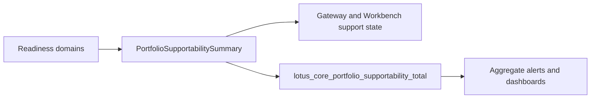

# Operations Runbook

## Main operational surfaces

- app-local compose runtime
- migration-runner and kafka-topic-creator startup prerequisites
- replay and ingestion-health contracts
- support and lineage APIs
- reconciliation runs
- demo data pack loading

Executable incident playbooks are maintained in
`contracts/operations/incident-playbooks.v1.json`, summarized in
[Incident Playbooks](../docs/operations/Incident-Playbooks.md), and validated by
`make incident-playbook-guard`.

Guarded incident IDs: `ingestion-stuck-failed`, `dlq-growth`, `replay-failure`, `outbox-backlog`,
`valuation-aggregation-lag`, `stale-source-data`, `reconciliation-failure`, `readiness-failure`,
`database-connectivity`, `kafka-connectivity`, and `security-audit-denial-spikes`.

## Durable Enterprise Access Evidence

Promoted profiles persist one typed access decision before protected work across ingestion, query,
query control plane, financial reconciliation, and event replay. Audit write failure returns
`503 security_audit_unavailable`; local/development/test profiles remain explicitly log-only.
The legacy production-security-profile opt-out cannot disable this durable control outside an
explicit local profile, and a named non-local `ENVIRONMENT` rejects
`ENTERPRISE_AUDIT_READS=false`. An unset environment remains schema-tooling compatible but still
forces durable GET/HEAD evidence at runtime. Monitor
`security_audit_delivery_total{service,outcome}` and treat `outcome="failed"` as the source signal
for #501 alerting.

Use `GET /support/security-audit/events` with the `core.security_audit.read` capability, an inclusive
UTC `occurred_from`/`occurred_to` window of at most 31 days, and pages of at most 200. Tenant scope
comes only from the verified signed request context. Continuations require both cursor fields.
Responses contain safe route templates and typed identity posture, not request bodies, headers,
queries, concrete URLs, secrets, arbitrary metadata, or raw exceptions. Alerting remains #501 and
retention/purge/legal-hold behavior remains #708. Treat 422 as invalid caller-supplied query bounds
or cursor evidence. Treat source-safe 503 as database unavailability or persisted evidence that
failed domain verification: preserve the row, keep its values out of tickets and ordinary logs,
distinguish connectivity from integrity failure through controlled diagnostics, and escalate to the
audit-data owner before repair.

## Useful commands

```bash
docker compose up -d
docker compose logs --tail=200 demo_data_loader
docker compose logs --tail=200 migration-runner
docker compose logs --tail=200 kafka-topic-creator
make test-docker-smoke
```

The one-shot app-local demo loader compares every generated portfolio and reference segment with
source-owned query truth. It treats a retained-volume restart as a complete-pack no-op and logs
`reason=unchanged_pack_present` only when all segments are complete; a partial or evolved pack
publishes only the missing segments. If a selected missing segment returns only an idempotency
replay, the loader fails closed because the earlier job has not materialized verified source state;
inspect that job or use an intentional force refresh. Set `DEMO_DATA_PACK_FORCE_INGEST=true` only
for an intentional full sample-data refresh that bypasses those reads. Routine restarts must not
republish unchanged source history or create avoidable valuation work.
Calendar completeness compares the source-owned digest of exact ordered business dates and requires
at least one business-date observation and requires that projection to form a gap-free suffix from
the first holding date. Ordered,
unique, in-window non-business observations remain valid and do not satisfy a missing business date.
Pre-holding calendar dates legitimately have no portfolio observation; matching counts alone do
not qualify, and the response must terminate without a continuation page.

The sample pack resolves its fixed as-of date from the RFC-0076 front-office seed contract and
retains the deployed v1 `2023-07-20` transaction anchor. It does not move stable transaction IDs or
overlapping economic observations with the host clock or a shorter history request. Market-price
and FX writes are date-ordered logical series per security or currency pair, fenced by the
`lotus-demo-pack:v2` content namespace. A retained complete pack is
still a zero-write decision regardless of historical v1 ingestion-job audit rows.

The loader verifies terminal quantities from one explicit HoldingsAsOf read per portfolio. Do not
replace this with exact-date position-history polling: position history records transaction dates,
not a synthetic row for every later business date.

Kafka topic counts and ordering scopes are source-owned. The topic creator and service startup fail
when existing metadata conflicts with the governed contract. Use the
[Kafka Partition Migration Runbook](../docs/operations/kafka-partition-migration-runbook.md) for
pause, drain, expansion, replacement-topic, and rollback procedures; do not bypass the mismatch
check or use a global partition-count override.

The transaction raw/persisted pair and market-price raw/persisted pair each use twelve aligned
partitions and bounded in-flight tasks. Transaction capacity is position/group ordered;
market-price capacity is security ordered. Change both sides of an event-family contract together,
and never expand a live topic until the affected lag and outbox work are fully drained.

## Transaction-processing runtime

App-local Compose runs one `portfolio_transaction_processing_service` on host port `8090`; it owns
one live consumer and one replay-request consumer while keeping cost, cashflow, and position as
separate internal modules. Do not start the legacy cost, cashflow, or position worker shells beside
it. Valuation remains separately deployed.

Before switching an environment, follow the
[Transaction Processing Cutover Runbook](../docs/operations/Transaction-Processing-Cutover-Runbook.md).
The Kafka offset command is dry-run by default and requires `--apply` to mutate target offsets.

Image canary and rollback use a different, stable-group proof. Generate the immutable plan with
`make transaction-release-rehearsal-plan`, then run `make transaction-release-rehearsal` only after
merge, from the exact-main candidate SHA, with the Image Release candidate manifest and a qualified
immutable previous-main rollback manifest. Do not create a pre-merge tag to manufacture release
authority. The runner owns a
generated `lotus-integration-transaction-release-rehearsal-*` Compose project, recreates only
`portfolio_transaction_processing_service`, preserves PostgreSQL/Kafka through rollback, runs fixed
financial canaries, and fails unless its exact project has zero cleanup residue. Its receipt is
scoped to image replacement on the stable consumer group and governed twelve-partition topology;
it does not claim a twelve-to-eight Kafka partition reduction. The receipt remains
local Compose evidence with `cluster_certification=false`; Kubernetes rollout, production canary,
and rollback-RTO evidence remain environment-owned.
Qualified manifests may supply only six governed build-metadata values; database, port, Compose,
and arbitrary environment overrides fail before runtime preparation. Canary DLQ evidence comes
from durable rows scoped to the exact stable consumer group and source topic, not from readiness.

```bash
export ENVIRONMENT=local
export KAFKA_SECURITY_PROTOCOL=PLAINTEXT
python scripts/operations/transaction_processing_cutover_offsets.py --bootstrap-servers localhost:9092
curl http://localhost:8090/health/ready
curl http://localhost:8090/version
make test-performance-load-gate
```

Those values are bounded to the local rehearsal. Promoted cutovers must declare the actual
environment and source Kafka TLS/SASL trust and credentials from the deployment secret store. An
absent or invalid connection-security profile fails closed and writes a `status=blocked` cutover
receipt rather than attempting offset inspection or mutation.

Treat load-gate throughput as completed cost/cashflow/position processing. Request submission rate
alone is not capacity evidence. Keep the target and legacy topologies mutually exclusive.

`portfolio_transaction_processing_service` stages transaction and valuation readiness after cost,
position, and cashflow effects succeed in one database transaction. Neither
`transactions.cost.processed` nor `cashflows.calculated` has an active in-repo consumer. When
valuation readiness is delayed, inspect the target transaction-processing result, readiness-stage
claim, database transaction rollback, and outbox dispatch. Do not restore a compatibility-event
consumer group as a recovery action. Portfolio aggregation directly stages reconciliation requests;
financial reconciliation persists control evidence and stages the controls decision in the same
transaction as reconciliation completion. The former pipeline orchestrator runtime is retired and
must not be restored as a recovery action.

## Preferred diagnostics

Use APIs before going directly to the database where possible:

- support overview:
  `GET /support/portfolios/{portfolio_id}/overview`
  Add `?as_of_date=YYYY-MM-DD` when validating a historical portfolio date so later-dated
  aggregation work remains visible in the default full-queue view without blocking that bounded
  readiness decision.
- readiness:
  `GET /support/portfolios/{portfolio_id}/readiness?as_of_date=YYYY-MM-DD`
- lineage routes:
  `GET /lineage/portfolios/{portfolio_id}/keys`
- replay evidence:
  `GET /support/portfolios/{portfolio_id}/reprocessing-keys`
  `GET /support/portfolios/{portfolio_id}/reprocessing-jobs`
- reconciliation run inspection:
  `GET /support/portfolios/{portfolio_id}/reconciliation-runs`
- corporate-action cohort/release inspection:
  `GET /support/portfolios/{portfolio_id}/corporate-action-events?tenant_id={tenant_id}&legal_book_id={legal_book_id}`
- institutional load progress:
  `GET /support/load-runs/{run_id}?business_date=YYYY-MM-DD`

For event-publication drift, inspect outbox backlog and dispatcher health before assuming downstream
consumer faults.

For price-driven valuation replay, compare `instrument_reprocessing_triggers_pending` with
`instrument_reprocessing_trigger_conversions_total{outcome}`. `created` means the conversion
staged a new pending `RESET_WATERMARKS` generation; `coalesced_pending` means it merged the request
into existing pending work, where `LEAST` retains the earliest date and avoids a duplicate
job. A `PROCESSING` job is intentionally
immutable, so a concurrent earlier price can coexist as one new pending generation. Do not delete
trigger rows or mutate job payloads by hand: transaction rollback and the next scheduler poll are
the governed recovery path.

Position support listings may report `operational_state=SNAPSHOT_ONLY` for legacy keys that have a
durable daily snapshot but no replayable position history. This is a truthful terminal source
posture, not current calculation authority: Core preserves the latest actual snapshot watermark,
keeps the position visible, and excludes the key from history-driven backfill and automatic
watermark advancement. If authoritative position history is later ingested, the normal epoch and
reprocessing path supersedes this posture. Operators must not relabel or manually advance these
keys to `CURRENT`; reconcile or ingest the missing history authority instead.

High-cardinality valuation and reprocessing operations are physically bounded to 1,000 rows and
the governed PostgreSQL bind budget per statement. When one logical operation needs multiple
statements, inspect the single structured `database_statement_batch` event: its bounded fields are
`operation`, `status`, and `reason_code`, accompanied by `item_count`, `chunk_count`, and
`max_rows_per_statement`. It contains no portfolio, security, job, claim, or correlation identity.
Multiple statements do not mean partial persistence; they share the caller's transaction, so any
later-chunk failure rolls back the complete logical operation.
Expired valuation claims and stale reprocessing jobs are recovered in deterministic cohorts of at
most 1,000 per scheduler poll; subsequent polls drain any remaining backlog. Recovery evidence uses
bounded counts and reason codes and never emits job-ID collections. Use the support APIs above for
business-key drill-down.

For corporate-action cohorts, use `readiness_status` to locate missing/invalid source evidence and
`execution_status` to locate pending, processing, failed, superseded, or complete releases. Supply
the same tenant in `X-Tenant-Id` and the query, plus `core.support.read`. This is privileged
tenant-wide operator authority narrowed by legal book. Empty/filter-empty pages are healthy 200
responses; 404 is reserved for an absent exact portfolio scope. Use returned hashes, reason codes,
fence, attempt, and member-progress counts. Never repair the immutable graph/release tables by hand.

Aggregate worker alerts use `lotus_core_corporate_action_release_cycles_total`,
`lotus_core_corporate_action_release_cycle_duration_seconds`, and
`lotus_core_corporate_action_release_lease_renewals_total`. Their only label is bounded `outcome`.
Do not add tenant, book, portfolio, event, release, transaction, token, or reason labels; drill down
through the support API and correlated structured logs.

During an upgrade across the corporate-action authority migrations, preserve applied migration
history: `c152` is immutable and `c155` carries the forward manifest-authority change. Migration
`c153` backfills legacy observation fingerprints only from the exact durable
transaction-processing semantic fence and then makes the field non-null. If any legacy observation
lacks valid source authority, the migration deliberately fails and rolls back; repair the missing
source evidence through the governed recovery path before retrying. Never synthesize a fingerprint,
edit the immutable ledgers, or mark the Alembic revision manually. Historical unscoped manifest
hashes remain replay-compatible and retain their durable authority through application
reconstruction and readiness; newly scoped manifests must match the parent tenant and legal book.

## Preferred diagnostic sequence

When a portfolio or load scenario looks wrong, check in this order:

1. support overview or load-run progress for the first truthful status
2. readiness when the question is front-office or workflow gating rather than operator backlog
3. replay, valuation, aggregation, and reconciliation listings when support evidence shows lag or
   blocking controls
4. lineage routes when the problem is narrowed to a portfolio-security key
5. database facts only when rollout mismatch, migration doubt, or API/schema drift makes the API
   evidence insufficient

## Portfolio Readiness Observability

`GET /support/portfolios/{portfolio_id}/readiness` is the source-owned supportability surface for
front-office portfolio readiness. The response `supportability` object publishes:

- `feature_key`: `core.observability.portfolio_supportability`
- `state`: `ready`, `degraded`, or `empty`
- `reason`: a bounded `portfolio_supportability_*` reason
- `freshness_bucket`: `current`, `stale`, or `unknown`
- `metric_labels`: `state`, `reason`, and `freshness_bucket`

The matching Prometheus counter is `lotus_core_portfolio_supportability_total`. Do not add
portfolio, account, client, transaction, security, trace, correlation, request-body, or
response-body fields to metric labels. Use readiness payload fields for drill-through, and use
metrics only for aggregate supportability posture.


```mermaid
flowchart LR
    A[Readiness domains] --> B[PortfolioSupportabilitySummary]
    B --> C[Gateway and Workbench support state]
    B --> D[lotus_core_portfolio_supportability_total]
    D --> E[Aggregate alerts and dashboards]
```

## Canonical front-office reseed

Routine canonical front-office reseeding is scoped to `PB_SG_GLOBAL_BAL_001`. The seed tool may
clear known volatile replay fences for canonical seed topics when local Kafka offsets have been
reset or reused, but it must not perform broad `processed_events` deletion. If broader local
runtime state is polluted, reset the Docker-backed core runtime before reseeding.

The app-local `demo_data_loader` demo pack is diagnostic/sample-data tooling and must not be part
of canonical private-banking proof. Governed Workbench and platform QA startup set
`DEMO_DATA_PACK_ENABLED=false`; canonical `PB_SG_GLOBAL_BAL_001` data must come from
`tools/front_office_portfolio_seed.py`, launched from the repository root through
`python scripts/development/repository_python.py tools/front_office_portfolio_seed.py ...` so
first-party imports are proven to come from the active checkout.

Canonical clean bootstrap is source first: persist portfolio and instrument parents, then FX and
market-price history, and fail closed until the required source windows are query visible. After
raw price readiness, publish effective-dated valuation-policy assignments for every seeded
instrument and authoritative price source facts for every seeded observation before activating the
business-date horizon. Bonds use `CLEAN_PERCENT_FACE_CALCULATED_ACCRUAL` with
`PERCENT_OF_PRINCIPAL_CLEAN`; other seeded instruments use `UNIT_PRICE_MARKET_VALUE` with
`UNIT_PRICE`. Transactions are posted only after that fence. This prevents initial history from
being misclassified as late corrections while preserving durable replay for backdated or future
observations against an existing horizon.

The canonical portfolio owns valuation scope `LOTUS_PB_SG` / `SG_PRIVATE_BANK_BOOK`. If only bond
positions remain unvalued and valuation jobs report
`bond valuation requires explicit quote-convention authority`, repair the missing same-scope Core
assignment/source evidence. Do not restore magnitude inference or synthesize quote authority in
Gateway, Workbench, or another downstream service. Replay cleanup is limited to evidence owned by
`LOTUS_FRONT_OFFICE_SEED` in that exact tenant/book.

A canonical seed is complete only after valuation and aggregation queues have no pending,
processing, stale-processing, or failed work for three consecutive observations at the configured
poll interval. Any reopened work resets the stability fence. Pending/processing aggregation is not
background success: keep it inside the existing readiness deadline so an exit-zero result proves a
stable terminal state. The verifier sleeps for the configured poll interval between observations;
it must not busy-loop against the shared runtime.

The canonical seed includes planned withdrawal evidence for both the fixed contract as-of window
and the current Workbench forward-liquidity horizon. After reseeding, `PortfolioCashflowProjection`
should show at least one non-zero point for the canonical window and one non-zero current-horizon
planned settlement point.

Projected settlements in the canonical seed must land on business days and must be covered by the
required FX pairs through the latest projected settlement date. Benchmark and FX reference coverage
extends through at least 45 calendar days after the canonical as-of date, and through any later
projected settlement date, so current-date Gateway and Workbench probes do not degrade on missing
reference series. The current raw `market_prices` and `fx_rates` contracts are point-in-time
series; when those contracts move to effective-date ranges, open-ended terminal price/rate validity
should use `3999-12-31` explicitly.

## Startup checks

When app-local runtime is unhealthy, check this order:

1. `docker compose ps`
2. `migration-runner` completed successfully
3. `kafka-topic-creator` completed successfully
4. service health routes are responding
5. demo data loader completed if the scenario expects seeded data

The Core Compose file is explicitly app-local: services declare `ENVIRONMENT=local`, Kafka clients
use local-only `PLAINTEXT`, and PostgreSQL development credentials stay inside that boundary.
Staging, UAT, production, and unspecified profiles fail closed on the local database password or
plaintext Kafka. Production-like deployments must provide database secrets plus Kafka TLS/SASL
trust and credentials through their deployment secret mechanism.
The release-managed Kubernetes base fixes Kafka transport to `SASL_SSL` with `SCRAM-SHA-512`, reads
the environment from `lotus-core-runtime`, reads credentials from `lotus-core-kafka`, and mounts the
`lotus-core-kafka-trust` CA bundle read-only. Missing release authority blocks pod startup instead
of falling back to plaintext.
KEDA lag scalers share that SASL/TLS authority instead of connecting to the local plaintext port.

An interrupted Kafka broker can temporarily leave `/brokers/ids/1` owned by its previous ZooKeeper
session. App-local Kafka retries the unchanged startup at most five times while that ephemeral
session expires; it never deletes registration state or volumes. Its unchanged real broker-health
probe has a 30-second start period and twelve 10-second attempts, including two bounded attempts
beyond the former ten-probe budget. Run `make test-kafka-restart-recovery-gate` for isolated restart
certification. The gate requires the actual `service_healthy` dependency path, topic creator, and a
dependent Core service to recover from an interrupted broker session. If the
bounded attempts are exhausted, inspect `docker compose ps` and the exact ZooKeeper/Kafka logs for
another live broker.
Do not use daemon-wide prune, direct ZooKeeper node deletion, or volume removal as default recovery.
The full command and secret-sourcing contract is in the repository
[operations runbook](https://github.com/sgajbi/lotus-core/blob/main/docs/operations/runbook.md#app-local-connection-security-and-kafka-restart-recovery).

Runtime-facing API services and worker health web apps expose `/health/live`, `/health/ready`, and
`/metrics`. They also expose `GET /version`, which returns the image provenance values embedded
during build or deployment: Git commit SHA, Git branch, build timestamp, repo URL, image version,
image digest resolved after push, CI pipeline/run ID, and the corresponding OCI label/release
metadata map. Local builds report `image_digest: "unknown"` unless the build/release lane or deploy
manifest supplies `LOTUS_IMAGE_DIGEST`. The final registry digest is release/deployment metadata;
it cannot be truthfully baked as a self-digest label during the same image build because changing
that label changes the digest.

`/health/live` and `/health/ready` include a bounded `runtime` block with service name, app
version, environment, runtime profile, router started-at time, uptime seconds, and the same shared
build metadata payload. Missing build metadata is explicit as `unknown` in local development and
does not fail probes.

Health responses include `X-Correlation-ID`, `X-Request-Id`, `X-Trace-Id`, and
`traceparent` headers so incident triage can tie probe behavior to request logs and route-template
HTTP metrics. Valid incoming W3C `traceparent` headers are preserved. Requests with only
`X-Trace-Id`, or no trace headers, receive a W3C-shaped `traceparent` with a fresh non-zero span id.
This is propagation context for Lotus diagnostics; it is not a standalone claim that OpenTelemetry
export or an APM collector is configured.

Readiness dependency checks emit bounded Prometheus telemetry:

- `health_dependency_check_total{service,dependency,status}`
- `health_dependency_check_duration_seconds{service,dependency}`
- `health_readiness_state{service,state}`

Use these for dependency flapping and latency trends. Keep portfolio, security, request,
correlation, trace, and raw exception details in logs or support APIs, not metric labels.

Web-backed worker supervision uses bounded task names: Kafka loops include consumer group and topic,
and the shared outbox dispatcher and health server use stable component names. If `worker_runtime`
is failed, use that component identity in supervision logs to distinguish a live-consumer,
replay-consumer, dispatcher, or health-server exit; readiness payloads intentionally remain bounded
and do not expose raw exceptions.

Metric vocabulary is guarded by `make metric-vocabulary-guard`. HTTP request metrics use
`endpoint_template` for route templates; raw `path`, portfolio/account/client/security IDs,
request/correlation/trace IDs, payload fields, stack traces, and raw exception text are forbidden
Prometheus labels. Service-local metrics must either move to `portfolio_common.monitoring` or be
registered with an owner in `SERVICE_LOCAL_METRIC_OWNERS`.

Image provenance is guarded by `make image-provenance-guard`. It checks service Dockerfile OCI
labels, CI prebuild build args, CI-only image publication, full Git SHA image tags, release digest
manifests, SBOM artifact/provenance/signing/scan workflow controls, digest-based Kubernetes image
references, same-image promotion evidence across `dev`, `uat`, and `prod`, no secret-like build
ARG/ENV additions, and the shared `/version` route.

For the unified transaction runtime, render
`deployment/kubernetes/base/portfolio-transaction-processing.yaml` with
`scripts/release/render_transaction_processing_deployment.py` and the target CI image-release manifest.
Never apply the checked-in all-zero digest placeholder or deploy the legacy cost, cashflow, and
position worker images/scalers. Apply `deployment/kubernetes/keda/processing-scaledobjects.yaml`
only after the governed Kafka offset handoff.

HTTP security-control coverage is guarded by `make security-control-coverage-guard`. Production-like
profiles must set non-wildcard `LOTUS_HTTP_TRUSTED_HOSTS`; local/dev/test profiles default to `*`
for app-local compatibility. Browser CORS remains deny-by-default unless
`LOTUS_HTTP_CORS_ALLOW_ORIGINS` is configured.

Kafka consumers inheriting `BaseConsumer` emit:

- `kafka_consumer_events_total{service,topic,group_id,outcome,reason}`
- `kafka_consumer_processing_duration_seconds{service,topic,group_id}`

Use these for worker fleet dashboards and incident triage across processing attempts, successes,
retryable failures, terminal failures, DLQ outcomes, commit failures, poll errors, critical loop
exits, and shutdown failures. Keep message keys, offsets, payload fields, raw exception text,
portfolio/security IDs, request/correlation IDs, and trace IDs out of metric labels.

Retryable processing is fail-stop by default. When both retry budgets are `0`, the first
`RetryableConsumerError` stops the consumer before a later same-partition offset can be processed or
committed, leaving the failed offset uncommitted for restart/rebalance redelivery. Positive attempt
or elapsed budgets are the explicit opt-in to ordered in-process retry and eventual DLQ recovery.
See [Kafka Consumer Retryable Failure Budgets](https://github.com/sgajbi/lotus-core/blob/main/docs/operations/runbook.md#kafka-consumer-retryable-failure-budgets)
for settings, telemetry, and recovery semantics.

Operational logs in guarded health, Kafka, outbox, ingestion, query, replay, and scheduler paths
use constant messages with `event_name`, `operation`, `status`, and `reason_code` structured
fields. Use `portfolio_common.logging_utils.operation_log_extra(...)` or
`log_operation_event(...)` for new operational logs in these paths. Do not embed portfolio,
account, client, security, request, correlation, or trace identifiers in free-text log messages; use
support APIs, audit records, DLQ evidence, or bounded structured fields for drill-through.

Run the guard with:

```bash
make structured-log-guard
```

It is also part of `make lint`.

## Database-first diagnostics

Generate the governed representative PostgreSQL hot-path report from a clean committed worktree:

```bash
make database-hot-path-evidence
```

The command writes a source-safe local artifact under
`output/database-hot-path-evidence/database-hot-path-evidence.json`. It retains plan node types,
index names, bounded row metrics (including emitted and executor-discarded rows across loops),
violations, exact source SHA, and content identity; it never
retains SQL, bind values, database URLs, credentials, or portfolio/security identifiers. The
posture is `report_only`, so a complete artifact may have `status: failed` while the command exits
successfully. Treat each failed scenario as an issue-backed query finding. The command itself fails
closed for test failure, dirty or changing source, stale catalog,
missing/extra/malformed/contradictory fragments, or unsafe artifact content. Claim and stale-recovery
mutation plans are analyzed only behind mandatory rollback and fresh-session authority checks. Do
not present this report as production capacity certification.

Prefer API diagnostics first, but go to the database when:

- service rollout has not caught up with support telemetry changes
- migration state is in doubt
- you need durable truth for queue or materialization state
- you need exact run-scoped facts after a branch-only telemetry change has not yet reached the
  running stack

For schema state:

```bash
python -m alembic current
```

## Operational boundary

Treat these as `lotus-core` issues:

- ingestion, persistence, replay, and DLQ behavior
- position, valuation, and timeseries materialization
- support, lineage, and reconciliation evidence
- app-local schema or topic bring-up

Treat these as `lotus-platform` issues:

- shared ingress
- cross-repo environment wiring
- platform-owned runtime automation
- ecosystem-level validation governance

## Important rule

When shared infrastructure ownership is the issue, move to `lotus-platform`. When the issue is core
domain truth, replay, persistence, or supportability behavior, stay in `lotus-core`.

## Related references

- [Support and Lineage](Support-and-Lineage)
- [Query Control Plane](Query-Control-Plane)
- [Architecture Index](../docs/architecture/README.md)
