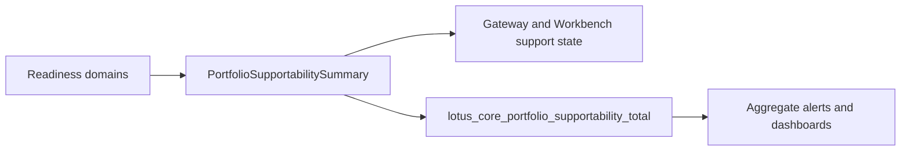

# Operations Runbook

## Current Scope And Evidence

This page is the first-response map for the Core app-local runtime, durable evidence, queue
recovery, and canonical seed operations. Commands and limits below are backed by repository-owned
contracts, tests, or the linked deep runbooks. They describe current Core behavior; they do not by
themselves certify a particular environment, production capacity, or downstream product surface.

| Reader | Start here | Escalate when |
| --- | --- | --- |
| Operations and support | Main operational surfaces, useful commands, and the affected runtime section | A source-safe failure persists after the documented bounded retry or recovery path |
| Security and audit support | Durable Enterprise Access Evidence | Durable evidence is unavailable, fails domain verification, or requires controlled repair |
| Valuation and derived-state support | Transaction-processing runtime and bounded database work | Backlog does not drain across polls, authority is missing, or terminal work conflicts with source truth |
| Engineers and release owners | Linked contracts, deep runbooks, and validation commands | A contract, migration, topology, or operator command must change |

## Main operational surfaces

- app-local compose runtime
- migration-runner and kafka-topic-creator startup prerequisites
- replay and ingestion-health contracts
- support and lineage APIs
- reconciliation runs
- demo data pack loading

### Service HTTP surfaces and ports

Ten services listen over HTTP. Five publish a business contract surface; five are Kafka workers
that still expose an operational surface, which is how they are probed and scraped. Container ports
are fixed; host ports are the app-local Compose defaults and are overridable by the environment
variable shown.

| Service | Kind | Container | Host default | Override | OpenAPI paths |
| --- | --- | ---: | ---: | --- | ---: |
| `ingestion_service` | API | 8000 | 8200 | `LOTUS_INGESTION_HOST_PORT` | 42 |
| `query_service` | API | 8001 | 8201 | `LOTUS_QUERY_HOST_PORT` | 33 |
| `query_control_plane_service` | API | 8002 | 8202 | `LOTUS_QUERY_CONTROL_PLANE_HOST_PORT` | 78 |
| `event_replay_service` | API | 8009 | 8209 | `LOTUS_EVENT_REPLAY_HOST_PORT` | 28 |
| `financial_reconciliation_service` | API | 8010 | 8210 | `LOTUS_FINANCIAL_RECONCILIATION_HOST_PORT` | 10 |
| `persistence_service` | worker | 8080 | 8080 | `LOTUS_PERSISTENCE_HOST_PORT` | 4 (operational) |
| `position_valuation_calculator` | worker | 8084 | 8084 | `LOTUS_POSITION_VALUATION_HOST_PORT` | 4 (operational) |
| `portfolio_derived_state_service` | worker | 8085 | 8085 | `LOTUS_PORTFOLIO_DERIVED_STATE_HOST_PORT` | 4 (operational) |
| `portfolio_transaction_processing_service` | worker | 8085 | 8090 | `LOTUS_TRANSACTION_PROCESSING_HOST_PORT` | 4 (operational) |
| `valuation_orchestrator_service` | worker | 8087 | 8087 | `LOTUS_VALUATION_ORCHESTRATOR_HOST_PORT` | 4 (operational) |

The path counts above are **unique OpenAPI paths**, which is how the route catalog keys them for
navigation. A few paths carry more than one method, so the operation count is slightly higher —
`query_control_plane_service` has 79 operations over 78 paths, and `event_replay_service` 29 over 28,
because one path in each supports two verbs. Use the operation count when sizing an exposure
review; use the path count when navigating the catalog.

A worker has **no business routes by design**: it consumes Kafka and writes durable state. Its
operational surface is four OpenAPI routes — `GET /health/live`, `GET /health/ready`, `GET /metrics`,
`GET /version`. Use `/health/ready` to decide whether it is safe to send traffic through the pipeline
it feeds, `/metrics` for scrape, and `/version` to confirm which build is running before trusting any
other diagnostic.

**Four further paths are reachable on every service, worker included** — `/docs`,
`/docs/oauth2-redirect`, `/openapi.json` and `/redoc`. FastAPI's documentation URLs stay enabled on
the shared health app, including the Swagger OAuth2 redirect, and none of the four is in the OpenAPI
schema, so they never appear in route counts.

**A worker therefore exposes eight reachable paths, not four.** Use eight when reviewing network
policy or building an exposure inventory:

| | Paths |
| --- | --- |
| In the OpenAPI schema | `/health/live`, `/health/ready`, `/metrics`, `/version` |
| Reachable, outside the schema | `/docs`, `/docs/oauth2-redirect`, `/openapi.json`, `/redoc` |

`contracts/security/security-control-coverage.v1.json` allowlists `/docs`, `/openapi.json` and
`/redoc` for each of the ten apps, but **not** `/docs/oauth2-redirect` — tracked as
[issue #1048](https://github.com/sgajbi/lotus-core/issues/1048). Until that closes, treat the security
contract as covering three of the four documentation paths.

The five API services expose the same four operational routes in addition to their contract surface,
so the probe pattern is identical everywhere.

The generated route inventory is
[`docs/standards/api-route-catalog.v1.json`](https://github.com/sgajbi/lotus-core/blob/main/docs/standards/api-route-catalog.v1.json), checked by
`make api-route-catalog-guard`. Its scope is **all ten apps, workers included** — each worker
contributes its four operational entries, keyed by `service_app`. The guard imports every app and
compares the committed catalog to each `app.openapi()` **in process**; it is a static parity check
against the code, not a query against running services, so a green guard proves the catalog matches
the code rather than proving any service is up.

The host ports above are what "service health routes are responding" in
[Startup checks](#startup-checks) means in practice — for example
the local `curl` readiness check reaches
`portfolio_transaction_processing_service`, whose container port is 8085.

Executable incident playbooks are maintained in
`contracts/operations/incident-playbooks.v1.json`, summarized in
[Incident Playbooks](https://github.com/sgajbi/lotus-core/blob/main/docs/operations/Incident-Playbooks.md), and validated by
`make incident-playbook-guard`.

Guarded incident IDs: `ingestion-stuck-failed`, `dlq-growth`, `replay-failure`, `outbox-backlog`,
`valuation-aggregation-lag`, `stale-source-data`, `reconciliation-failure`, `readiness-failure`,
`database-connectivity`, `kafka-connectivity`, and `security-audit-denial-spikes`.

Effective-dated Reset and FX replay retries are repository-owned. A live claim either returns to
`PENDING` when it is the only row for its security/direct pair, or its retained same-identity sibling
evidence is atomically coalesced into one pending job while preserving the earliest impacted date
and required lineage without taking an active sibling's lease. The
exact database-clock lease and token remain authoritative. Do not repair a retry by rewriting job
status, deleting the sibling, or weakening a pending uniqueness constraint; inspect the support
listing and correlated logs, then correct the source or ownership failure.

## Durable Enterprise Access Evidence

Promoted profiles persist one typed access decision before protected work across ingestion, query,
query control plane, financial reconciliation, and event replay. Audit write failure returns
`503 security_audit_unavailable`; local/development/test profiles remain explicitly log-only.
The legacy production-security-profile opt-out cannot disable this durable control outside an
explicit local profile, and a named non-local `ENVIRONMENT` rejects
`ENTERPRISE_AUDIT_READS=false`. An unset environment remains schema-tooling compatible but still
forces durable GET/HEAD evidence at runtime. Monitor
`security_audit_delivery_total{service,outcome}` and treat `outcome="failed"` as the source signal
for #501 alerting.

Use `GET /support/security-audit/events` with the `core.security_audit.read` capability, an inclusive
UTC `occurred_from`/`occurred_to` window of at most 31 days, and pages of at most 200. Tenant scope
comes only from the verified signed request context. Continuations require both cursor fields.
Responses contain safe route templates and typed identity posture, not request bodies, headers,
queries, concrete URLs, secrets, arbitrary metadata, or raw exceptions. Alerting remains #501 and
retention/purge/legal-hold behavior remains #708. Treat 422 as invalid caller-supplied query bounds
or cursor evidence. Treat source-safe 503 as database unavailability or persisted evidence that
failed domain verification: preserve the row, keep its values out of tickets and ordinary logs,
distinguish connectivity from integrity failure through controlled diagnostics, and escalate to the
audit-data owner before repair.

## Useful commands

```bash
docker compose up -d
docker compose logs --tail=200 demo_data_loader
docker compose logs --tail=200 migration-runner
docker compose logs --tail=200 kafka-topic-creator
make test-docker-smoke
```

The one-shot app-local demo loader compares every generated portfolio and reference segment with
source-owned query truth. It treats a retained-volume restart as a complete-pack no-op and logs
`reason=unchanged_pack_present` only when all segments are complete; a partial or evolved pack
publishes only the missing segments. If a selected missing segment returns only an idempotency
replay, the loader fails closed because the earlier job has not materialized verified source state;
inspect that job or use an intentional force refresh. Set `DEMO_DATA_PACK_FORCE_INGEST=true` only
for an intentional full sample-data refresh that bypasses those reads. Routine restarts must not
republish unchanged source history or create avoidable valuation work.
Calendar completeness compares the source-owned digest of exact ordered business dates and requires
at least one business-date observation and requires that projection to form a gap-free suffix from
the first holding date. Ordered,
unique, in-window non-business observations remain valid and do not satisfy a missing business date.
Pre-holding calendar dates legitimately have no portfolio observation; matching counts alone do
not qualify, and the response must terminate without a continuation page.

The sample pack resolves its fixed as-of date from the RFC-0076 front-office seed contract and
retains the deployed v1 `2023-07-20` transaction anchor. It does not move stable transaction IDs or
overlapping economic observations with the host clock or a shorter history request. Market-price
and FX writes are date-ordered logical series per security or currency pair, fenced by the
`lotus-demo-pack:v2` content namespace. A retained complete pack is
still a zero-write decision regardless of historical v1 ingestion-job audit rows.

The loader verifies terminal quantities from one explicit HoldingsAsOf read per portfolio. Do not
replace this with exact-date position-history polling: position history records transaction dates,
not a synthetic row for every later business date.

Kafka topic counts and ordering scopes are source-owned. The topic creator and service startup fail
when existing metadata conflicts with the governed contract. Use the
[Kafka Partition Migration Runbook](https://github.com/sgajbi/lotus-core/blob/main/docs/operations/kafka-partition-migration-runbook.md) for
pause, drain, expansion, replacement-topic, and rollback procedures; do not bypass the mismatch
check or use a global partition-count override.

The transaction raw/persisted pair and market-price raw/persisted pair each use twelve aligned
partitions and bounded in-flight tasks. Transaction capacity is position/group ordered;
market-price capacity is security ordered. Change both sides of an event-family contract together,
and never expand a live topic until the affected lag and outbox work are fully drained.

## Transaction-processing runtime

App-local Compose runs one `portfolio_transaction_processing_service` on host port `8090`; it owns
one live consumer and one replay-request consumer while keeping cost, cashflow, and position as
separate internal modules. Do not start the legacy cost, cashflow, or position worker shells beside
it. Valuation remains separately deployed.

Before switching an environment, follow the
[Transaction Processing Cutover Runbook](https://github.com/sgajbi/lotus-core/blob/main/docs/operations/Transaction-Processing-Cutover-Runbook.md).
The Kafka offset command is dry-run by default and requires `--apply` to mutate target offsets.

Image canary and rollback use a different, stable-group proof. Generate the immutable plan with
`make transaction-release-rehearsal-plan`, then run `make transaction-release-rehearsal` only after
merge, from the exact-main candidate SHA, with the Image Release candidate manifest and a qualified
immutable previous-main rollback manifest. Do not create a pre-merge tag to manufacture release
authority. The runner owns a
generated `lotus-integration-transaction-release-rehearsal-*` Compose project, recreates only
`portfolio_transaction_processing_service`, preserves PostgreSQL/Kafka through rollback, runs fixed
financial canaries, and fails unless its exact project has zero cleanup residue. Its receipt is
scoped to image replacement on the stable consumer group and governed twelve-partition topology;
it does not claim a twelve-to-eight Kafka partition reduction. The receipt remains
local Compose evidence with `cluster_certification=false`; Kubernetes rollout, production canary,
and rollback-RTO evidence remain environment-owned.
Qualified manifests may supply only six governed build-metadata values; database, port, Compose,
and arbitrary environment overrides fail before runtime preparation. Canary DLQ evidence comes
from durable rows scoped to the exact stable consumer group and source topic, not from readiness.

```bash
export ENVIRONMENT=local
export KAFKA_SECURITY_PROTOCOL=PLAINTEXT
python scripts/operations/transaction_processing_cutover_offsets.py --bootstrap-servers localhost:9092
curl http://localhost:8090/health/ready
curl http://localhost:8090/version
make test-performance-load-gate
```

Those values are bounded to the local rehearsal. Promoted cutovers must declare the actual
environment and source Kafka TLS/SASL trust and credentials from the deployment secret store. An
absent or invalid connection-security profile fails closed and writes a `status=blocked` cutover
receipt rather than attempting offset inspection or mutation.

Treat load-gate throughput as completed cost/cashflow/position processing. Request submission rate
alone is not capacity evidence. Keep the target and legacy topologies mutually exclusive.

`portfolio_transaction_processing_service` stages transaction and valuation readiness after cost,
position, and cashflow effects succeed in one database transaction. Neither
`transactions.cost.processed` nor `cashflows.calculated` has an active in-repo consumer. When
valuation readiness is delayed, inspect the target transaction-processing result, readiness-stage
claim, database transaction rollback, and outbox dispatch. Do not restore a compatibility-event
consumer group as a recovery action. Portfolio aggregation directly stages reconciliation requests;
financial reconciliation persists control evidence and stages the controls decision in the same
transaction as reconciliation completion. The former pipeline orchestrator runtime is retired and
must not be restored as a recovery action.

## Preferred diagnostics

Use APIs before going directly to the database where possible:

- support overview:
  `GET /support/portfolios/{portfolio_id}/overview`
  Add `?as_of_date=YYYY-MM-DD` when validating a historical portfolio date so later-dated
  aggregation work remains visible in the default full-queue view without blocking that bounded
  readiness decision.
- readiness:
  `GET /support/portfolios/{portfolio_id}/readiness?as_of_date=YYYY-MM-DD`
- lineage routes:
  `GET /lineage/portfolios/{portfolio_id}/keys`
- replay evidence:
  `GET /support/portfolios/{portfolio_id}/reprocessing-keys`
  `GET /support/portfolios/{portfolio_id}/reprocessing-jobs`
- reconciliation run inspection:
  `GET /support/portfolios/{portfolio_id}/reconciliation-runs`
- corporate-action cohort/release inspection:
  `GET /support/portfolios/{portfolio_id}/corporate-action-events?tenant_id={tenant_id}&legal_book_id={legal_book_id}`
- institutional load progress:
  `GET /support/load-runs/{run_id}?business_date=YYYY-MM-DD`

For event-publication drift, inspect outbox backlog and dispatcher health before assuming downstream
consumer faults.

For price-driven valuation replay, compare `instrument_reprocessing_triggers_pending` with
`instrument_reprocessing_trigger_conversions_total{outcome}`. `created` means the conversion
staged a new pending `RESET_WATERMARKS` generation; `coalesced_pending` means it merged the request
into existing pending work, where `LEAST` retains the earliest date and avoids a duplicate
job. A `PROCESSING` job is intentionally
immutable, so a concurrent earlier price can coexist as one new pending generation. Do not delete
trigger rows or mutate job payloads by hand: transaction rollback and the next scheduler poll are
the governed recovery path.

Position support listings may report `operational_state=SNAPSHOT_ONLY` for legacy keys that have a
durable daily snapshot but no replayable position history. This is a truthful terminal source
posture, not current calculation authority: Core preserves the latest actual snapshot watermark,
keeps the position visible, and excludes the key from history-driven backfill and automatic
watermark advancement. If authoritative position history is later ingested, the normal epoch and
reprocessing path supersedes this posture. Operators must not relabel or manually advance these
keys to `CURRENT`; reconcile or ingest the missing history authority instead.

High-cardinality valuation and reprocessing operations are physically bounded to 1,000 rows and
the governed PostgreSQL bind budget per statement. When one logical operation needs multiple
statements, inspect the single structured `database_statement_batch` event: its bounded fields are
`operation`, `status`, and `reason_code`, accompanied by `item_count`, `chunk_count`, and
`max_rows_per_statement`. It contains no portfolio, security, job, claim, or correlation identity.
Multiple statements do not mean partial persistence; they share the caller's transaction, so any
later-chunk failure rolls back the complete logical operation.
`VALUATION_SCHEDULER_BATCH_SIZE` therefore has an effective maximum of 1,000 for claim execution,
dispatch-loop exhaustion, ingestion operating-policy reporting, and Query Control Plane poll
capacity. A larger legacy configured value remains startup-compatible but is exposed and executed
as 1,000; dispatch rounds may continue after a full 1,000-row cohort until the configured round,
poll-budget, dispatch-budget, in-flight, or producer-back-pressure boundary is reached.
Expired valuation and reprocessing claims are recovered by database-clock lease expiry in
deterministic cohorts of at
most 1,000 per scheduler poll; subsequent polls drain any remaining backlog. Recovery evidence uses
bounded counts and reason codes and never emits job-ID collections. Use the support APIs above for
business-key drill-down.

Each reprocessing claim commits before execution. Every reset-watermarks or FX job then owns an
independent transaction, so one failed job cannot roll back a sibling. Terminal writes require the
exact opaque claim token and an unexpired lease; a late worker rolls its domain mutations back.
`REPROCESSING_WORKER_STALE_TIMEOUT_MINUTES` (default `15`) is the lease lifetime, measured by the
PostgreSQL clock rather than `updated_at` or an application clock. Before scheduling work and after
each renewal, the worker reads the remaining lease budget from PostgreSQL; it never re-bases the
configured duration on a local clock. The worker renews the lease every
one-third of that lifetime in a separate transaction. Renewal I/O is bounded to half that interval;
transport failures retry after a positive I/O-timeout floor against a monotonic lease budget rather
than waiting another full interval. The floor bounds connection attempts and traceback logs during
a database outage while still scheduling another attempt before authority expires. Startup fails
closed unless I/O timeout < renewal interval < lease lifetime. If
renewal reports expiry, token mismatch, or lost processing state, the worker cancels the job task
and rolls back its domain transaction.
`reprocessing_worker_lease_renewals_total{job_type,outcome}` exposes only `renewed`,
`renewal_error`, and `ownership_lost`. A transient renewal transport error is logged and retried;
the existing lease fence rejects any later terminal write if authority expires meanwhile. Alert on
renewal errors and ownership loss, and use structured logs for job-level diagnosis.
The reprocessing-job support listing uses that same `lease_expires_at` deadline for
`STALE_PROCESSING`. A caller-selected `stale_threshold_minutes` cannot classify an unexpired claim
as stale; that threshold remains fallback policy only for queues without lease authority. Its
timestamp, total, ordered page, and lease classification come from one PostgreSQL statement
snapshot, so heartbeat updates cannot hide a live claim or split count from page and host-clock
skew cannot contradict the worker fence.

Aggregation and outbox durable claim deadlines follow the same rule. PostgreSQL mints, reclaims,
and fences `lease_expires_at`/`claim_expires_at` with `clock_timestamp()`. The scheduler and
dispatcher retain application time only for telemetry, poll cadence, and ordinary retry scheduling
(`next_attempt_at`). Neither path renews a claim: work is deliberately processed in bounded chunks,
and the configured lease must exceed the measured batch/delivery budget. A host-clock skew therefore
cannot steal a live claim or authorize a late terminal write.

Migration `c161b2c3d528` requires a quiesced reprocessing queue. Stop old workers and ensure no
`PROCESSING` rows remain before upgrade; the migration fails closed otherwise. For rollback, stop
new workers and clear active work through governed recovery or terminal processing before
downgrade. The cutover's exclusive table lock times out after five seconds. If it cannot be acquired,
drain the lingering reader or writer and retry; do not leave the migration queued behind live table
traffic. Never bypass the guard by editing lease fields, statuses, or Alembic revision state.

Migration `c162b2c3d529` uses the same upgrade drain and five-second exclusive-lock boundary. It
preflights relevant active payload text against PostgreSQL's safe JSON extraction boundary and
fails with an actionable message when a legacy value cannot be extracted. Harmless literal escape
text remains accepted. Preserve unsafe raw evidence and terminalize or repair the affected row
through governed recovery before retrying; do not bypass the guard.
After that preflight, the migration
quarantines malformed pending Reset and FX replay payloads as `FAILED`, preserves their durable
payload evidence, and emits separate bounded FX/security quarantine counts in the migration log.
It classifies temporal strings with Python `fromisoformat` while the exclusive lock remains held,
so PostgreSQL-only spellings such as `infinity` are quarantined without copying Python grammar into
SQL. Padded replay identities and hashes are quarantined rather than normalized or rewritten.
It then installs `ck_reprocessing_jobs_active_payload_valid`, which authoritatively rejects unsafe,
non-string, incomplete, unnormalized, or database-unrepresentable `PENDING`/`PROCESSING` Reset/FX
work at the post-cutover database boundary. Application `fromisoformat` is the grammar pre-filter
and PostgreSQL `pg_input_is_valid` is the storage representability authority; work must pass both.
Runtime staging applies both checks before date-bearing SQL coalescing, and runtime quarantine
remains required for grammar-invalid or storage-unrepresentable predecessor-schema or restored
rows. Claim, Reset staging return, owned identity lookup, and stale discovery/revalidation read
retained payloads as text through the shared safe decoder, preventing a permitted unknown numeric
extension from blocking replay. Reset coalescing preserves unknown fields and the earliest replay
boundary. Owned requeue also retains a usable earlier sibling boundary when the sibling is already
processing or becomes terminal between discovery and row locking. Siblings already processing or
claimed during lock revalidation are read as committed snapshots without row locks, so their lease
renewal is not blocked. Legacy Reset
 duplicate normalization and owned sibling coalescing retain the maximum retry count; FX source
 authority continues to follow generated-at/content-hash ordering. If that source lacks correlation,
 the latest valid available correlation is retained without changing source authority. Reset coalescing
uses valid sibling correlation at the authoritative boundary, fills missing owned correlation at an
equal boundary, and retains known owned correlation when an earlier sibling has none. Canonical FX
fields are recovered around an unrepresentable extension so the valuation adapter can validate the
 execution identity and date and attributable claimed work can proceed. Staging quarantine for both
 replay families validates and carries recovered boundary, source, retry, and lineage evidence
through the same merge policy; the extension is not copied into replacement work.
Review the recorded counts after upgrade and
investigate each failed row through the support API and source lineage; do not edit the payload or
restore it to active status by hand. Valid terminal historical evidence is not rewritten.

Migration `c166b2c3d52d` corrects the FX zoned-timestamp constraint to accept bare-hour offsets such
as `-07` when both Python and PostgreSQL accept them. It does not alter c162. Under an exclusive
lock it examines only rows quarantined by the c162 cutover, re-stages only work provably valid at
both boundaries, coalesces duplicate pair work by the governed earliest-date rule, and preserves
the original failed evidence. Downgrade fails closed while active work uses a timestamp form that
the predecessor constraint cannot represent.

For corporate-action cohorts, use `readiness_status` to locate missing/invalid source evidence and
`execution_status` to locate pending, processing, failed, superseded, or complete releases. Supply
the same tenant in `X-Tenant-Id` and the query, plus `core.support.read`. This is privileged
tenant-wide operator authority narrowed by legal book. Empty/filter-empty pages are healthy 200
responses; 404 is reserved for an absent exact portfolio scope. Use returned hashes, reason codes,
fence, attempt, and member-progress counts. Never repair the immutable graph/release tables by hand.

Aggregate worker alerts use `lotus_core_corporate_action_release_cycles_total`,
`lotus_core_corporate_action_release_cycle_duration_seconds`, and
`lotus_core_corporate_action_release_lease_renewals_total`. Their only label is bounded `outcome`.
Do not add tenant, book, portfolio, event, release, transaction, token, or reason labels; drill down
through the support API and correlated structured logs.

During an upgrade across the corporate-action authority migrations, preserve applied migration
history: `c152` is immutable and `c155` carries the forward manifest-authority change. Migration
`c153` backfills legacy observation fingerprints only from the exact durable
transaction-processing semantic fence and then makes the field non-null. If any legacy observation
lacks valid source authority, the migration deliberately fails and rolls back; repair the missing
source evidence through the governed recovery path before retrying. Never synthesize a fingerprint,
edit the immutable ledgers, or mark the Alembic revision manually. Historical unscoped manifest
hashes remain replay-compatible and retain their durable authority through application
reconstruction and readiness; newly scoped manifests must match the parent tenant and legal book.

## Preferred diagnostic sequence

When a portfolio or load scenario looks wrong, check in this order:

1. support overview or load-run progress for the first truthful status
2. readiness when the question is front-office or workflow gating rather than operator backlog
3. replay, valuation, aggregation, and reconciliation listings when support evidence shows lag or
   blocking controls
4. lineage routes when the problem is narrowed to a portfolio-security key
5. database facts only when rollout mismatch, migration doubt, or API/schema drift makes the API
   evidence insufficient

## Portfolio Readiness Observability

`GET /support/portfolios/{portfolio_id}/readiness` is the source-owned supportability surface for
front-office portfolio readiness. The response `supportability` object publishes:

- `feature_key`: `core.observability.portfolio_supportability`
- `state`: `ready`, `degraded`, or `empty`
- `reason`: a bounded `portfolio_supportability_*` reason
- `freshness_bucket`: `current`, `stale`, or `unknown`
- `metric_labels`: `state`, `reason`, and `freshness_bucket`

The matching Prometheus counter is `lotus_core_portfolio_supportability_total`. Do not add
portfolio, account, client, transaction, security, trace, correlation, request-body, or
response-body fields to metric labels. Use readiness payload fields for drill-through, and use
metrics only for aggregate supportability posture.


```mermaid
flowchart LR
    A[Readiness domains] --> B[PortfolioSupportabilitySummary]
    B --> C[Gateway and Workbench support state]
    B --> D[lotus_core_portfolio_supportability_total]
    D --> E[Aggregate alerts and dashboards]
```

## Canonical front-office reseed

Routine canonical front-office reseeding is scoped to `PB_SG_GLOBAL_BAL_001`. The seed tool may
clear known volatile replay fences for canonical seed topics when local Kafka offsets have been
reset or reused, but it must not perform broad `processed_events` deletion. If broader local
runtime state is polluted, reset the Docker-backed core runtime before reseeding.

The app-local `demo_data_loader` demo pack is diagnostic/sample-data tooling and must not be part
of canonical private-banking proof. Governed Workbench and platform QA startup set
`DEMO_DATA_PACK_ENABLED=false`; canonical `PB_SG_GLOBAL_BAL_001` data must come from
`tools/front_office_portfolio_seed.py`, launched from the repository root through
`python scripts/development/repository_python.py tools/front_office_portfolio_seed.py ...` so
first-party imports are proven to come from the active checkout.

Canonical clean bootstrap is source first: persist portfolio and instrument parents, then FX and
market-price history, and fail closed until the required source windows are query visible. After
raw price readiness, publish effective-dated valuation-policy assignments for every seeded
instrument and authoritative price source facts for every seeded observation before activating the
business-date horizon. Each canonical security has an explicit source quote convention. Both
canonical bonds explicitly declare clean percent, denominator 100, and 1,000 face per held unit;
missing or mismatched per-security metadata fails before publication. The deterministic
clean-percent-to-unit-price normalization and its inputs are bound into each fact's content hash.
All canonical assignments therefore use `UNIT_PRICE_MARKET_VALUE` with `UNIT_PRICE`; position
quantity is never relabeled as runtime face authority. Transactions are posted only after that
fence. This prevents initial history from being misclassified as late corrections while preserving
durable replay for backdated or future observations against an existing horizon.

Cash unit-price facts continue through the latest planned-withdrawal transaction date because those
future cash legs enter the same exact-scope valuation queue. A canonical authority bundle that ends
cash facts at the reporting date is incomplete even when current positions already show 11-of-11
valued.

The canonical portfolio owns valuation scope `LOTUS_PB_SG` / `SG_PRIVATE_BANK_BOOK`. If only bond
positions remain unvalued and valuation jobs report
`bond valuation requires explicit quote-convention authority`, repair the missing same-scope Core
assignment/source evidence. If they instead report missing `signed_face_amount`, verify that the
canonical bond fact was normalized to `UNIT_PRICE`; do not infer face from position quantity. Do not
restore magnitude inference or synthesize quote authority in Gateway, Workbench, or another
downstream service. A full seed waits for exact portfolio tenant/book scope before dependent data;
reuse requires that scope and complete authority already durable and publishes no core valuation
authority.
Routine replay cleanup never deletes the shared append-only valuation
authority or its canonical portfolio/instrument parents. Identical version-1 replay is idempotent;
changed evidence must append a governed newer version or use an explicit full local-state reset.
Before cleanup or any ingest write, the tool accepts only entirely absent seed-owned authority or an
exact complete latest-version replay. Partial, extra, or changed version-1 authority fails before
mutation and requires the explicit full local-state reset.

On `--skip-cleanup`, the tool preserves transaction history but does not upgrade valuation
authority. It requires all canonical seeded valuation work to be quiescent, exact durable
tenant/book scope, existing instruments, complete matching raw-price windows, and exact durable
valuation assignments/source facts. Wrong scope, absent authority, missing observations, or a
price/currency conflict fails closed before core seed writes and requires the governed full reseed.
Reuse does not publish portfolio scope, raw prices, or valuation authority because no durable
source-row-to-consumer acknowledgement exists for deferred price processing. It neither rearms
unchanged source parents nor silently treats an existing pre-authority seed as complete. If an affected
canonical security already has terminal failed valuation jobs, the tool fails before any write and
requires a normal governed full reseed without `--skip-cleanup`. The full reseed recreates
portfolio-owned valuation work while preserving shared append-only quote authority; unchanged
transaction replay is not treated as a recovery mechanism for a completed readiness stage. A
second active-or-terminal check after durable authority catches concurrent work before downstream
seed continuation. Wait and retry for active work; use the governed full reseed for terminal work.
The same fence includes instrument reprocessing triggers and `RESET_WATERMARKS` jobs and runs after
complete raw-price visibility is validated but before durable authority verification.

A canonical seed is complete only after valuation and aggregation queues have no pending,
processing, stale-processing, or failed work for three consecutive observations at the configured
poll interval. Any reopened work resets the stability fence. Pending/processing aggregation is not
background success: keep it inside the existing readiness deadline so an exit-zero result proves a
stable terminal state. The verifier sleeps for the configured poll interval between observations;
it must not busy-loop against the shared runtime.
Use `--evidence-output <path>` to retain a source-safe JSON receipt. The tool first compares every
expected seed-owned assignment and source fact with the latest-version rows from a read-only
PostgreSQL projection and fails
without writing a file on missing, extra, changed, or unreadable authority. Receipt counts and
hashes are derived from those durable rows and bind the final verification, three-observation
stability count, and receipt content hash.
`--evidence-output` cannot be combined with `--ingest-only`, because evidence requires completed
verification; the invalid combination fails before readiness checks.

The canonical seed includes planned withdrawal evidence for both the fixed contract as-of window
and the current Workbench forward-liquidity horizon. After reseeding, `PortfolioCashflowProjection`
should show at least one non-zero point for the canonical window and one non-zero current-horizon
planned settlement point.

Projected settlements in the canonical seed must land on business days and must be covered by the
required FX pairs through the latest projected settlement date. Benchmark and FX reference coverage
extends through at least 45 calendar days after the canonical as-of date, and through any later
projected settlement date, so current-date Gateway and Workbench probes do not degrade on missing
reference series. The current raw `market_prices` and `fx_rates` contracts are point-in-time
series; when those contracts move to effective-date ranges, open-ended terminal price/rate validity
should use `3999-12-31` explicitly.

## Startup checks

When app-local runtime is unhealthy, check this order:

1. `docker compose ps`
2. `migration-runner` completed successfully
3. `kafka-topic-creator` completed successfully
4. service health routes are responding
5. demo data loader completed if the scenario expects seeded data

The Core Compose file is explicitly app-local: services declare `ENVIRONMENT=local`, Kafka clients
use local-only `PLAINTEXT`, and PostgreSQL development credentials stay inside that boundary.
Staging, UAT, production, and unspecified profiles fail closed on the local database password or
plaintext Kafka. Production-like deployments must provide database secrets plus Kafka TLS/SASL
trust and credentials through their deployment secret mechanism.
The release-managed Kubernetes base fixes Kafka transport to `SASL_SSL` with `SCRAM-SHA-512`, reads
the environment from `lotus-core-runtime`, reads credentials from `lotus-core-kafka`, and mounts the
`lotus-core-kafka-trust` CA bundle read-only. Missing release authority blocks pod startup instead
of falling back to plaintext.
KEDA lag scalers share that SASL/TLS authority instead of connecting to the local plaintext port.

An interrupted Kafka broker can temporarily leave `/brokers/ids/1` owned by its previous ZooKeeper
session. App-local Kafka retries the unchanged startup at most five times while that ephemeral
session expires; it never deletes registration state or volumes. Its unchanged real broker-health
probe has a 30-second start period and twelve 10-second attempts, including two bounded attempts
beyond the former ten-probe budget. Run `make test-kafka-restart-recovery-gate` for isolated restart
certification. The gate requires the actual `service_healthy` dependency path, topic creator, and a
dependent Core service to recover from an interrupted broker session. If the
bounded attempts are exhausted, inspect `docker compose ps` and the exact ZooKeeper/Kafka logs for
another live broker.
Do not use daemon-wide prune, direct ZooKeeper node deletion, or volume removal as default recovery.
The full command and secret-sourcing contract is in the repository
[operations runbook](https://github.com/sgajbi/lotus-core/blob/main/docs/operations/runbook.md#app-local-connection-security-and-kafka-restart-recovery).

Runtime-facing API services and worker health web apps expose `/health/live`, `/health/ready`, and
`/metrics`. They also expose `GET /version`, which returns the image provenance values embedded
during build or deployment: Git commit SHA, Git branch, build timestamp, repo URL, image version,
image digest resolved after push, CI pipeline/run ID, and the corresponding OCI label/release
metadata map. Local builds report `image_digest: "unknown"` unless the build/release lane or deploy
manifest supplies `LOTUS_IMAGE_DIGEST`. The final registry digest is release/deployment metadata;
it cannot be truthfully baked as a self-digest label during the same image build because changing
that label changes the digest.

`/health/live` and `/health/ready` include a bounded `runtime` block with service name, app
version, environment, runtime profile, router started-at time, uptime seconds, and the same shared
build metadata payload. Missing build metadata is explicit as `unknown` in local development and
does not fail probes.

Health responses include `X-Correlation-ID`, `X-Request-Id`, `X-Trace-Id`, and
`traceparent` headers so incident triage can tie probe behavior to request logs and route-template
HTTP metrics. Valid incoming W3C `traceparent` headers are preserved. Requests with only
`X-Trace-Id`, or no trace headers, receive a W3C-shaped `traceparent` with a fresh non-zero span id.
This is propagation context for Lotus diagnostics; it is not a standalone claim that OpenTelemetry
export or an APM collector is configured.

Readiness dependency checks emit bounded Prometheus telemetry:

- `health_dependency_check_total{service,dependency,status}`
- `health_dependency_check_duration_seconds{service,dependency}`
- `health_readiness_state{service,state}`

Use these for dependency flapping and latency trends. Keep portfolio, security, request,
correlation, trace, and raw exception details in logs or support APIs, not metric labels.

Web-backed worker supervision uses bounded task names: Kafka loops include consumer group and topic,
and the shared outbox dispatcher and health server use stable component names. If `worker_runtime`
is failed, use that component identity in supervision logs to distinguish a live-consumer,
replay-consumer, dispatcher, or health-server exit; readiness payloads intentionally remain bounded
and do not expose raw exceptions.

Metric vocabulary is guarded by `make metric-vocabulary-guard`. HTTP request metrics use
`endpoint_template` for route templates; raw `path`, portfolio/account/client/security IDs,
request/correlation/trace IDs, payload fields, stack traces, and raw exception text are forbidden
Prometheus labels. Service-local metrics must either move to `portfolio_common.monitoring` or be
registered with an owner in `SERVICE_LOCAL_METRIC_OWNERS`.

Image provenance is guarded by `make image-provenance-guard`. It checks service Dockerfile OCI
labels, CI prebuild build args, CI-only image publication, full Git SHA image tags, release digest
manifests, SBOM artifact/provenance/signing/scan workflow controls, digest-based Kubernetes image
references, same-image promotion evidence across `dev`, `uat`, and `prod`, no secret-like build
ARG/ENV additions, and the shared `/version` route.

Deployments are rendered from governed image evidence by
`scripts/release/render_release_deployment.py`, which pins each image to a digest taken from the
target CI image-release manifest. It covers two services, selected by `--service`:

```bash
python scripts/release/render_release_deployment.py \
  --service portfolio_transaction_processing_service \
  --release-manifest output/build-evidence/portfolio_transaction_processing_service-image-release-manifest.json \
  --output output/deployment/portfolio-transaction-processing.yaml

python scripts/release/render_release_deployment.py \
  --service portfolio_derived_state_service \
  --release-manifest output/build-evidence/portfolio_derived_state_service-image-release-manifest.json \
  --output output/deployment/portfolio-derived-state.yaml
```

Render to `output/deployment/`, never back over the base template. The tracked files under
`deployment/kubernetes/base/` carry an all-zero digest placeholder that the renderer needs in order
to substitute a real digest; writing a rendered deployment over one replaces that placeholder and
makes the next render fail with `deployment template must contain one target image placeholder`.
`deployment/kubernetes/base/README.md` holds the canonical commands, including the matching
`kubectl apply -f output/deployment/...` step.

`--template` is optional; each service already declares its own base template.

The renderer refuses to emit a deployment the release evidence does not authorize, and reports every
refusal as a `DeploymentRenderError`. The exception alone does not identify the fault; read its
message, which names one of three families:

| Message names | Fault is in | Remediation |
| --- | --- | --- |
| `deployment template must contain one target image placeholder` | the template | Restore the base template. This is the failure seen after rendering over `deployment/kubernetes/base/`. |
| `release manifest does not belong to the target service`, `release manifest has an unexpected image name`, `release manifest does not prove <field>=...` | the manifest/service pairing or its attestation | Render the service its own manifest, or fix the attested fields. |
| `release manifest has an invalid digest image reference`, `release digest belongs to an unexpected image`, `release digest and digest image reference differ`, `release manifest promotions are missing`, `release manifest does not cover dev, uat, and prod`, `release environments do not promote the same digest` | the release evidence | Correct the evidence; do not edit the template to make the render pass. |

The template family is checked before the manifest is validated, so a damaged template masks any
evidence problem until it is repaired.

Never apply the checked-in all-zero digest placeholder or deploy the legacy cost, cashflow, and
position worker images/scalers. Apply `deployment/kubernetes/keda/processing-scaledobjects.yaml`
only after the governed Kafka offset handoff.

HTTP security-control coverage is guarded by `make security-control-coverage-guard`. Production-like
profiles must set non-wildcard `LOTUS_HTTP_TRUSTED_HOSTS`; local/dev/test profiles default to `*`
for app-local compatibility. Browser CORS remains deny-by-default unless
`LOTUS_HTTP_CORS_ALLOW_ORIGINS` is configured.

Kafka consumers inheriting `BaseConsumer` emit:

- `kafka_consumer_events_total{service,topic,group_id,outcome,reason}`
- `kafka_consumer_processing_duration_seconds{service,topic,group_id}`

Use these for worker fleet dashboards and incident triage across processing attempts, successes,
retryable failures, terminal failures, DLQ outcomes, commit failures, poll errors, critical loop
exits, and shutdown failures. Keep message keys, offsets, payload fields, raw exception text,
portfolio/security IDs, request/correlation IDs, and trace IDs out of metric labels.

Retryable processing is fail-stop by default. When both retry budgets are `0`, the first
`RetryableConsumerError` stops the consumer before a later same-partition offset can be processed or
committed, leaving the failed offset uncommitted for restart/rebalance redelivery. Positive attempt
or elapsed budgets are the explicit opt-in to ordered in-process retry and eventual DLQ recovery.
See [Kafka Consumer Retryable Failure Budgets](https://github.com/sgajbi/lotus-core/blob/main/docs/operations/runbook.md#kafka-consumer-retryable-failure-budgets)
for settings, telemetry, and recovery semantics.

Operational logs in guarded health, Kafka, outbox, ingestion, query, replay, and scheduler paths
use constant messages with `event_name`, `operation`, `status`, and `reason_code` structured
fields. Use `portfolio_common.logging_utils.operation_log_extra(...)` or
`log_operation_event(...)` for new operational logs in these paths. Do not embed portfolio,
account, client, security, request, correlation, or trace identifiers in free-text log messages; use
support APIs, audit records, DLQ evidence, or bounded structured fields for drill-through.

Run the guard with:

```bash
make structured-log-guard
```

It is also part of `make lint`.

## Database-first diagnostics

Generate the governed representative PostgreSQL hot-path report from a clean committed worktree:

```bash
make database-hot-path-evidence
```

The command writes a source-safe local artifact under
`output/database-hot-path-evidence/database-hot-path-evidence.json`. It retains plan node types,
index names, bounded row metrics (including emitted and executor-discarded rows across loops),
violations, exact source SHA, and content identity; it never
retains SQL, bind values, database URLs, credentials, or portfolio/security identifiers. The
posture is `report_only`, so a complete artifact may have `status: failed` while the command exits
successfully. Treat each failed scenario as an issue-backed query finding. The command itself fails
closed for test failure, dirty or changing source, stale catalog,
missing/extra/malformed/contradictory fragments, or unsafe artifact content. Claim and stale-recovery
mutation plans are analyzed only behind mandatory rollback and fresh-session authority checks. Do
not present this report as production capacity certification.

Prefer API diagnostics first, but go to the database when:

- service rollout has not caught up with support telemetry changes
- migration state is in doubt
- you need durable truth for queue or materialization state
- you need exact run-scoped facts after a branch-only telemetry change has not yet reached the
  running stack

For schema state:

```bash
python -m alembic current
```

## Operational boundary

Treat these as `lotus-core` issues:

- ingestion, persistence, replay, and DLQ behavior
- position, valuation, and timeseries materialization
- support, lineage, and reconciliation evidence
- app-local schema or topic bring-up

Treat these as `lotus-platform` issues:

- shared ingress
- cross-repo environment wiring
- platform-owned runtime automation
- ecosystem-level validation governance

## Important rule

When shared infrastructure ownership is the issue, move to `lotus-platform`. When the issue is core
domain truth, replay, persistence, or supportability behavior, stay in `lotus-core`.

## Related references

- [Support and Lineage](Support-and-Lineage)
- [Query Control Plane](Query-Control-Plane)
- [Architecture Index](https://github.com/sgajbi/lotus-core/blob/main/docs/architecture/README.md)
