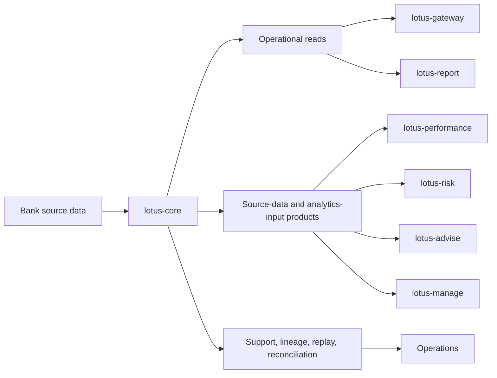

# Overview

## Repository Role

`lotus-core` is the system of record for portfolio, booking, account, holding, mandate, and
transaction data in Lotus.

It provides the foundational facts that other Lotus services compose into performance analytics,
risk views, advisory workflows, discretionary portfolio management, reports, and front-office
experiences.

## Current-State Value

Core is useful because it separates recorded source truth from downstream interpretation:

- business teams can explain where portfolio and transaction facts originate,
- operators can investigate freshness, lineage, replay, and reconciliation without reading code,
- downstream apps can consume governed source-data products instead of cloning core logic,
- demo teams can distinguish implementation-backed claims from target-state roadmap claims.

## What It Owns

- source-data ingestion and persistence,
- foundational financial calculators,
- position, valuation, cashflow, and time-series foundations,
- operational read-plane contracts,
- analytics-input, snapshot/simulation, support, lineage, policy, and source-data product contracts,
- app-level validation evidence for supported core surfaces.

## What It Does Not Own

- performance conclusions, attribution, or benchmark-relative interpretation,
- risk conclusions, VaR, stress, drawdown, or concentration methodology,
- report composition and publication,
- advisory recommendation logic,
- discretionary rebalance decisioning or execution action registers,
- cross-cutting ecosystem platform narrative or shared ingress ownership.

## Operating Model

## Current Posture

- RFC-0082 governs downstream contract-family placement.
- RFC-0083 governs target-state hardening and implementation closure tracking.
- `make lotus-core-validate` produces machine-readable app-level evidence and is report-only in PR
  CI until promoted through governed CI-enforcement proof.
- Local validation is heavier than most Lotus repos because core contracts are high blast-radius.
- App-local isolated runtime is supported, while shared platform runtime ownership stays in
  `lotus-platform`.

## Read Next

- [Supported Features](Supported-Features) for implementation-backed capability claims.
- [Architecture](Architecture) for the runtime and module map.
- [Integrations](Integrations) for upstream and downstream boundaries.
- [Validation and CI](Validation-and-CI) for the gates that protect this repo.
