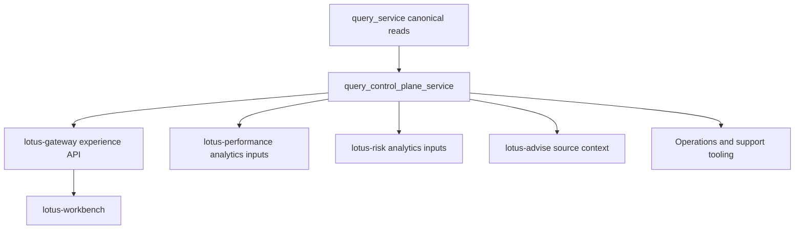

# Query Control Plane

## Purpose

The query control plane is the governed downstream contract and supportability surface inside
`lotus-core`.

It exists alongside `query_service`, not in place of it. `query_service` owns canonical operational
read routes, while `query_control_plane_service` owns control-plane APIs for analytics inputs,
integration contracts, support, lineage, policy, simulation, and export workflows.

## What it handles

The current runtime centers on:

- analytics-input source-data products for downstream performance and risk consumers
- governed portfolio snapshot and integration contracts
- support, readiness, lineage, reconciliation, and reprocessing evidence routes
- integration policy and capability discovery
- deterministic simulation-session workflows
- analytics export job lifecycle for large-window retrieval

This makes it a contract and operations plane, not a generic duplicate of the read API.

## Current feature state

| Surface | What it provides today | What it does not own |
| --- | --- | --- |
| Support and lineage | Portfolio readiness, support overview, control-stage evidence, replay evidence, reconciliation evidence, and lineage drill-through. | Performance, risk, or advisory business conclusions. |
| Analytics inputs | Portfolio and position timeseries inputs, analytics references, and export-job lifecycle for large-window retrieval. | Calculated performance or risk metrics. |
| Integration contracts | Policy-aware snapshots; QCP-owned client restriction, sustainability, tax-reference, income-needs, liquidity-reserve, and planned-withdrawal evidence; benchmark/reference, enrichment, taxonomy, and coverage contracts. | Raw ad hoc table access, financial planning, DPM/tax decisioning, treasury/OMS workflow, or unmanaged aliases. |
| Capabilities and policy | Consumer-aware capability and policy discovery using canonical snake_case query parameters. | Client-specific entitlement adjudication outside the governed policy contract. |
| Simulation | Deterministic source-owned simulation sessions and projected state. | Recommendation, suitability, or advisor decisioning logic. |

## Runtime role

The service groups several related surfaces:

1. `operations`
   support overviews, readiness, lineage, reconciliation evidence, reprocessing and job-state views
2. `integration`
   policy-aware core snapshots through QCP-owned contracts, application policies, source/simulation
   ports, immutable records, and SQL adapter; enrichment/reference contracts plus benchmark and
   market/reference source-data products
3. `analytics_inputs`
   canonical portfolio and position analytics timeseries plus reference metadata and export jobs;
   QCP owns the public contracts, application workflow/policies, ports, immutable portfolio/export
   records, SQL adapters, unit of work, runtime limits, and tests
4. `capabilities`
   tenant- and consumer-aware discovery of supported integration workflows
5. `simulation`
   deterministic what-if sessions and projected-state inspection through QCP-owned API contracts,
   application commands/results, domain records/policy, ports, and SQLAlchemy adapters
6. `advisory_simulation`
   governed canonical simulation execution contract for core source effects

The key design rule is that these APIs publish governed source state, support evidence, or control
policy. They do not own downstream analytics conclusions or advisory decisioning.

## Integration flow



The service boundary exists to prevent downstream consumers from binding to accidental internal
read shapes. It gives integrations a stable contract for source data, readiness, supportability,
policy, and simulation while keeping analytics conclusions in their owning services.

## Boundary decision guide

Use `query_service` when the route is a canonical operational read model.

Use `query_control_plane_service` when the route is mainly for downstream systems, support,
simulation, governed paging/export, policy, lineage, or diagnostics.

Use downstream services when the route returns performance, risk, attribution, active-risk, or
advisory interpretation. `lotus-core` may publish the source inputs and readiness evidence for
those workflows, but it must not publish the downstream conclusion itself.

## Data and contract surfaces it owns

Primary contract areas include:

- `PortfolioStateSnapshot`
- `PortfolioTimeseriesInput`
- `PositionTimeseriesInput`
- `PortfolioAnalyticsReference`
- `ClientRestrictionProfile`
- `SustainabilityPreferenceProfile`
- `ClientTaxProfile`
- `ClientTaxRuleSet`
- integration policy and capability diagnostics
- supportability, lineage, reconciliation, and reprocessing evidence bundles
- simulation session and projected-state contracts
- analytics export job state

These outputs feed:

- `lotus-gateway`
- `lotus-performance`
- `lotus-risk`
- `lotus-advise`
- `lotus-manage`
- operator and support tooling

## Current query and body conventions

The control plane is intentionally not uniform in the way every route accepts input, so future
docs need to stay explicit.

Use:

- query parameters for discovery and policy inspection routes
- JSON request bodies for snapshot, analytics-input, benchmark/reference, and enrichment contracts
- durable path identifiers for support, lineage, export-job, and simulation-session drill-through

Important current rule:

- policy and capability discovery routes use canonical snake_case query parameters such as
  `consumer_system` and `tenant_id`
- capability contracts, policy resolution, settings, and application tests are QCP-owned; do not
  place new capability implementation under `query_service`
- camelCase aliases such as `consumerSystem` and `tenantId` are not supported

Examples:

```text
GET /integration/policy/effective?consumer_system=lotus-gateway&tenant_id=tenant_sg_pb
GET /integration/capabilities?consumer_system=lotus-risk&tenant_id=tenant_sg_pb
POST /integration/portfolios/{portfolio_id}/core-snapshot
POST /integration/portfolios/{portfolio_id}/analytics/portfolio-timeseries
GET /integration/exports/analytics-timeseries/jobs/{job_id}
GET /support/portfolios/{portfolio_id}/overview
```

## Current route map

Use this grouping when deciding where a new consumer should bind:

- policy and capabilities
  `GET /integration/policy/effective`
  `GET /integration/capabilities`
- portfolio snapshots and integration contracts
  `POST /integration/portfolios/{portfolio_id}/core-snapshot`
  benchmark, reference, and enrichment routes under `/integration/...`
- analytics inputs and export jobs
  portfolio timeseries, position timeseries, analytics reference, and
  `/integration/exports/analytics-timeseries/jobs...`

`PortfolioAnalyticsReference.performance_end_date` is the latest complete performance horizon
where required portfolio and position analytics source families overlap. It is bounded by the
requested `as_of_date` and must not advertise a newer isolated source date that downstream
performance analytics cannot calculate.
- support and lineage
  `/support/...` and `/lineage/...`
- simulation lifecycle
  `/simulation-sessions/...`
- canonical advisory simulation execution
  `/integration/advisory/proposals/simulate-execution`

## Why it matters

If the control plane is blurred or under-documented:

- downstream services can couple directly to the wrong tables or routes
- support and readiness state gets inferred indirectly instead of read from governed evidence routes
- simulation can drift toward advisory logic instead of staying deterministic and source-owned
- analytics-input and export consumers can adopt inconsistent contract shapes

That is why `query_control_plane_service` is a distinct service boundary rather than a convenience
router inside the operational read plane.

## Boundary rules

- `query_service` owns canonical operational read routes
- `query_control_plane_service` owns downstream source-data products and control-plane contracts
- the service may expose supportability and policy evidence, but it does not own business
  calculations that belong to calculators or downstream analytics services
- simulation routes must stay deterministic and source-owned, not recommendation-bearing
- generic simulation and Core snapshot assembly must remain QCP package-owned and must not import
  query-service repositories; snapshot source reads use `CoreSnapshotSourceReader`, and proposed
  changes use the QCP-owned `SimulationStore`
- effective integration policy contracts and resolution must remain QCP package-owned; environment
  configuration and clock construction stay at dependency composition, while precedence,
  section filtering, provenance, and warnings remain deterministic application policy
- generic simulation must not import advisory suitability, recommendation, proposal approval, or
  workflow-gate implementations; the advisory simulation route is a quarantined compatibility
  contract while those downstream-owned decisions migrate to `lotus-advise`
- analytics input/export code must remain QCP package-owned; do not restore Query Service DTO,
  workflow, repository, or runtime-setting imports for this route family
- client-restriction contracts, application policy, immutable records, source port, and SQL adapter
  must remain QCP package-owned; Core publishes effective restriction evidence while
  `lotus-manage` owns DPM interpretation, enforcement, workflow, and client-facing conclusions
- sustainability-preference contracts, policy, records, port, and adapter must remain QCP-owned;
  Core publishes captured preference evidence while `lotus-manage` owns DPM interpretation
- client-tax-profile contracts and implementation must remain QCP-owned and bounded to reference
  evidence; tax advice, optimization, suitability, and approval remain outside Core
- client-tax-rule contracts and implementation must remain QCP-owned and bounded to source
  references; tax policy decisions, approvals, and reporting certification remain outside Core
- client income-needs, liquidity-reserve, and planned-withdrawal contracts share the QCP-owned
  `client_liquidity_evidence` capability while retaining product-specific records and SQL policy;
  do not restore the deleted Query Service DTO, mapper, repository, response, or facade paths
- Core publishes captured liquidity requirement and schedule facts only; financial planning,
  suitability, funding recommendations, treasury instructions, OMS acknowledgement, and DPM
  interpretation remain downstream responsibilities
- `lotus-risk` may consume projected Core state, but scenario, stress, concentration, VaR, and risk
  conclusions remain owned by `lotus-risk`

## Operational hints

Check this service when:

- a downstream consumer needs analytics-input or snapshot contracts
- a UI or operator flow needs readiness, lineage, reconciliation, or reprocessing evidence
- integration policy or capability posture needs to be inspected before calling a governed route
- large analytics windows need export-job retrieval instead of direct inline pagination
- what-if projected state is needed without mutating booked baseline state
- a downstream consumer needs policy or capability inspection before choosing a governed snapshot or
  analytics-input route
- large-window analytics retrieval should be handled as an export-job lifecycle instead of repeated
  inline paging

Check beyond this service when:

- the need is a simple operational portfolio/transaction/position read that belongs in
  `query_service`
- the request is for downstream performance, risk, or advisory conclusions rather than core source
  state

## Related references

- [API Surface](API-Surface)
- [Support and Lineage](Support-and-Lineage)
- [System Data Flow](System-Data-Flow)
- [Financial Reconciliation](Financial-Reconciliation)
- [Event Replay Service](Event-Replay-Service)
- [Architecture Index](../docs/architecture/README.md)
- [Lotus Core Microservice Boundaries and Trigger Matrix](../docs/architecture/microservice-boundaries-and-trigger-matrix.md)
- [RFC-0083 Source-Data Product Catalog](../docs/architecture/RFC-0083-source-data-product-catalog.md)
