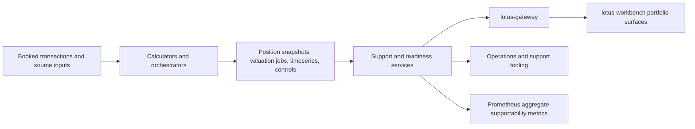

# Support and Lineage

## Purpose

Support and lineage routes are the operator-facing evidence surface for runtime truth inside
`lotus-core`.

They let operators and downstream support tooling inspect whether a portfolio is healthy, blocked,
stale, replaying, unreconciled, or missing adjacent artifacts without inferring that state from raw
tables.

## What it handles

The current runtime centers on:

- support overview and source-owned readiness
- calculator SLO and queue-pressure summaries
- portfolio-day control-stage visibility
- reprocessing key and reprocessing job listings
- valuation, aggregation, and analytics export job listings
- reconciliation run and finding drill-through
- lineage-key discovery and portfolio-security lineage inspection

This makes the surface more than troubleshooting convenience. It is the governed operational
evidence plane for portfolio processing.

## Current feature state

| Area | Current implementation-backed behavior | Primary audience |
| --- | --- | --- |
| Portfolio readiness | Publishes source-owned readiness buckets for holdings, pricing, transactions, reporting, blocking reasons, latest booked transaction date, latest current-epoch snapshot date, control posture, missing historical FX prerequisites, and RFC-0108 supportability posture. | Relationship managers, operations, support, Gateway, Workbench |
| Support overview | Summarizes portfolio-day operational posture, queue pressure, stale or failed jobs, replay state, controls status, and publish allowance. | Operations, production support |
| Lineage | Exposes portfolio and portfolio-security artifact identity, current epoch, watermarks, and adjacent processing evidence without requiring direct table inspection. | Operations, engineering support |
| Reprocessing evidence | Lists replay keys and jobs so stale or blocked derived state can be diagnosed before downstream services are blamed. | Operations, engineering support |
| Reconciliation evidence | Exposes reconciliation runs and findings so blocked controls can be explained with durable source evidence. | Operations, client-service escalation |

These features are non-functional as well as functional. They provide auditability, support-safe
diagnostics, bounded metric labels, and governed drill-through paths for client-facing portfolio
readiness conversations.

## Runtime role

The main routes are grouped around two concepts:

1. `support`
   portfolio-scoped operational state such as overview, readiness, SLOs, control stages,
   reprocessing, reconciliation, and durable job queues
2. `lineage`
   portfolio and portfolio-security lineage discovery for current epoch, watermark, and adjacent
   artifact truth

These routes are designed to answer questions like:

- is this portfolio blocked or simply stale?
- which durable control stage is driving the current status?
- are replay keys or replay jobs still active?
- do current epoch artifacts exist for positions, snapshots, and valuation jobs?
- which reconciliation run produced the current finding set?

## End-to-end flow



The flow is intentionally source-owned. `lotus-core` publishes readiness and evidence; downstream
analytics services publish performance, risk, or advisory conclusions.

## Why it matters

If support and lineage surfaces are weak:

- operators fall back to direct database inspection for routine triage
- downstream tooling can misclassify readiness or supportability from partial signals
- replay, reconciliation, and job-state investigation becomes slower and less auditable
- route consumers lose a common vocabulary for backlog, stale state, and blocking controls

That is why these routes are published as governed control-plane evidence instead of being treated
as internal-only diagnostics.

## Boundary rules

- these routes publish supportability and evidence, not front-office analytics
- readiness and support overview are not substitutes for portfolio timeseries or snapshot products
- lineage routes explain current durable artifact state; they do not replace replay or calculator
  ownership
- when the issue is shared ingress or cross-repo runtime wiring, move to `lotus-platform`

## Operational hints

Start with:

- `GET /support/portfolios/{portfolio_id}/overview`
- `GET /support/portfolios/{portfolio_id}/readiness`

Readiness supportability also emits `lotus_core_portfolio_supportability_total` with only
`state`, `reason`, and `freshness_bucket` labels. Treat those labels as the complete metric
contract; use the API payload for portfolio-scoped investigation rather than adding identifiers to
metrics.

### Readiness supportability behavior

| State | Reason | Meaning | Typical next step |
| --- | --- | --- | --- |
| `ready` | `portfolio_supportability_ready` | All readiness domains are ready and source evidence is current or known. | Use Gateway or Workbench as the front-office consumption path. |
| `degraded` | `portfolio_supportability_blocked` | At least one readiness domain has an error severity reason, such as missing historical FX or blocked controls. | Inspect `blocking_reasons`, reconciliation runs, and missing prerequisite summaries. |
| `degraded` | `portfolio_supportability_pending` | No domain is blocked, but one or more domains still have pending source evidence. | Inspect valuation, aggregation, export, or replay queues for lag. |
| `empty` | `portfolio_supportability_empty` | No source-owned activity is available for the requested readiness window. | Confirm portfolio identity, seed/load status, and business-date assumptions. |

Freshness is reported separately through `freshness_bucket` so a ready portfolio can still be
distinguished from a stale evidence snapshot.

Drill deeper with:

- `GET /support/portfolios/{portfolio_id}/control-stages`
- `GET /support/portfolios/{portfolio_id}/reprocessing-keys`
- `GET /support/portfolios/{portfolio_id}/reprocessing-jobs`
- `GET /support/portfolios/{portfolio_id}/valuation-jobs`
- `GET /support/portfolios/{portfolio_id}/aggregation-jobs`
- `GET /support/portfolios/{portfolio_id}/analytics-export-jobs`
- `GET /support/portfolios/{portfolio_id}/reconciliation-runs`
- `GET /lineage/portfolios/{portfolio_id}/keys`

Use these routes before going directly to the database unless rollout mismatch or schema doubt makes
API evidence insufficient.

## Copy-paste examples

Readiness for a governed as-of date:

```text
GET /support/portfolios/{portfolio_id}/readiness?as_of_date=2026-03-28
```

Replay backlog inspection:

```text
GET /support/portfolios/{portfolio_id}/reprocessing-keys?status_filter=REPROCESSING&watermark_date=2026-03-10
GET /support/portfolios/{portfolio_id}/reprocessing-jobs?status_filter=PROCESSING&security_id=SEC-US-IBM
```

Blocked reconciliation drill-through:

```text
GET /support/portfolios/{portfolio_id}/reconciliation-runs?status_filter=FAILED
GET /support/portfolios/{portfolio_id}/reconciliation-runs/{run_id}/findings?security_id=SEC-US-IBM
```

Run-scoped institutional load progress:

```text
GET /support/load-runs/{run_id}?business_date=2026-04-17
```

This route is for governed load-run validation and operator forensics. It is not a substitute for
portfolio readiness or normal front-office support posture.

## Related references

- [Query Control Plane](Query-Control-Plane)
- [Event Replay Service](Event-Replay-Service)
- [Financial Reconciliation](Financial-Reconciliation)
- [Operations Runbook](Operations-Runbook)
- [Troubleshooting](Troubleshooting)
- [Architecture Index](../docs/architecture/README.md)
