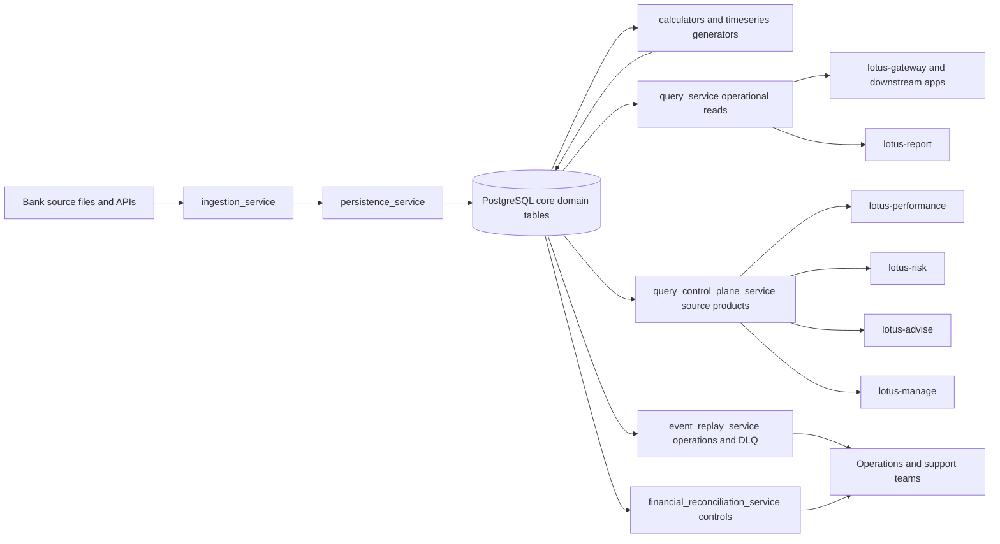
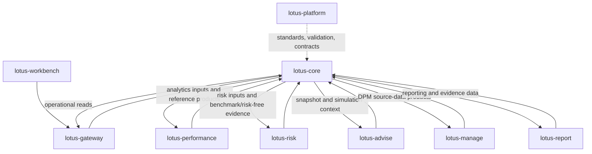

# Supported Features

This page summarizes the current implementation-backed `lotus-core` feature set for business,
operations, sales, client-demo, and engineering audiences.

Use this as a current-state map, not a target-state roadmap. A capability is listed here only when
the repository has implementation evidence in code, contracts, tests, RFCs, or repo-local wiki
source. Broader ecosystem claims still belong in `lotus-platform` or in the consuming application
that owns the client-facing experience.

## Executive Summary

`lotus-core` is the Lotus system of record for foundational portfolio, booking, transaction,
position, cashflow, valuation, source-data, support, lineage, and reconciliation evidence.

The implementation-backed value proposition is:

1. private-bank portfolio data is stored with governed source and temporal semantics,
2. downstream analytics and management applications consume explicit source-data products instead
   of copying Core logic,
3. operational teams can investigate stale, missing, partial, or blocked evidence through support
   and lineage APIs,
4. demo and client-facing claims can distinguish recorded source truth from downstream analytics,
   advice, risk, reporting, tax, liquidity, or execution interpretation.

## Current Capability Map

| Capability area | Implementation-backed support | Primary audience | Main evidence |
| --- | --- | --- | --- |
| Portfolio and account source of record | Portfolio master, account/cash-account context, holdings, position state, cash balances, instruments, lookups, and reporting-oriented reads. | Business, operations, engineering | [API Surface](API-Surface), [Data Models](Data-Models), [Query Service](API-Surface) |
| Transaction and booking evidence | Transaction ledger windows, buy/sell state support, cash movements, cashflow linkage, realized-tax evidence, fees, FX/event linkage, and deterministic pagination. | Business, reporting, operations | [Mesh Data Products](Mesh-Data-Products), [TransactionLedgerWindow methodology](../docs/methodologies/source-data-products/transaction-ledger-window.md) |
| Position, valuation, and cashflow calculators | Position materialization, valuation jobs, cashflow rules, cost basis, portfolio aggregation, and time-series foundations. | Engineering, operations, demo support | [Position Calculator](Position-Calculator), [Valuation Calculator](Valuation-Calculator), [Cashflow Calculator](Cashflow-Calculator), [Timeseries and Aggregation](Timeseries-and-Aggregation) |
| Operational read plane | Stable read APIs for portfolios, positions, transactions, prices, FX rates, cash, reporting evidence, and lookup/reference data. | Gateway, Workbench, reporting, support teams | [API Surface](API-Surface), `src/services/query_service/app/routers/` |
| Query control plane | Governed analytics-input, snapshot, simulation, policy, capability, support, lineage, and source-data product APIs. | Performance, risk, advise, manage, gateway, operations | [Query Control Plane](Query-Control-Plane), [Integrations](Integrations) |
| DPM source-data products | Model targets, mandate binding, instrument eligibility, tax lots, transaction-cost evidence, market-data coverage, source readiness, PM book membership, CIO affected cohort, DPM universe candidates, client restrictions, sustainability, tax, income, reserve, withdrawal, and external fail-closed evidence. | `lotus-manage`, portfolio managers, operations, demos | [Mesh Data Products](Mesh-Data-Products), `contracts/domain-data-products/lotus-core-products.v1.json` |
| Market/reference products | Benchmark assignment, benchmark composition, index prices/returns, benchmark returns, risk-free series, market-data coverage, FX rates, and classification taxonomy. | Performance, risk, reporting, advisory, operations | [Mesh Data Products](Mesh-Data-Products), [Database Migrations](Database-Migrations) |
| Ingestion and replay | API-first ingestion, portfolio bundle ingestion, file preview/commit, job bookkeeping, retry/replay, DLQ diagnostics, idempotency diagnostics, and operational health views. | Operations, engineering | [Ingestion Service](Ingestion-Service), [Event Replay Service](Event-Replay-Service), [Operations Runbook](Operations-Runbook) |
| Reconciliation and supportability | Financial reconciliation runs/findings, readiness, support overview, calculator SLOs, lineage keys, load-run progress, queue/job health, and bounded portfolio supportability metrics. | Operations, SRE, engineering, demos | [Financial Reconciliation](Financial-Reconciliation), [Support and Lineage](Support-and-Lineage), [Operations Runbook](Operations-Runbook) |
| Simulation and advisory source effects | Simulation sessions, projected state, and canonical advisory proposal execution simulation effects as source-owned proposal impact evidence. | Advisory, gateway, engineering | [API Surface](API-Surface), `src/services/query_control_plane_service/app/routers/simulation.py`, `src/services/query_control_plane_service/app/routers/advisory_simulation.py` |

## Functional Flow

## Integration Map

## Functional Capability Detail

### Operational Portfolio Truth

Implemented support includes portfolio master data, holdings, positions, instruments, cash accounts,
cash balances, transactions, market prices, FX rates, and lookup/reference data. These surfaces are
served primarily through `query_service` and remain the authoritative source for downstream
services.

Use this in demos as: "Core provides the recorded portfolio and ledger truth that other Lotus apps
compose into analytics, advice, reporting, and management workflows."

Do not claim: performance attribution, risk methodology, discretionary rebalancing decisions,
report composition, tax advice, or OMS execution.

### Analytics and Reference Inputs

Core exposes governed analytics-input products for portfolio time series, position time series,
portfolio analytics reference metadata, benchmark assignments, benchmark compositions, index
series, risk-free series, instrument reference enrichment, market-data windows, and coverage
diagnostics.

These products are built for downstream services such as `lotus-performance` and `lotus-risk`.
Recent implementation work on this branch also hardens database access patterns for these source
products: canonical provider-row ranking, latest-effective source-row ranking, and query-shaped
indexes now reduce materialization of superseded source rows.

### DPM Source Evidence

Core now exposes a broad DPM source-data family for `lotus-manage`. This family supports
discretionary mandate portfolio management by supplying source-owned facts, not execution
decisions.

Implementation-backed products include:

| Product family | Examples | Supported claim |
| --- | --- | --- |
| Mandate and model source | `DpmModelPortfolioTarget:v1`, `DiscretionaryMandateBinding:v1`, `CioModelChangeAffectedCohort:v1`, `DpmPortfolioUniverseCandidate:v1` | Core can identify approved models, effective discretionary mandates, affected mandates, and eligible DPM universe candidates from source tables. |
| Instrument and market readiness | `InstrumentEligibilityProfile:v1`, `MarketDataCoverageWindow:v1`, `DpmSourceReadiness:v1` | Core can report whether required instrument, price, and FX evidence exists for DPM source assembly. |
| Portfolio tax and cost evidence | `PortfolioTaxLotWindow:v1`, `TransactionCostCurve:v1`, `PortfolioRealizedTaxSummary:v1` | Core can expose recorded tax-lot, fee, and tax evidence without claiming tax advice or execution quality. |
| Client governance evidence | `ClientRestrictionProfile:v1`, `SustainabilityPreferenceProfile:v1`, `ClientTaxProfile:v1`, `ClientTaxRuleSet:v1`, `ClientIncomeNeedsSchedule:v1`, `LiquidityReserveRequirement:v1`, `PlannedWithdrawalSchedule:v1` | Core can serve bounded client/mandate facts for downstream supportability and workflow checks. |
| External execution boundary | `ExternalCurrencyExposure:v1`, `ExternalHedgePolicy:v1`, `ExternalEligibleHedgeInstrument:v1`, `ExternalFXForwardCurve:v1`, `ExternalHedgeExecutionReadiness:v1`, `ExternalOrderExecutionAcknowledgement:v1` | Core exposes fail-closed posture until bank-owned external treasury or OMS ingestion is certified. |

### Operations and Support

Implemented supportability surfaces include readiness, support overview, calculator SLOs,
reprocessing keys and jobs, reconciliation runs/findings, lineage keys, load-run progress,
ingestion health, backlog and capacity diagnostics, DLQ replay, and idempotency diagnostics.

These surfaces are intended for operating the platform. They should not be used as front-office
business APIs unless the route family explicitly supports that use.

## Non-Functional Capability Matrix

| Non-functional area | Current implementation-backed posture | Evidence |
| --- | --- | --- |
| Contract governance | Routes are classified by RFC-0082 families; source-data products are declared in repo-native domain-product contracts. | [RFC Index](RFC-Index), [API Surface](API-Surface), `docs/standards/route-contract-family-registry.json` |
| Source-data identity | Product responses carry product identity, version, runtime metadata, lineage, evidence timestamps, and deterministic request fingerprints where applicable. | [Mesh Data Products](Mesh-Data-Products), `contracts/domain-data-products/lotus-core-products.v1.json` |
| Validation and CI | Feature Lane, PR Merge Gate, migration contract checks, warning gates, unit-db manifest, integration-lite, Docker/runtime gates, and workflow lint are part of the repo posture. | [Validation and CI](Validation-and-CI), `scripts/test_manifest.py` |
| Database performance | Hot read paths use query-shaped indexes, normalized identifier expression indexes, partial indexes for sparse source classes, SQL ranking for latest/canonical rows, and partition-readiness review tooling. | [Database Migrations](Database-Migrations), `scripts/db_partition_advisor.py`, CR-490 through CR-569 |
| Idempotency and replay | Ingestion jobs, idempotency keys, replay audit records, DLQ recovery, correlation identifiers, and event outbox support are implemented. | [Ingestion Service](Ingestion-Service), [Event Replay Service](Event-Replay-Service), [Outbox Events](Outbox-Events) |
| Auditability and lineage | Source products, reconciliation evidence, support pages, and ingestion/replay records expose lineage and evidence paths for operator investigation. | [Support and Lineage](Support-and-Lineage), [Operations Runbook](Operations-Runbook) |
| Sensitive-data posture | Source-data security profiles, access classifications, audit requirements, and retention posture are governed through RFC-0083 security/tenancy/lifecycle material. | [Security and Governance](Security-and-Governance), `docs/architecture/RFC-0083-security-tenancy-lifecycle-target-model.md` |
| Observability | Portfolio readiness publishes bounded supportability metric labels; ingestion and support routes expose operational health, SLO, backlog, and saturation views. | [API Surface](API-Surface), [Operations Runbook](Operations-Runbook) |
| Degraded and unavailable states | DPM readiness and external treasury/OMS products fail closed with explicit missing-data families and blocked capabilities instead of inventing unsupported data. | [Mesh Data Products](Mesh-Data-Products), source-product methodologies |

## Demo And Pitch Guidance

### Safe implementation-backed demo claims

- Core is the authoritative source for portfolio, transaction, position, cash, reference, and
  source-data evidence.
- Downstream apps can consume governed source products rather than duplicating source logic.
- Operations can investigate freshness, readiness, lineage, replay, and reconciliation posture from
  Core support surfaces.
- DPM source readiness is explicit and fail-closed: missing mandate, model, eligibility, tax-lot,
  market-data, external treasury, or OMS evidence is visible rather than silently fabricated.
- Recent performance work is database-backed: latest-effective and canonical-row selection is pushed
  into SQL for high-value source-data paths, with matching indexes where predicates require them.

### Claims that require another owning service

| Claim | Owning layer |
| --- | --- |
| Performance return methodology, attribution, or benchmark-relative performance conclusion | `lotus-performance` |
| Risk, VaR, drawdown, concentration, or stress conclusion | `lotus-risk` |
| Advisory recommendation and proposal lifecycle decisioning | `lotus-advise` |
| Discretionary mandate rebalance decisioning and action register | `lotus-manage` |
| Client report composition, rendering, archive retrieval, and evidence-pack publication | `lotus-report`, `lotus-render`, `lotus-archive` |
| Unified front-office product experience | `lotus-workbench` through `lotus-gateway` |

## Current Limitations

- This page is source-truth for `lotus-core` implementation-backed capability only; it is not a
  cross-application sales deck by itself.
- Some source products are intentionally fail-closed until external bank-owned treasury or OMS
  ingestion is certified.
- Some products are Core producer-certified while downstream consumer proof remains owned by the
  consuming app.
- Wiki publication is a post-merge step. Repo-local `wiki/` is the authored source; the GitHub wiki
  publication target must not be hand-edited.

## Evidence And Deep Links

- [Mesh Data Products](Mesh-Data-Products)
- [API Surface](API-Surface)
- [System Data Flow](System-Data-Flow)
- [Integrations](Integrations)
- [Operations Runbook](Operations-Runbook)
- [Security and Governance](Security-and-Governance)
- [Database Migrations](Database-Migrations)
- [Architecture Index](../docs/architecture/README.md)
- [Route Contract-Family Registry](../docs/standards/route-contract-family-registry.json)
- [Domain Product Declaration](../contracts/domain-data-products/lotus-core-products.v1.json)
